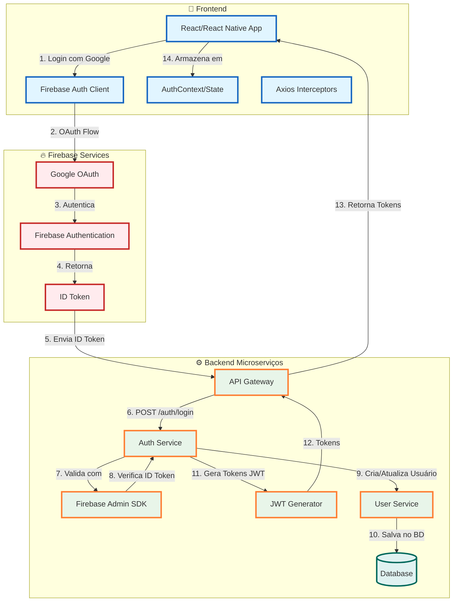
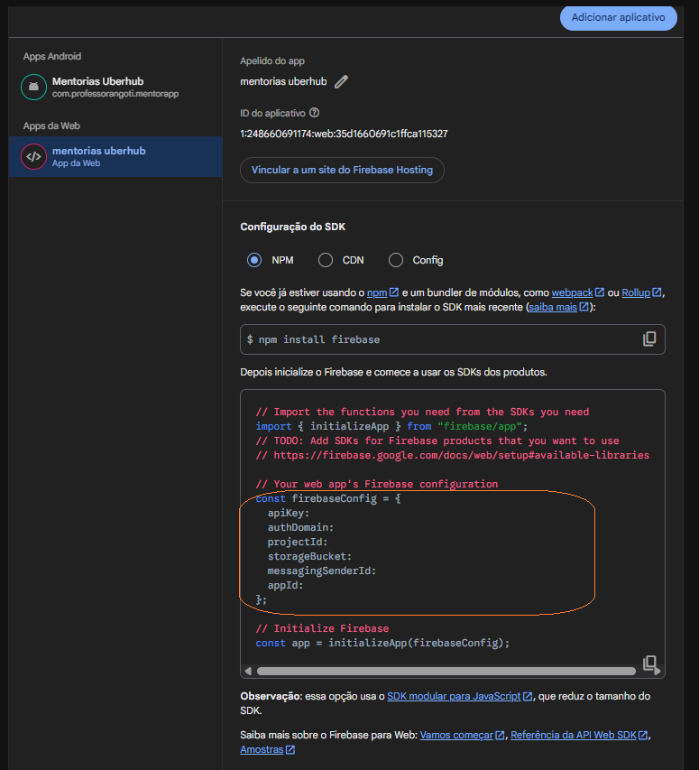

# 🎓 Aula: Arquitetura de Autenticação Dupla | Firebase + Backend Microserviços



---

## 📚 Índice

1. [Fundamentos Teóricos](#1-fundamentos-teóricos)
2. [Arquitetura do Sistema](#2-arquitetura-do-sistema)
3. [Fluxo de Autenticação Explicado](#3-fluxo-de-autenticação-explicado)
4. [Plano de Implementação - React Web](#4-plano-de-implementação---react-web)
5. [Plano de Implementação - React Native](#5-plano-de-implementação---react-native)
6. [Checklist de Implementação](#6-checklist-de-implementação)

---

<details>
<summary>📄 Fundamentos Teóricos</summary>

## 1. Fundamentos Teóricos

### 1.1 O que é Autenticação?

**Autenticação** é o processo de verificar a identidade de um usuário. É diferente de **autorização**, que verifica o que o usuário pode fazer.

**Analogia simples**:

- **Autenticação**: "Quem é você?" → Verifica identidade
- **Autorização**: "O que você pode fazer?" → Verifica permissões

### 1.2 OAuth 2.0 e Firebase Authentication

**OAuth 2.0** é um protocolo de autorização que permite que aplicações acessem recursos de um usuário sem expor suas senhas.

**Firebase Authentication** implementa OAuth 2.0 e oferece:

- Autenticação com Google, Facebook, GitHub, etc.
- Gerenciamento de sessões
- Renovação automática de tokens
- Segurança gerenciada pelo Google

### 1.3 Tokens: ID Token vs JWT

#### ID Token do Firebase

- **O que é**: Token emitido pelo Firebase após autenticação bem-sucedida
- **Conteúdo**: Informações do usuário (email, nome, foto)
- **Validade**: ~1 hora (renovado automaticamente)
- **Uso**: Validar identidade no backend

#### JWT (JSON Web Token) Próprio

- **O que é**: Token gerado pelo seu backend após validar o ID token
- **Conteúdo**: Claims customizados (roles, permissões, etc.)
- **Validade**: Configurável (geralmente 15min-1h)
- **Uso**: Controlar acesso às APIs

**Por que usar ambos?**

- **ID Token**: Valida identidade (Firebase cuida disso)
- **JWT Próprio**: Controla autorização (você controla isso)

### 1.4 Refresh Tokens

**Refresh Token** é um token de longa duração usado para obter novos access tokens sem reautenticação.

**Fluxo**:

```text
Access Token expira → Usa Refresh Token → Obtém novo Access Token
```

**Vantagens**:

- Usuário não precisa fazer login novamente
- Access tokens podem ter vida curta (mais seguro)
- Refresh tokens podem ser revogados se necessário

### 1.5 Padrão Observer

O **Observer Pattern** permite que objetos observem mudanças em outro objeto.


```javascript
// Registra um observer
const unsubscribe = onIdTokenChanged(auth, user => {
  // Este callback é executado sempre que o token muda
  console.log("Token mudou!", user);
});

// Remove o observer
unsubscribe();
```

**Vantagens**:

- Reativo: reage automaticamente a mudanças
- Eficiente: não precisa verificar periodicamente
- Simples: menos código, menos bugs

### 1.6 Interceptors (Axios)

**Interceptors** são funções que interceptam requisições ou respostas antes que sejam processadas.

**Request Interceptor**: Modifica requisições antes de enviar

```javascript
api.interceptors.request.use(config => {
  // Adiciona token em todas as requisições
  config.headers.Authorization = `Bearer ${token}`;
  return config;
});
```

**Response Interceptor**: Trata respostas (especialmente erros)

```javascript
api.interceptors.response.use(
  response => response,
  error => {
    // Trata erros 401 automaticamente
    if (error.response?.status === 401) {
      // Renova token
    }
  }
);
```

</details>
<details>
<summary>📄 Arquitetura do Sistema</summary>

## 2. Arquitetura do Sistema

### 2.1 Visão Geral da Arquitetura

```text
┌─────────────┐
│   Usuário   │
└──────┬──────┘
       │
       ▼
┌─────────────────────────────────┐
│      Frontend (React)           │
│  ┌──────────────────────────┐   │
│  │  Firebase Auth Client    │   │
│  │  (Autenticação OAuth)    │   │
│  └──────────┬───────────────┘   │
│             │                   │
│  ┌──────────▼───────────────┐   │
│  │  AuthContext (Estado)    │   │
│  └──────────┬───────────────┘   │
│             │                   │
│  ┌──────────▼───────────────┐   │
│  │  Axios Interceptors      │   │
│  └──────────┬───────────────┘   │
└─────────────┼───────────────────┘
              │
              ▼
┌─────────────────────────────────┐
│      Backend (API)              │
│  ┌──────────────────────────┐   │
│  │  Firebase Admin SDK      │   │
│  │  (Valida ID Token)       │   │
│  └──────────┬───────────────┘   │
│             │                   │
│  ┌──────────▼───────────────┐   │
│  │  Gera JWT Tokens         │   │
│  └──────────┬───────────────┘   │
│             │                   │
│  ┌──────────▼───────────────┐   │
│  │  MongoDB (Usuários)      │   │
│  └──────────────────────────┘   │
└─────────────────────────────────┘
```

### 2.2 Separação de Responsabilidades

| Componente        | Responsabilidade                                |
| ----------------- | ----------------------------------------------- |
| **Firebase Auth** | Autenticação OAuth (Google)                     |
| **Backend**       | Validação de tokens e gerenciamento de usuários |
| **JWT Próprio**   | Controle de acesso às APIs                      |
| **Frontend**      | Gerenciamento de estado e renovação de tokens   |

### 2.3 Camadas de Segurança

1. **Camada 1 - Identidade**: ID Token do Firebase valida quem é o usuário
2. **Camada 2 - Autorização**: JWT próprio controla o que o usuário pode fazer
3. **Camada 3 - Renovação**: Refresh tokens permitem renovação sem reautenticação

</details>

<details>
<summary>📄 Fluxo de Autenticação Explicado</summary>

## 3. Fluxo de Autenticação Explicado

### 3.1 Fluxo Completo (Passo a Passo)

#### Passo 1: Usuário Clica em "Entrar com Google"

```text
Usuário → Clica no botão → Frontend inicia processo
```

**O que acontece**:

- Frontend chama `signInWithPopup(auth, googleProvider)`
- Firebase abre popup do Google
- Usuário seleciona conta e autoriza

#### Passo 2: Firebase Retorna ID Token

```text
Firebase → Valida com Google → Retorna ID Token
```

**O que acontece**:

- Google valida credenciais
- Firebase gera ID token
- Frontend recebe o token

#### Passo 3: Frontend Envia ID Token para Backend

```text
Frontend → POST /auth/login {idToken} → Backend
```

**O que acontece**:

- Frontend envia ID token para seu backend
- Backend precisa validar esse token

#### Passo 4: Backend Valida ID Token

```text
Backend → Firebase Admin SDK → Valida ID Token
```

**O que acontece**:

- Backend usa Firebase Admin SDK
- Verifica se o token é válido
- Obtém dados do usuário (email, nome, etc.)

#### Passo 5: Backend Cria/Atualiza Usuário

```text
Backend → MongoDB → Salva/Atualiza usuário
```

**O que acontece**:

- Backend verifica se usuário existe
- Se não existe, cria novo usuário
- Se existe, atualiza dados

#### Passo 6: Backend Gera Tokens JWT

```text
Backend → Gera accessToken + refreshToken → Retorna ao Frontend
```

**O que acontece**:

- Backend gera dois tokens JWT:
  - **accessToken**: Token de curta duração (15min-1h)
  - **refreshToken**: Token de longa duração (7-30 dias)
- Envia ambos ao frontend

#### Passo 7: Frontend Armazena Tokens

```text
Frontend → localStorage → Salva tokens
```

**O que acontece**:

- Frontend salva tokens no `localStorage`
- Salva também dados do usuário
- Estado de autenticação é atualizado

#### Passo 8: Frontend Usa Tokens em Requisições

```text
Frontend → Adiciona token no header → Backend valida → Retorna dados
```

**O que acontece**:

- Interceptor do Axios adiciona token automaticamente
- Backend valida token JWT
- Se válido, retorna dados solicitados

### 3.2 Renovação Automática de Tokens

**Problema**: Tokens expiram. O que fazer?

**Solução 1: Listener `onIdTokenChanged`**

```javascript
// Quando Firebase renova ID token automaticamente
onIdTokenChanged(auth, async user => {
  if (user) {
    const idToken = await user.getIdToken();
    // Renova JWT usando novo ID token
    await authService.login(idToken);
  }
});
```

**Solução 2: Interceptor de Resposta (Erro 401)**

```javascript
// Quando recebe erro 401
api.interceptors.response.use(
  response => response,
  async error => {
    if (error.response?.status === 401) {
      // Tenta renovar com refreshToken
      // Se falhar, tenta com Firebase Auth
    }
  }
);
```

### 3.3 Tratamento de Erros 401

**Cenário**: Token expirou durante uso

**Estratégia em Cascata**:

1. **Tenta Refresh Token** (mais rápido)

   ```text
   Token expirado → Usa refreshToken → Obtém novos tokens
   ```

2. **Se falhar, aguarda Firebase Auth** (para navegador reaberto)

   ```text
   Aguarda até 3s → Firebase restaura sessão → Obtém novo ID token
   ```

3. **Se tudo falhar, redireciona para login**

   ```text
   Todas estratégias falharam → Limpa tokens → Redireciona para /login
   ```

### 3.4 Restauração de Sessão

**Cenário**: Usuário fecha e reabre navegador

**O que acontece**:

1. **Frontend restaura estado do localStorage**

   ```javascript
   const storedUser = localStorage.getItem("user");
   if (storedUser) {
     setUser(JSON.parse(storedUser));
   }
   ```

2. **Firebase Auth restaura sessão automaticamente**

   - Firebase mantém sessão em cookies/localStorage
   - Restaura automaticamente quando navegador reabre

3. **`onIdTokenChanged` dispara**

   ```javascript
   onIdTokenChanged(auth, async user => {
     // Dispara quando sessão é restaurada
     // Renova tokens JWT automaticamente
   });
   ```

4. **Frontend renova tokens JWT**
   - Usa novo ID token para obter novos JWT
   - Atualiza localStorage
   - Usuário continua autenticado

</details>

<details>
<summary>📄 Plano de Implementação - React Web</summary>

## 4. Plano de Implementação - React Web

### 4.1 Pré-requisitos

- Node.js 16+ instalado
- Conta no Firebase Console
- Projeto React criado (Vite ou Create React App)
- Backend configurado (Spring Boot ou similar)

### 4.2 Instalação de Dependências

```bash
# No diretório do projeto React
npm install firebase axios
# ou
yarn add firebase axios
```

### 4.3 Configuração do Firebase

#### Obter Credenciais do Firebase

1. Acesse [Firebase Console](https://console.firebase.google.com/)
2. Crie um projeto ou selecione existente
3. Vá em **Authentication** → **Sign-in method**
4. Habilite **Google** como provedor
5. Vá em **Project Settings** → **General**
6. Copie as credenciais do app web

#### Criar Arquivo de Configuração

Crie `src/config/firebase.js`:

<details>
<summary>📄 Ver código completo: firebase.js</summary>

```javascript
import { initializeApp } from "firebase/app";
import { getAuth, GoogleAuthProvider } from "firebase/auth";

// Configuração do Firebase
const firebaseConfig = {
  apiKey: import.meta.env.VITE_FIREBASE_API_KEY,
  authDomain: import.meta.env.VITE_FIREBASE_AUTH_DOMAIN,
  projectId: import.meta.env.VITE_FIREBASE_PROJECT_ID,
  storageBucket: import.meta.env.VITE_FIREBASE_STORAGE_BUCKET,
  messagingSenderId: import.meta.env.VITE_FIREBASE_MESSAGING_SENDER_ID,
  appId: import.meta.env.VITE_FIREBASE_APP_ID,
};

// Inicializa Firebase
const app = initializeApp(firebaseConfig);

// Inicializa Auth
export const auth = getAuth(app);

// Configura Google Provider
export const googleProvider = new GoogleAuthProvider();
googleProvider.setCustomParameters({
  prompt: "select_account", // Força seleção de conta
});
```

</details>

#### Criar Arquivo `.env`

Crie `.env` na raiz do projeto:

```env
VITE_FIREBASE_API_KEY=sua-api-key
VITE_FIREBASE_AUTH_DOMAIN=seu-projeto.firebaseapp.com
VITE_FIREBASE_PROJECT_ID=seu-projeto-id
VITE_FIREBASE_STORAGE_BUCKET=seu-projeto.appspot.com
VITE_FIREBASE_MESSAGING_SENDER_ID=seu-sender-id
VITE_FIREBASE_APP_ID=seu-app-id
```

### 4.4 Criar Serviço de API

Crie `src/services/api.js`:

<details>
<summary>📄 Ver código completo: api.js (arquivo completo com interceptors)</summary>

```javascript
import axios from "axios";

// URL base da API
const API_BASE_URL = import.meta.env.VITE_API_BASE_URL || "http://localhost:8080/api/v1";

// Cria instância do Axios
const api = axios.create({
  baseURL: API_BASE_URL,
  headers: {
    "Content-Type": "application/json",
  },
});

// ============================================
// REQUEST INTERCEPTOR
// ============================================
// Adiciona token em todas as requisições
api.interceptors.request.use(
  config => {
    const token = localStorage.getItem("token");
    if (token) {
      config.headers.Authorization = `Bearer ${token}`;
    }
    return config;
  },
  error => {
    return Promise.reject(error);
  }
);

// ============================================
// RESPONSE INTERCEPTOR
// ============================================
// Trata erros 401 automaticamente
api.interceptors.response.use(
  response => response,
  async error => {
    const originalRequest = error.config;

    // Se receber 401 e não for uma tentativa de refresh
    if (error.response?.status === 401 && !originalRequest._retry) {
      originalRequest._retry = true;

      // Estratégia 1: Tenta renovar com refreshToken
      const refreshToken = localStorage.getItem("refreshToken");
      if (refreshToken) {
        try {
          const response = await axios.post(`${API_BASE_URL}/auth/refresh`, {
            refreshToken,
          });

          if (response.data.accessToken) {
            // Salva novos tokens
            localStorage.setItem("token", response.data.accessToken);
            localStorage.setItem("refreshToken", response.data.refreshToken);

            // Busca dados atualizados do usuário
            const userResponse = await api.get(`${API_BASE_URL}/users/me`);
            localStorage.setItem("user", JSON.stringify(userResponse.data));

            // Repete requisição original
            originalRequest.headers.Authorization = `Bearer ${response.data.accessToken}`;
            return api(originalRequest);
          }
        } catch (refreshError) {
          // Estratégia 2: Se refreshToken falhar, tenta com Firebase
          // (continua abaixo)
        }
      }

      // Estratégia 2: Aguarda Firebase Auth restaurar sessão
      try {
        const { auth } = await import("../config/firebase.js");
        let currentUser = auth.currentUser;

        // Aguarda até 3 segundos para Firebase restaurar sessão
        if (!currentUser) {
          const maxWait = 3000; // 3 segundos
          const checkInterval = 100; // 100ms
          let waited = 0;

          while (!currentUser && waited < maxWait) {
            await new Promise(resolve => setTimeout(resolve, checkInterval));
            currentUser = auth.currentUser;
            waited += checkInterval;
          }
        }

        if (currentUser) {
          // Obtém novo ID token
          const newIdToken = await currentUser.getIdToken(true);

          // Faz login novamente
          const loginResponse = await axios.post(`${API_BASE_URL}/auth/login`, {
            idToken: newIdToken,
          });

          if (loginResponse.data.accessToken) {
            // Salva novos tokens
            localStorage.setItem("token", loginResponse.data.accessToken);
            localStorage.setItem("refreshToken", loginResponse.data.refreshToken);

            // Busca dados atualizados do usuário
            const userResponse = await api.get(`${API_BASE_URL}/users/me`);
            localStorage.setItem("user", JSON.stringify(userResponse.data));

            // Repete requisição original
            originalRequest.headers.Authorization = `Bearer ${loginResponse.data.accessToken}`;
            return api(originalRequest);
          }
        }
      } catch (firebaseError) {
        // Todas as estratégias falharam
      }

      // Se todas as estratégias falharam, limpa tokens e redireciona
      localStorage.removeItem("token");
      localStorage.removeItem("refreshToken");
      localStorage.removeItem("user");
      window.location.href = "/login";
    }

    return Promise.reject(error);
  }
);

// ============================================
// SERVIÇO DE AUTENTICAÇÃO
// ============================================
export const authService = {
  // Login com ID token do Firebase
  login: async idToken => {
    const response = await axios.post(`${API_BASE_URL}/auth/login`, {
      idToken,
    });

    // Salva tokens
    localStorage.setItem("token", response.data.accessToken);
    localStorage.setItem("refreshToken", response.data.refreshToken);

    // Busca dados do usuário
    const userResponse = await api.get(`${API_BASE_URL}/users/me`);
    localStorage.setItem("user", JSON.stringify(userResponse.data));

    return userResponse.data;
  },

  // Logout
  logout: async () => {
    // Limpa localStorage
    localStorage.removeItem("token");
    localStorage.removeItem("refreshToken");
    localStorage.removeItem("user");

    // Faz logout do Firebase
    const { auth } = await import("../config/firebase.js");
    await auth.signOut();

    // Pequeno delay para garantir processamento
    await new Promise(resolve => setTimeout(resolve, 100));
  },

  // Verifica se está autenticado
  isAuthenticated: () => {
    return !!localStorage.getItem("token");
  },

  // Obtém token
  getToken: () => {
    return localStorage.getItem("token");
  },

  // Obtém dados do usuário
  getUser: () => {
    const user = localStorage.getItem("user");
    return user ? JSON.parse(user) : null;
  },
};

export default api;
```

</details>

### 4.5 Criar AuthContext

Crie `src/context/AuthContext.js`:

<details>
<summary>📄 Ver código completo: AuthContext.js</summary>

```javascript
import { createContext, useContext, useEffect, useState } from "react";
import { onIdTokenChanged } from "firebase/auth";
import { auth } from "../config/firebase";
import { authService } from "../services/api";

// Cria contexto
const AuthContext = createContext(null);

// Provider component
export const AuthProvider = ({ children }) => {
  const [user, setUser] = useState(null);
  const [loading, setLoading] = useState(true);
  const [firebaseUser, setFirebaseUser] = useState(null);

  useEffect(() => {
    let isInitialLoad = true;

    // Restaura estado do localStorage imediatamente (para hot reload)
    const storedUser = authService.getUser();
    const hasToken = authService.isAuthenticated();

    if (storedUser && hasToken) {
      setUser(storedUser);
    }

    // Observer do Firebase - dispara quando ID token muda
    const unsubscribe = onIdTokenChanged(auth, async firebaseUser => {
      setFirebaseUser(firebaseUser);

      if (firebaseUser) {
        try {
          // Obtém ID token
          const idToken = await firebaseUser.getIdToken();

          // Renova tokens JWT
          await authService.login(idToken);

          // Atualiza estado do usuário
          const updatedUser = authService.getUser();
          if (updatedUser) {
            setUser(updatedUser);
          }
        } catch (error) {
          console.error("Erro ao renovar token:", error);

          // Se erro 401/403, faz logout
          if (error.response?.status === 401 || error.response?.status === 403) {
            await authService.logout();
            setUser(null);
          }
        }
      } else {
        // Firebase logout - limpa tudo
        await authService.logout();
        setUser(null);
      }

      // Finaliza loading após primeira execução
      if (isInitialLoad) {
        isInitialLoad = false;
        setLoading(false);
      }
    });

    // Cleanup: remove observer quando componente desmonta
    return () => {
      unsubscribe();
    };
  }, []);

  // Função de login
  const login = async idToken => {
    try {
      const userData = await authService.login(idToken);

      // Verifica se é admin
      if (!userData?.role) {
        await logout();
        return { success: false, error: "Usuário não possui permissões" };
      }

      const roles = Array.isArray(userData.role) ? userData.role : [userData.role];
      const isAdmin = roles.includes("ADMIN");

      if (!isAdmin) {
        await logout();
        return { success: false, error: "Apenas administradores podem acessar" };
      }

      setUser(userData);
      return { success: true };
    } catch (error) {
      console.error("Erro ao fazer login:", error);
      return { success: false, error: error.message };
    }
  };

  // Função de logout
  const logout = async () => {
    setUser(null);
    setFirebaseUser(null);
    await authService.logout();
  };

  // Verifica se está autenticado
  const isAuthenticated = () => {
    return !!(user && authService.isAuthenticated());
  };

  const value = {
    user,
    loading,
    firebaseUser,
    login,
    logout,
    isAuthenticated,
  };

  return <AuthContext.Provider value={value}>{children}</AuthContext.Provider>;
};

// Custom hook
export const useAuth = () => {
  const context = useContext(AuthContext);
  if (!context) {
    throw new Error("useAuth deve ser usado dentro de AuthProvider");
  }
  return context;
};
```

</details>

### 4.6 Criar Página de Login

Crie `src/pages/Login.js`:

<details>
<summary>📄 Ver código completo: Login.js</summary>

```javascript
import { useState } from "react";
import { useNavigate } from "react-router-dom";
import { signInWithPopup } from "firebase/auth";
import { auth, googleProvider } from "../config/firebase";
import { useAuth } from "../context/AuthContext";

export default function Login() {
  const [loading, setLoading] = useState(false);
  const [error, setError] = useState("");
  const navigate = useNavigate();
  const { login } = useAuth();

  const handleGoogleSignIn = async () => {
    setError("");
    setLoading(true);

    try {
      // Garante logout anterior (força seleção de conta)
      if (auth.currentUser) {
        await auth.signOut();
        await new Promise(resolve => setTimeout(resolve, 100));
      }

      // Faz login com Google
      const result = await signInWithPopup(auth, googleProvider);
      const idToken = await result.user.getIdToken();

      // Envia para AuthContext
      const loginResult = await login(idToken);

      if (loginResult.success) {
        navigate("/");
      } else {
        setError(loginResult.error || "Erro ao fazer login");
      }
    } catch (error) {
      console.error("Erro ao fazer login:", error);
      setError("Erro ao fazer login. Tente novamente.");
    } finally {
      setLoading(false);
    }
  };

  return (
    <div className="min-h-screen flex items-center justify-center bg-gray-50">
      <div className="max-w-md w-full space-y-8">
        <div>
          <h2 className="mt-6 text-center text-3xl font-extrabold text-gray-900">
            Entrar na sua conta
          </h2>
        </div>
        <div>
          <button
            onClick={handleGoogleSignIn}
            disabled={loading}
            className="w-full flex justify-center items-center px-4 py-2 border border-transparent rounded-md shadow-sm text-sm font-medium text-white bg-blue-600 hover:bg-blue-700 disabled:opacity-50">
            {loading ? "Carregando..." : "Entrar com Google"}
          </button>
          {error && <p className="mt-2 text-sm text-red-600 text-center">{error}</p>}
        </div>
      </div>
    </div>
  );
}
```

</details>

### 4.7 Criar Rota Protegida

Crie `src/components/ProtectedRoute.js`:

<details>
<summary>📄 Ver código completo: ProtectedRoute.js</summary>

```javascript
import { Navigate } from "react-router-dom";
import { useAuth } from "../context/AuthContext";

export default function ProtectedRoute({ children }) {
  const { isAuthenticated, loading, user } = useAuth();

  if (loading) {
    return <div>Carregando...</div>;
  }

  if (!isAuthenticated()) {
    return <Navigate to="/login" replace />;
  }

  // Verifica se é admin
  const roles = Array.isArray(user?.role) ? user.role : [user?.role];
  const isAdmin = roles.includes("ADMIN");

  if (!isAdmin) {
    return <Navigate to="/login?error=admin_required" replace />;
  }

  return children;
}
```

</details>

### 4.8 Configurar App.js

Atualize `src/App.js`:

<details>
<summary>📄 Ver código completo: App.js</summary>

```javascript
import { BrowserRouter, Routes, Route, Navigate } from "react-router-dom";
import { AuthProvider } from "./context/AuthContext";
import ProtectedRoute from "./components/ProtectedRoute";
import Login from "./pages/Login";
import Dashboard from "./pages/Dashboard";

function App() {
  return (
    <AuthProvider>
      <BrowserRouter>
        <Routes>
          <Route path="/login" element={<Login />} />
          <Route
            path="/"
            element={
              <ProtectedRoute>
                <Dashboard />
              </ProtectedRoute>
            }
          />
          <Route path="*" element={<Navigate to="/" replace />} />
        </Routes>
      </BrowserRouter>
    </AuthProvider>
  );
}

export default App;
```

</details>

### 4.9 Testar Implementação

1. **Inicie o servidor de desenvolvimento**:

   ```bash
   npm run dev
   ```

2. **Teste o fluxo**:

   - Acesse `/login`
   - Clique em "Entrar com Google"
   - Selecione uma conta
   - Deve redirecionar para dashboard

3. **Teste renovação de tokens**:

   - Faça login
   - Aguarde alguns minutos
   - Tokens devem ser renovados automaticamente

4. **Teste restauração de sessão**:
   - Faça login
   - Feche o navegador
   - Reabra o navegador
   - Deve continuar autenticado

</details>

<details>
<summary>📄 Plano de Implementação - React Native</summary>

## 5. Plano de Implementação - React Native

### 5.1 Diferenças entre Web e Mobile

| Aspecto         | Web               | Mobile                                                   |
| --------------- | ----------------- | -------------------------------------------------------- |
| **Storage**     | `localStorage`    | `AsyncStorage`                                           |
| **Popup**       | `signInWithPopup` | `@react-native-google-signin/google-signin` (SDK nativo) |
| **Navegação**   | React Router      | React Navigation (opcional)                              |
| **HTTP Client** | Axios             | Axios (opcional, para backend)                           |
| **Auth Init**   | `getAuth()`       | `initializeAuth()` com persistência                      |

> **Nota**: A implementação atual usa `@react-native-google-signin/google-signin` diretamente, que é mais robusta e nativa do que `signInWithRedirect`. Isso oferece melhor experiência do usuário e funciona tanto em desenvolvimento quanto em produção.

### 5.2 Instalação de Dependências

> Após instalar as dependências, execute o comando: `npx expo-doctor` para verificar se todas as dependências estão instaladas corretamente.

```bash
# Storage assíncrono
npm install @react-native-async-storage/async-storage

# Navegação (opcional, para quando integrar navegação)
npm install @react-navigation/native @react-navigation/native-stack
npm install react-native-screens react-native-safe-area-context

# HTTP Client (opcional, para quando integrar com backend)
npm install axios

# Dependências do Firebase
npm install firebase

# Google Sign In
npm install @react-native-google-signin/google-signin

# babel
npm install babel-preset-expo

# Paper UI
npm install react-native-paper
npm install react-native-safe-area-context

```

### 5.3 Configuração do Firebase

> **Nota**: Para configuração detalhada do Firebase no React Native, consulte o [Codelab: Autenticação Firebase - email e senha](https://angoti.github.io/expo-firebase-login/#1)
>
> **Atenção**: Habilitar o provedor de login do Google no Firebase Console, embora este codelab habilite o provedor de login e-mail e senha.

#### 5.3.1 google-services.json

Após criar o projeto no Firebase Console, faça o download do arquivo `google-services.json` e coloque na raiz do projeto.


### 5.4 Configurar Babel e app.json

Crie ou atualize `/app.json`:

```json
{
  "expo": {
    "plugins": ["@react-native-google-signin/google-signin"],
    "name": "seu-app",
    "slug": "seu-app",
    "version": "1.0.0",
    "orientation": "portrait",
    "icon": "./assets/icon.png",
    "userInterfaceStyle": "light",
    "newArchEnabled": true,
    "android": {
      "googleServicesFile": "./google-services.json",
      "package": "-------------- INSIRA O PACKAGE AQUI -----------------------",
      "edgeToEdgeEnabled": true
    },
    "ios": {
      "supportsTablet": true
    }
  }
}
```

> **Nota**: No arquivo acima, o <span style={{color:"red", fontWeight:"bold"}}>package</span> deve corresponder ao package name configurado no Firebase Console (Configurações do projeto → Seus aplicativos → Android).

#### O que é o Babel e por que precisamos do `babel.config.js`?

O **Babel** é um transpilador JavaScript que converte código JavaScript moderno (ES6+, JSX, TypeScript) em código compatível com versões mais antigas do JavaScript, permitindo que você use recursos modernos mesmo em ambientes que não os suportam nativamente.

No contexto do React Native com Expo, o Babel é essencial para:

1. **Transpilar JSX**: Converte sintaxe JSX (`<Component />`) em chamadas `React.createElement()`
2. **Converter ES6+ para ES5**: Permite usar arrow functions, async/await, destructuring, etc.
3. **Processar módulos**: Converte imports/exports modernos para CommonJS quando necessário
4. **Otimizar código**: Remove código não utilizado, minifica, etc.

O arquivo `babel.config.js` configura quais transformações o Babel deve aplicar ao seu código.

#### Explicação do código

```javascript
module.exports = function babelConfig(api) {
  // api.cache(true) habilita cache do Babel para melhorar performance
  // O cache armazena resultados de transformações anteriores
  api.cache(true);

  return {
    // presets são conjuntos pré-configurados de plugins do Babel
    // "babel-preset-expo" inclui todas as transformações necessárias para Expo
    presets: ["babel-preset-expo"],
  };
};
```

**Componentes explicados**:

- **`api.cache(true)`**: Habilita cache do Babel. Isso melhora significativamente a performance durante o desenvolvimento, pois o Babel não precisa recompilar arquivos que não mudaram. O cache é invalidado automaticamente quando arquivos são modificados.

- **`presets: ["babel-preset-expo"]`**: Define o preset do Expo, que inclui:
  - Suporte a JSX e React
  - Transformações para React Native
  - Suporte a TypeScript (se usado)
  - Otimizações específicas do Expo
  - Suporte a decorators e outras features modernas

**Quando você precisa modificar este arquivo**:

- Se você adicionar bibliotecas que requerem plugins específicos do Babel
- Se você quiser adicionar suporte a decorators (`@decorator`)
- Se você quiser configurar transformações customizadas
- Se você usar TypeScript e precisar de configurações específicas

**Nota importante**: Para a maioria dos projetos Expo, esta configuração padrão é suficiente. Não modifique a menos que tenha uma necessidade específica.

Crie ou atualize `/babel.config.js`:

```javascript
module.exports = function babelConfig(api) {
  api.cache(true);
  return {
    presets: ["babel-preset-expo"],
  };
};
```

### 5.5 Criar arquivo `.env`

Crie `/.env`:

```env
EXPO_PUBLIC_GOOGLE_CLIENT_ID=ID do cliente da Web (do Firebase Console)
EXPO_PUBLIC_FIREBASE_API_KEY=sua-api-key
EXPO_PUBLIC_FIREBASE_AUTH_DOMAIN=seu-projeto.firebaseapp.com
EXPO_PUBLIC_FIREBASE_PROJECT_ID=seu-projeto-id
EXPO_PUBLIC_FIREBASE_STORAGE_BUCKET=seu-projeto.appspot.com
EXPO_PUBLIC_FIREBASE_MESSAGING_SENDER_ID=seu-sender-id
EXPO_PUBLIC_FIREBASE_APP_ID=seu-app-id
```

> **Nota**: Variáveis de ambiente no Expo devem começar com `EXPO_PUBLIC_` para serem acessíveis no código JavaScript.

Você encontra o ID do cliente da Web (do Firebase Console) no arquivo `google-services.json`. Procurar o client_id para client_type : 3. Os demais valores são encontrados no Firebase Console em "Configurações do projeto" > Geral > Seus aplicativos > Apps da Web.



### 5.6 Criar arquivo de configuração do Firebase

Crie `/src/config/firebase.js`:

<details>
<summary>📄 Ver código completo: firebase.js</summary>

```javascript
import { initializeApp } from "firebase/app";
import {
  initializeAuth,
  getReactNativePersistence,
  signInWithCredential,
  GoogleAuthProvider,
  signOut as firebaseSignOut,
} from "firebase/auth";
import { GoogleSignin, statusCodes } from "@react-native-google-signin/google-signin";
import AsyncStorage from "@react-native-async-storage/async-storage";

// Configuração do Firebase
const firebaseConfig = {
  apiKey: process.env.EXPO_PUBLIC_FIREBASE_API_KEY,
  authDomain: process.env.EXPO_PUBLIC_FIREBASE_AUTH_DOMAIN,
  projectId: process.env.EXPO_PUBLIC_FIREBASE_PROJECT_ID,
  storageBucket: process.env.EXPO_PUBLIC_FIREBASE_STORAGE_BUCKET,
  messagingSenderId: process.env.EXPO_PUBLIC_FIREBASE_MESSAGING_SENDER_ID,
  appId: process.env.EXPO_PUBLIC_FIREBASE_APP_ID,
};

// Inicializar Firebase
const app = initializeApp(firebaseConfig);

// Inicializar Firebase Auth com persistência usando AsyncStorage
const auth = initializeAuth(app, { persistence: getReactNativePersistence(AsyncStorage) });
/**
 * Configura o Google Sign-In com o webClientId fornecido
 * @param {string} webClientId - Web Client ID do Google OAuth
 */
const configureGoogleSignIn = webClientId => {
  if (webClientId) {
    GoogleSignin.configure({
      webClientId: webClientId,
      offlineAccess: true,
    });
  }
};

/**
 * Autentica o usuário no Firebase usando o idToken do Google Sign-In
 * @param {string} idToken - Token de ID obtido do Google Sign-In
 * @returns {Promise<void>}
 * @throws {Error} Se a autenticação falhar
 */
const signInWithGoogleToken = async idToken => {
  if (!idToken || typeof idToken !== "string") {
    throw new Error("idToken inválido ou não fornecido");
  }

  const googleCredential = GoogleAuthProvider.credential(idToken);
  await signInWithCredential(auth, googleCredential);
};

/**
 * Verifica se o erro tem uma propriedade code (erros do Google Sign-In)
 * @param {Error} error - Erro a ser verificado
 * @returns {boolean} True se o erro tem propriedade code
 */
const isErrorWithCode = error => {
  return error && typeof error === "object" && "code" in error;
};

/**
 * Realiza login completo com Google Sign-In e autentica no Firebase
 * O usuário autenticado será disponibilizado através do listener onIdTokenChanged
 * @returns {Promise<void>}
 * @throws {Error} Se o login falhar
 */
const signInWithGoogle = async () => {
  try {
    // 1. Verificar Play Services (Android)
    await GoogleSignin.hasPlayServices({ showPlayServicesUpdateDialog: true });

    // 2. Fazer login com Google Sign-In
    const response = await GoogleSignin.signIn();

    // 3. Obter o idToken do Google
    // Se o idToken não vier na resposta inicial, tentar obter diretamente
    let idToken = response?.data?.idToken;

    // Se o idToken não estiver disponível, tentar obter usando getTokens()
    if (!idToken) {
      const tokens = await GoogleSignin.getTokens();
      idToken = tokens.idToken;
    }

    // Validar se o idToken foi obtido
    if (!idToken) {
      throw new Error(
        "idToken não encontrado. Verifique se o webClientId está configurado corretamente."
      );
    }

    // 4. Autenticar no Firebase usando o idToken
    // O listener onIdTokenChanged será acionado automaticamente com o firebaseUser
    await signInWithGoogleToken(idToken);
  } catch (error) {
    // Tratar erros específicos do Google Sign-In
    if (isErrorWithCode(error)) {
      switch (error.code) {
        case statusCodes.SIGN_IN_CANCELLED:
          throw new Error("Login cancelado pelo usuário");
        case statusCodes.IN_PROGRESS:
          throw new Error("Login já em progresso");
        case statusCodes.PLAY_SERVICES_NOT_AVAILABLE:
          throw new Error("Play Services não disponível ou desatualizado");
        default:
          throw new Error("Erro no Google Sign-In: " + error.message);
      }
    }
    // Re-lançar outros erros
    throw error;
  }
};

/**
 * Faz logout do usuário do Firebase e do Google Sign-In
 * @returns {Promise<void>}
 * @throws {Error} Se o logout falhar
 */
const signOutUser = async () => {
  await firebaseSignOut(auth);
  await GoogleSignin.signOut();
};

// Exportar funções e objetos necessários
export { auth, configureGoogleSignIn, signInWithGoogle, signOutUser };
export { onIdTokenChanged } from "firebase/auth";
export { GoogleAuthProvider } from "firebase/auth";
```

</details>

#### 5.7 Exemplo de uso no App.js

Atualize `/App.js`:

<details>
<summary>📄 Ver código completo: App.js</summary>

```javascript
import { useState, useEffect } from "react";
import { StatusBar } from "expo-status-bar";
import { StyleSheet, Text, View, ActivityIndicator, Image } from "react-native";
import { Button, PaperProvider, Snackbar } from "react-native-paper";
import {
  auth,
  configureGoogleSignIn,
  signInWithGoogle,
  signOutUser,
  onIdTokenChanged,
} from "./src/config/firebase";

export default function App() {
  const [loading, setLoading] = useState(true);
  const [signingIn, setSigningIn] = useState(false);
  const [user, setUser] = useState(null);
  const [error, setError] = useState(null);
  const [snackbarVisible, setSnackbarVisible] = useState(false);

  useEffect(() => {
    // Configurar Google Sign-In usando variável de ambiente do Expo
    configureGoogleSignIn(process.env.EXPO_PUBLIC_GOOGLE_CLIENT_ID);

    // Monitorar mudanças no token de autenticação do Firebase
    const unsubscribe = onIdTokenChanged(auth, firebaseUser => {
      if (firebaseUser) {
        setUser(firebaseUser);
      } else {
        setUser(null);
      }
      setLoading(false);
    });

    // Cleanup
    return () => unsubscribe();
  }, []);

  const signIn = async () => {
    setSigningIn(true);
    setError(null);
    try {
      await signInWithGoogle();
    } catch (error) {
      const errorMessage = error?.message || "Erro ao fazer login. Tente novamente.";
      setError(errorMessage);
      setSnackbarVisible(true);
    } finally {
      setSigningIn(false);
    }
  };

  const handleSignOut = async () => {
    try {
      await signOutUser();
      setUser(null);
    } catch (error) {
      const errorMessage = error?.message || "Erro ao fazer logout. Tente novamente.";
      setError(errorMessage);
      setSnackbarVisible(true);
    }
  };

  return (
    <PaperProvider>
      <View style={styles.container}>
        {loading ? (
          <>
            <ActivityIndicator size="large" color="#4285f4" />
            <Text style={styles.loadingText}>Carregando...</Text>
          </>
        ) : (
          <>
            <Text style={styles.title}>Firebase Auth</Text>
            {user ? (
              <View style={styles.userContainer}>
                <Text style={styles.welcomeText}>Bem-vindo!</Text>
                <Text style={styles.emailText}>{user.email}</Text>
                <Text style={styles.nameText}>
                  {user.displayName || user.email?.split("@")[0] || "Usuário"}
                </Text>
                {user.photoURL && (
                  <Image
                    source={{ uri: user.photoURL }}
                    style={styles.userPhoto}
                    resizeMode="cover"
                  />
                )}
                <View style={styles.buttonContainer}>
                  <Button
                    mode="contained"
                    buttonColor="#d32f2f"
                    onPress={handleSignOut}
                    style={styles.logoutButton}>
                    Sair
                  </Button>
                </View>
              </View>
            ) : (
              <View style={styles.loginContainer}>
                <Text style={styles.loginText}>Faça login com sua conta Google</Text>
                {signingIn ? (
                  <View style={styles.signingInContainer}>
                    <ActivityIndicator size="large" color="#4285f4" />
                    <Text style={styles.signingInText}>Abrindo navegador...</Text>
                  </View>
                ) : (
                  <Button
                    mode="contained"
                    buttonColor="#1976d2"
                    onPress={signIn}
                    style={styles.loginButton}>
                    Entrar com Google
                  </Button>
                )}
              </View>
            )}
          </>
        )}
        <StatusBar style="auto" />
        <Snackbar
          visible={snackbarVisible}
          onDismiss={() => setSnackbarVisible(false)}
          duration={Snackbar.DURATION_LONG}
          action={{
            label: "Fechar",
            onPress: () => setSnackbarVisible(false),
          }}>
          {error || "Erro ao fazer login"}
        </Snackbar>
      </View>
    </PaperProvider>
  );
}

const styles = StyleSheet.create({
  container: {
    flex: 1,
    backgroundColor: "#fff",
    alignItems: "center",
    justifyContent: "center",
    padding: 20,
  },
  title: {
    fontSize: 28,
    fontWeight: "bold",
    marginBottom: 40,
    color: "#333",
  },
  loadingText: {
    marginTop: 10,
    fontSize: 16,
    color: "#666",
  },
  userContainer: {
    alignItems: "center",
    width: "100%",
  },
  welcomeText: {
    fontSize: 24,
    fontWeight: "bold",
    marginBottom: 10,
    color: "#333",
  },
  emailText: {
    fontSize: 16,
    color: "#666",
    marginBottom: 5,
  },
  nameText: {
    fontSize: 18,
    color: "#4285f4",
    marginBottom: 30,
    fontWeight: "600",
  },
  loginContainer: {
    alignItems: "center",
    width: "100%",
  },
  loginText: {
    fontSize: 18,
    color: "#666",
    marginBottom: 30,
    textAlign: "center",
  },
  signingInContainer: {
    alignItems: "center",
  },
  signingInText: {
    marginTop: 10,
    fontSize: 16,
    color: "#666",
  },
  userPhoto: {
    width: 100,
    height: 100,
    borderRadius: 50,
    marginBottom: 20,
  },
  buttonContainer: {
    marginTop: 40,
    width: "100%",
    alignItems: "center",
  },
  logoutButton: {
    minWidth: 120,
  },
  loginButton: {
    minWidth: 200,
  },
});
```

> **Nota**: Este exemplo usa um componente `Botao` customizado. Você pode substituir por `Button` do React Native ou criar seu próprio componente seguindo o padrão Material Design.

</details>

#### 5.8 Adicionar `.env` ao `.gitignore`

Certifique-se de que `/.gitignore` inclui:

```text
.env
.env.local
.env.*.local
```

### 5.9 Executar o projeto no Android

```bash
npx expo run:android
```

#### O que este comando faz?

O comando `npx expo run:android` é usado para criar e executar um **Development Build** do seu aplicativo React Native no Android. Este é um processo diferente do Expo Go tradicional e é necessário quando você usa bibliotecas nativas (como `@react-native-firebase/auth`).

**Development Build vs Expo Go:**

| Característica             | Expo Go                       | Development Build                     |
| -------------------------- | ----------------------------- | ------------------------------------- |
| **Bibliotecas nativas**    | ❌ Limitado (apenas Expo SDK) | ✅ Suporta qualquer biblioteca nativa |
| **Firebase Auth**          | ❌ Não funciona               | ✅ Funciona perfeitamente             |
| **Build necessário**       | ❌ Não precisa                | ✅ Precisa compilar o app nativo      |
| **Tempo de setup**         | ⚡ Instantâneo                | ⏱️ Primeira vez: ~5-10 min            |
| **Atualizações de código** | ⚡ Hot reload instantâneo     | ⚡ Hot reload (após build inicial)    |

**O que acontece quando você executa `npx expo run:android`:**

1. **Compila o código nativo**: Cria um APK/AAB com todas as dependências nativas (Firebase, etc.)
2. **Instala no dispositivo/emulador**: Instala o app compilado automaticamente
3. **Inicia o Metro Bundler**: Inicia o servidor de desenvolvimento para hot reload
4. **Abre o app**: Abre o aplicativo no dispositivo/emulador conectado

**Requisitos:**

- Android SDK instalado
- Emulador Android configurado OU dispositivo físico conectado via USB com depuração USB ativada
- Variáveis de ambiente do Android configuradas (ANDROID_HOME)

**Nota importante**: Na primeira execução, o comando pode demorar vários minutos enquanto compila o código nativo. Execuções subsequentes são mais rápidas devido ao cache do Gradle.

### 5.10 Criar Serviço de API (React Native)

O serviço `api.js` é um **cliente HTTP centralizado** que gerencia todas as comunicações entre o aplicativo React Native e o backend. Ele implementa funcionalidades essenciais de autenticação e segurança de forma automática e transparente.

#### Funções principais do serviço

1. **Cliente Axios configurado**: Cria uma instância do Axios com URL base e headers padrão configurados
2. **Interceptador de Requisições (Request Interceptor)**:
   - Adiciona automaticamente o token JWT no header `Authorization` de todas as requisições
   - Busca o token do AsyncStorage antes de cada chamada HTTP
3. **Interceptador de Respostas (Response Interceptor)**:
   - Detecta erros 401 (não autorizado) automaticamente
   - Implementa **duas estratégias de renovação de token**:
     - **Estratégia 1**: Tenta renovar usando o refresh token
     - **Estratégia 2**: Se a estratégia 1 falhar, usa o Firebase Auth para obter um novo ID token e fazer login novamente
   - Reexecuta automaticamente a requisição original após renovar o token
   - Limpa tokens e dados do usuário se todas as estratégias falharem
4. **Serviço de Autenticação (`authService`)**:
   - `login()`: Faz login no backend usando ID token do Firebase e armazena tokens JWT
   - `logout()`: Remove todos os tokens e faz logout do Firebase
   - `isAuthenticated()`: Verifica se o usuário está autenticado
   - `getToken()`: Retorna o token JWT atual
   - `getUser()`: Retorna os dados do usuário armazenados localmente

#### Por que este serviço é importante

- **Autenticação automática**: Você não precisa adicionar o token manualmente em cada requisição
- **Renovação transparente**: Tokens expirados são renovados automaticamente sem interromper o fluxo do usuário
- **Segurança**: Centraliza a lógica de autenticação em um único lugar
- **Manutenibilidade**: Facilita mudanças futuras na estratégia de autenticação
- **Experiência do usuário**: O usuário não percebe quando tokens são renovados em background

#### Fluxo de uso típico

```javascript
// Em qualquer componente ou serviço
import api from "./services/api";

// A requisição já terá o token automaticamente!
const response = await api.get("/users/me");
const data = await api.post("/posts", { title: "Novo post" });
```

Crie `src/services/api.js`:

<details>
<summary>📄 Ver código completo: api.js (React Native)</summary>

```javascript
import axios from "axios";
import AsyncStorage from "@react-native-async-storage/async-storage";
import auth from "@react-native-firebase/auth";

const API_BASE_URL = "https://sua-api.com/api/v1";

const api = axios.create({
  baseURL: API_BASE_URL,
  headers: {
    "Content-Type": "application/json",
  },
});

// REQUEST INTERCEPTOR
api.interceptors.request.use(
  async config => {
    const token = await AsyncStorage.getItem("token");
    if (token) {
      config.headers.Authorization = `Bearer ${token}`;
    }
    return config;
  },
  error => {
    return Promise.reject(error);
  }
);

// RESPONSE INTERCEPTOR
api.interceptors.response.use(
  response => response,
  async error => {
    const originalRequest = error.config;

    if (error.response?.status === 401 && !originalRequest._retry) {
      originalRequest._retry = true;

      // Estratégia 1: Refresh Token
      const refreshToken = await AsyncStorage.getItem("refreshToken");
      if (refreshToken) {
        try {
          const response = await axios.post(`${API_BASE_URL}/auth/refresh`, {
            refreshToken,
          });

          if (response.data.accessToken) {
            await AsyncStorage.setItem("token", response.data.accessToken);
            await AsyncStorage.setItem("refreshToken", response.data.refreshToken);

            const userResponse = await api.get(`${API_BASE_URL}/users/me`);
            await AsyncStorage.setItem("user", JSON.stringify(userResponse.data));

            originalRequest.headers.Authorization = `Bearer ${response.data.accessToken}`;
            return api(originalRequest);
          }
        } catch (refreshError) {
          // Continua para estratégia 2
        }
      }

      // Estratégia 2: Firebase Auth
      try {
        const currentUser = auth().currentUser;

        if (currentUser) {
          const idToken = await currentUser.getIdToken(true);
          const loginResponse = await axios.post(`${API_BASE_URL}/auth/login`, {
            idToken,
          });

          if (loginResponse.data.accessToken) {
            await AsyncStorage.setItem("token", loginResponse.data.accessToken);
            await AsyncStorage.setItem("refreshToken", loginResponse.data.refreshToken);

            const userResponse = await api.get(`${API_BASE_URL}/users/me`);
            await AsyncStorage.setItem("user", JSON.stringify(userResponse.data));

            originalRequest.headers.Authorization = `Bearer ${loginResponse.data.accessToken}`;
            return api(originalRequest);
          }
        }
      } catch (firebaseError) {
        // Todas estratégias falharam
      }

      // Limpa tokens e redireciona
      await AsyncStorage.multiRemove(["token", "refreshToken", "user"]);
      // Navegação será tratada no componente
    }

    return Promise.reject(error);
  }
);

export const authService = {
  login: async idToken => {
    const response = await axios.post(`${API_BASE_URL}/auth/login`, {
      idToken,
    });

    await AsyncStorage.setItem("token", response.data.accessToken);
    await AsyncStorage.setItem("refreshToken", response.data.refreshToken);

    const userResponse = await api.get(`${API_BASE_URL}/users/me`);
    await AsyncStorage.setItem("user", JSON.stringify(userResponse.data));

    return userResponse.data;
  },

  logout: async () => {
    await AsyncStorage.multiRemove(["token", "refreshToken", "user"]);
    await auth().signOut();
  },

  isAuthenticated: async () => {
    const token = await AsyncStorage.getItem("token");
    return !!token;
  },

  getToken: async () => {
    return await AsyncStorage.getItem("token");
  },

  getUser: async () => {
    const user = await AsyncStorage.getItem("user");
    return user ? JSON.parse(user) : null;
  },
};

export default api;
```

</details>

### 5.11 Criar AuthContext (React Native)

O `AuthContext` é um **gerenciador de estado global de autenticação** que utiliza o React Context API para compartilhar informações de autenticação entre todos os componentes da aplicação, sem precisar passar props manualmente (prop drilling).

#### Para que serve o AuthContext?

1. **Estado global de autenticação**: Mantém o estado do usuário autenticado (`user`), estado de carregamento (`loading`) e usuário do Firebase (`firebaseUser`) acessível em qualquer componente
2. **Sincronização automática**: Monitora mudanças no Firebase Auth através do `onIdTokenChanged` e sincroniza automaticamente os tokens JWT com o backend
3. **Restauração de sessão**: Ao iniciar o app, restaura automaticamente a sessão do usuário a partir do AsyncStorage
4. **Renovação automática de tokens**: Quando o Firebase renova o ID token, automaticamente renova os tokens JWT no backend
5. **Validação de permissões**: Verifica se o usuário possui as permissões necessárias (ex: role ADMIN) antes de permitir acesso
6. **Funções centralizadas**: Fornece métodos `login()`, `logout()` e `isAuthenticated()` que podem ser usados em qualquer componente através do hook `useAuth()`

#### Fluxo de funcionamento:

```
1. App inicia → AuthProvider monta
2. Restaura estado do AsyncStorage (usuário logado anteriormente)
3. Observa mudanças no Firebase Auth (onIdTokenChanged)
4. Quando Firebase detecta login/logout:
   - Se login: Obtém ID token → Faz login no backend → Atualiza estado
   - Se logout: Limpa tokens → Atualiza estado
5. Componentes usam useAuth() para acessar estado e funções
```

#### Benefícios:

- **Evita prop drilling**: Não precisa passar `user`, `login`, `logout` como props por vários níveis
- **Código mais limpo**: Componentes apenas chamam `const { user, login } = useAuth()`
- **Sincronização automática**: Mudanças no Firebase são refletidas automaticamente em toda a app
- **Reutilizável**: Qualquer componente pode acessar o estado de autenticação facilmente
- **Manutenibilidade**: Toda lógica de autenticação fica centralizada em um único lugar

#### Exemplo de uso em componentes:

```javascript
// Em qualquer componente
import { useAuth } from "../context/AuthContext";

function MeuComponente() {
  const { user, loading, login, logout, isAuthenticated } = useAuth();

  if (loading) return <Loading />;
  if (!user) return <LoginButton onPress={login} />;

  return <Dashboard user={user} onLogout={logout} />;
}
```

Crie `src/context/AuthContext.js`:

<details>
<summary>📄 Ver código completo: AuthContext.js (React Native)</summary>

```javascript
import React, { createContext, useContext, useEffect, useState } from "react";
import auth from "@react-native-firebase/auth";
import { authService } from "../services/api";

const AuthContext = createContext(null);

export const AuthProvider = ({ children }) => {
  const [user, setUser] = useState(null);
  const [loading, setLoading] = useState(true);
  const [firebaseUser, setFirebaseUser] = useState(null);

  useEffect(() => {
    let isInitialLoad = true;

    // Restaura estado
    const restoreState = async () => {
      const storedUser = await authService.getUser();
      const hasToken = await authService.isAuthenticated();

      if (storedUser && hasToken) {
        setUser(storedUser);
      }
    };

    restoreState();

    // Observer do Firebase
    // Nota: onIdTokenChanged está disponível no @react-native-firebase/auth v6+
    // Se não estiver disponível, use onAuthStateChanged e chame getIdToken() manualmente
    const unsubscribe = auth().onIdTokenChanged(async firebaseUser => {
      setFirebaseUser(firebaseUser);

      if (firebaseUser) {
        try {
          const idToken = await firebaseUser.getIdToken();
          await authService.login(idToken);

          const updatedUser = await authService.getUser();
          if (updatedUser) {
            setUser(updatedUser);
          }
        } catch (error) {
          console.error("Erro ao renovar token:", error);
          if (error.response?.status === 401 || error.response?.status === 403) {
            await authService.logout();
            setUser(null);
          }
        }
      } else {
        await authService.logout();
        setUser(null);
      }

      if (isInitialLoad) {
        isInitialLoad = false;
        setLoading(false);
      }
    });

    return () => unsubscribe();
  }, []);

  const login = async idToken => {
    try {
      const userData = await authService.login(idToken);

      if (!userData?.role) {
        await logout();
        return { success: false, error: "Usuário não possui permissões" };
      }

      const roles = Array.isArray(userData.role) ? userData.role : [userData.role];
      const isAdmin = roles.includes("ADMIN");

      if (!isAdmin) {
        await logout();
        return { success: false, error: "Apenas administradores podem acessar" };
      }

      setUser(userData);
      return { success: true };
    } catch (error) {
      console.error("Erro ao fazer login:", error);
      return { success: false, error: error.message };
    }
  };

  const logout = async () => {
    setUser(null);
    setFirebaseUser(null);
    await authService.logout();
  };

  const isAuthenticated = async () => {
    const hasToken = await authService.isAuthenticated();
    return !!(user && hasToken);
  };

  const value = {
    user,
    loading,
    firebaseUser,
    login,
    logout,
    isAuthenticated,
  };

  return <AuthContext.Provider value={value}>{children}</AuthContext.Provider>;
};

export const useAuth = () => {
  const context = useContext(AuthContext);
  if (!context) {
    throw new Error("useAuth deve ser usado dentro de AuthProvider");
  }
  return context;
};
```

</details>

### 5.12 Criar Tela de Login

Crie `src/screens/LoginScreen.js`:

<details>
<summary>📄 Ver código completo: LoginScreen.js (React Native)</summary>

```javascript
import React, { useState } from "react";
import { View, Text, TouchableOpacity, ActivityIndicator, StyleSheet } from "react-native";
import { GoogleSignin } from "@react-native-google-signin/google-signin";
import auth from "@react-native-firebase/auth";
import { useAuth } from "../context/AuthContext";

// Configura Google Sign-In
GoogleSignin.configure({
  webClientId: "SEU_WEB_CLIENT_ID", // Do Firebase Console
});

export default function LoginScreen({ navigation }) {
  const [loading, setLoading] = useState(false);
  const [error, setError] = useState("");
  const { login } = useAuth();

  const handleGoogleSignIn = async () => {
    setError("");
    setLoading(true);

    try {
      // Garante logout anterior
      if (auth().currentUser) {
        await auth().signOut();
      }

      // Obtém ID token do Google
      await GoogleSignin.hasPlayServices();
      const { idToken } = await GoogleSignin.signIn();

      // Cria credencial do Firebase
      const googleCredential = auth.GoogleAuthProvider.credential(idToken);

      // Faz login no Firebase
      const result = await auth().signInWithCredential(googleCredential);
      const firebaseIdToken = await result.user.getIdToken();

      // Envia para AuthContext
      const loginResult = await login(firebaseIdToken);

      if (loginResult.success) {
        navigation.replace("Dashboard");
      } else {
        setError(loginResult.error || "Erro ao fazer login");
      }
    } catch (error) {
      console.error("Erro ao fazer login:", error);
      setError("Erro ao fazer login. Tente novamente.");
    } finally {
      setLoading(false);
    }
  };

  return (
    <View style={styles.container}>
      <Text style={styles.title}>Entrar na sua conta</Text>

      <TouchableOpacity
        style={[styles.button, loading && styles.buttonDisabled]}
        onPress={handleGoogleSignIn}
        disabled={loading}>
        {loading ? (
          <ActivityIndicator color="#fff" />
        ) : (
          <Text style={styles.buttonText}>Entrar com Google</Text>
        )}
      </TouchableOpacity>

      {error ? <Text style={styles.error}>{error}</Text> : null}
    </View>
  );
}

const styles = StyleSheet.create({
  container: {
    flex: 1,
    justifyContent: "center",
    alignItems: "center",
    padding: 20,
    backgroundColor: "#f5f5f5",
  },
  title: {
    fontSize: 24,
    fontWeight: "bold",
    marginBottom: 30,
  },
  button: {
    backgroundColor: "#4285f4",
    paddingHorizontal: 30,
    paddingVertical: 15,
    borderRadius: 5,
    minWidth: 200,
    alignItems: "center",
  },
  buttonDisabled: {
    opacity: 0.6,
  },
  buttonText: {
    color: "#fff",
    fontSize: 16,
    fontWeight: "bold",
  },
  error: {
    color: "#d32f2f",
    marginTop: 10,
    textAlign: "center",
  },
});
```

</details>

### 5.13 Configurar Navegação

Atualize `App.js`:

<details>
<summary>📄 Ver código completo: App.js</summary>

```javascript
import React from "react";
import { NavigationContainer } from "@react-navigation/native";
import { createNativeStackNavigator } from "@react-navigation/native-stack";
import { PaperProvider } from "react-native-paper";
import { AuthProvider, useAuth } from "./src/context/AuthContext";
import LoginScreen from "./src/screens/LoginScreen";
import DashboardScreen from "./src/screens/DashboardScreen";
import { ActivityIndicator, View } from "react-native";

const Stack = createNativeStackNavigator();

function AppNavigator() {
  const { isAuthenticated, loading, user } = useAuth();

  if (loading) {
    return (
      <View style={{ flex: 1, justifyContent: "center", alignItems: "center" }}>
        <ActivityIndicator size="large" />
      </View>
    );
  }

  return (
    <NavigationContainer>
      <Stack.Navigator screenOptions={{ headerShown: false }}>
        {user ? (
          <Stack.Screen name="Dashboard" component={DashboardScreen} />
        ) : (
          <Stack.Screen name="Login" component={LoginScreen} />
        )}
      </Stack.Navigator>
    </NavigationContainer>
  );
}

export default function App() {
  return (
    <PaperProvider>
      <AuthProvider>
        <AppNavigator />
      </AuthProvider>
    </PaperProvider>
  );
}
```

</details>

</details>

<details>
<summary>📄 Checklist de Implementação</summary>

## 6. Checklist de Implementação

### 6.1 Configuração Inicial

- [ ] Criar projeto no Firebase Console
- [ ] Habilitar Google como provedor de autenticação
- [ ] Obter credenciais do Firebase
- [ ] Configurar variáveis de ambiente
- [ ] Instalar dependências necessárias

### 6.2 Backend

- [ ] Configurar Firebase Admin SDK
- [ ] Criar endpoint `/auth/login`
- [ ] Criar endpoint `/auth/refresh`
- [ ] Criar endpoint `/users/me`
- [ ] Implementar validação de ID token
- [ ] Implementar geração de tokens JWT
- [ ] Configurar CORS

### 6.3 Frontend - React Web

- [ ] Configurar Firebase Client SDK
- [ ] Criar serviço de API com interceptors
- [ ] Criar AuthContext
- [ ] Criar página de Login
- [ ] Criar rota protegida
- [ ] Configurar React Router
- [ ] Testar fluxo completo

### 6.4 Frontend - React Native

- [ ] Configurar Firebase para Android/iOS
- [ ] Configurar Google Sign-In
- [ ] Criar serviço de API com AsyncStorage
- [ ] Criar AuthContext
- [ ] Criar tela de Login
- [ ] Configurar React Navigation
- [ ] Testar em dispositivo real

### 6.5 Testes

- [ ] Testar login inicial
- [ ] Testar renovação automática de tokens
- [ ] Testar tratamento de erro 401
- [ ] Testar restauração de sessão
- [ ] Testar logout
- [ ] Testar em diferentes navegadores/dispositivos

### 6.6 Segurança

- [ ] Validar tokens no backend
- [ ] Usar HTTPS em produção
- [ ] Configurar CORS corretamente
- [ ] Implementar rate limiting
- [ ] Validar roles e permissões
- [ ] Revisar logs de segurança

</details>

## 🎯 Conclusão

Esta aula apresentou:

1. **Fundamentos teóricos** necessários para entender autenticação
2. **Arquitetura do sistema** e separação de responsabilidades
3. **Fluxo completo** explicado passo a passo
4. **Planos de implementação** detalhados para React Web e React Native

**Próximos passos**:

- Implementar seguindo os planos apresentados
- Testar cada funcionalidade
- Ajustar conforme necessário
- Documentar decisões específicas do seu projeto

**Dúvidas comuns**:

- **Por que usar JWT próprio se já temos ID token?** → Controle de autorização e roles
- **Por que renovar tokens automaticamente?** → Melhor experiência do usuário
- **Por que múltiplas estratégias de renovação?** → Maior resiliência e confiabilidade

Boa implementação! 🚀
