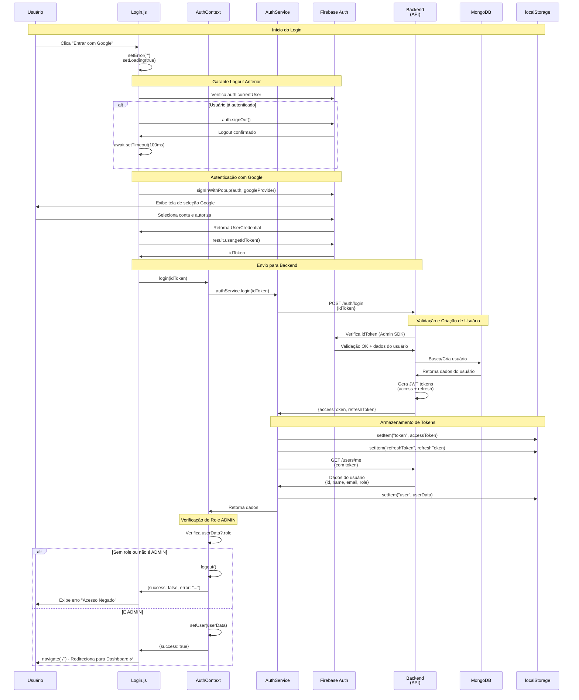
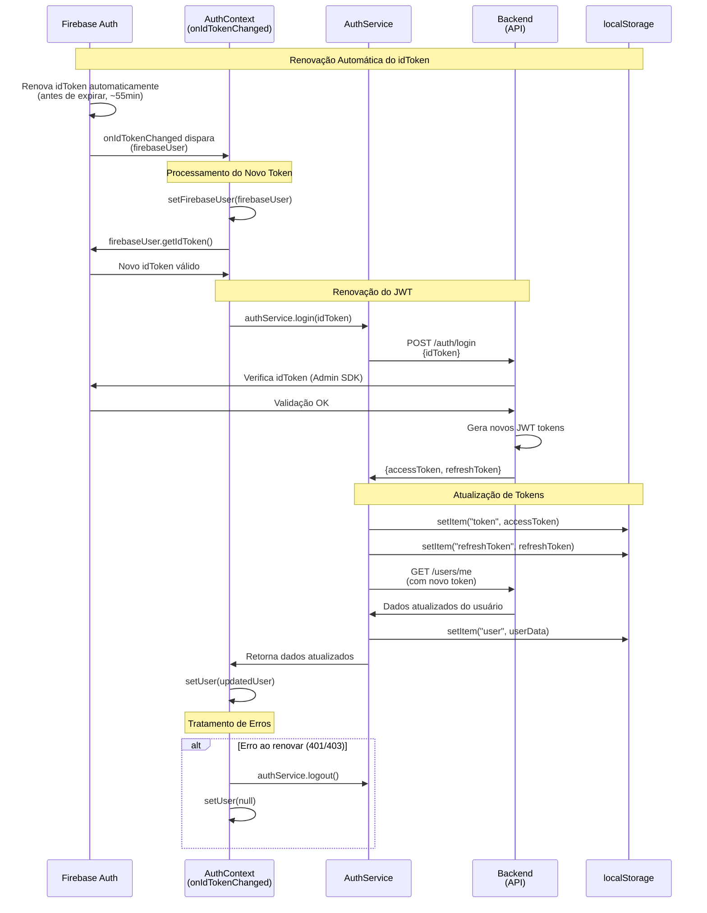
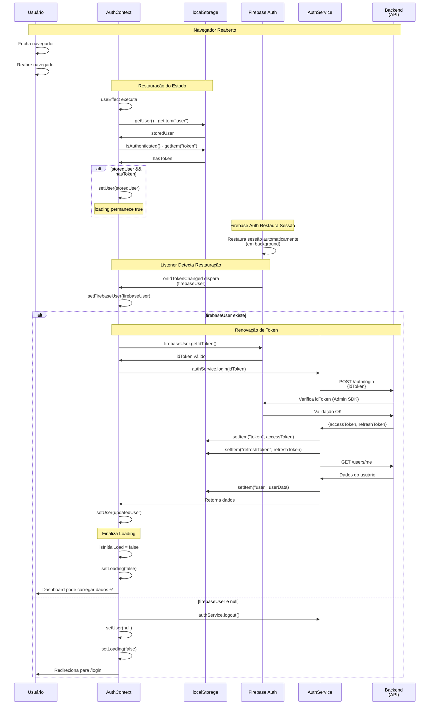
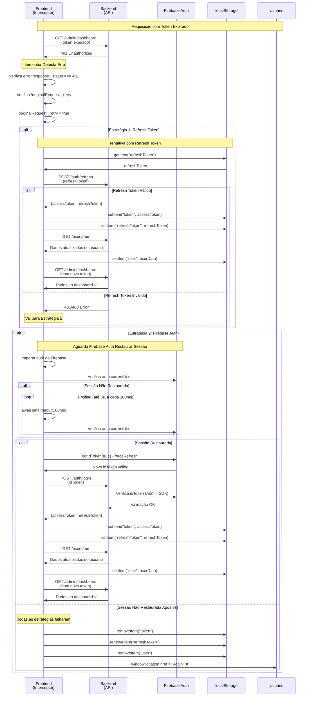
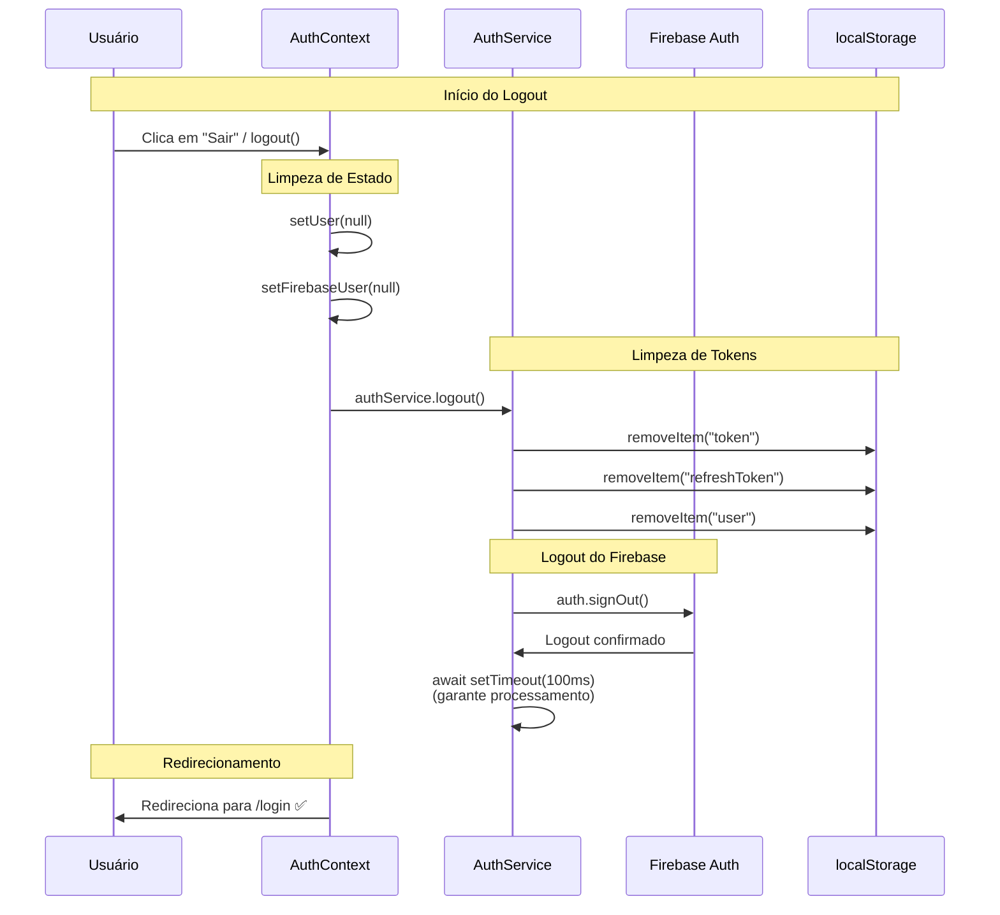

# Fluxo de Autenticação com Firebase

## 📑 Sumário

- [Visão Geral](#-visão-geral)
- [Arquitetura](#-arquitetura)
  - [Separação de Responsabilidades](#separação-de-responsabilidades)
  - [Segurança em Camadas](#segurança-em-camadas)
  - [Flexibilidade](#flexibilidade)
  - [Experiência do Usuário](#experiência-do-usuário)
- [Funcionalidades Implementadas](#-funcionalidades-implementadas)
  - [Renovação Automática de Tokens](#1-renovação-automática-de-tokens)
  - [Tratamento Inteligente de Erros 401](#2-tratamento-inteligente-de-erros-401)
  - [Logout Completo](#3-logout-completo)
  - [Sincronização de Estado](#4-sincronização-de-estado)
  - [Restauração de Sessão ao Reabrir Navegador](#5-restauração-de-sessão-ao-reabrir-navegador)
- [Considerações de Segurança](#-considerações-de-segurança)
  - [Boas Práticas Implementadas](#boas-práticas-implementadas)
  - [Pontos de Atenção](#pontos-de-atenção)
- [Configuração Necessária](#configuração-necessária)
  - [Backend](#backend)
  - [Frontend](#frontend)
- [Fluxos de Autenticação](#-fluxos-de-autenticação)
  - [Visão Geral dos Diagramas](#visão-geral-dos-diagramas)
  - [Diagrama de Sequência UML - Fluxo Completo](#diagrama-de-sequência-uml---fluxo-completo-de-autenticação)
  - [Diagramas UML Detalhados](#-diagramas-uml-detalhados)
    - [Login Inicial (Diagrama UML Detalhado)](#login-inicial-diagrama-uml-detalhado)
    - [Renovação Automática (Diagrama UML Detalhado)](#renovação-automática-diagrama-uml-detalhado)
    - [Restauração de Sessão (Diagrama UML Detalhado)](#restauração-de-sessão-diagrama-uml-detalhado)
    - [Tratamento de Erro 401 (Diagrama UML Detalhado)](#tratamento-de-erro-401-diagrama-uml-detalhado)
    - [Logout (Diagrama UML Detalhado)](#logout-diagrama-uml-detalhado)
  - [Diagramas ASCII Detalhados](#-diagramas-ascii-detalhados)
    - [Login Inicial (Diagrama ASCII)](#login-inicial-diagrama-ascii)
    - [Renovação Automática (onIdTokenChanged)](#renovação-automática-onidtokenchanged)
    - [Restauração de Sessão ao Reabrir Navegador](#restauração-de-sessão-ao-reabrir-navegador)
    - [Tratamento de Erro 401 (Interceptor de Resposta)](#tratamento-de-erro-401-interceptor-de-resposta)
- [Detalhes Técnicos](#-detalhes-técnicos)
  - [Entendendo Erros 401 em Detalhes](#entendendo-erros-401-em-detalhes)
  - [Interceptors do Axios](#interceptors-do-axios)
    - [Interceptor de Requisição (Request Interceptor)](#1-interceptor-de-requisição-request-interceptor)
    - [Interceptor de Resposta (Response Interceptor)](#2-interceptor-de-resposta-response-interceptor)
  - [Uso de `onIdTokenChanged`](#uso-de-onidtokenchanged)
  - [Gerenciamento de Estado](#gerenciamento-de-estado-na-implementação)
  - [Integração entre Interceptors e AuthContext](#integração-entre-interceptors-e-authcontext)
- [Detalhes de Implementação](#-detalhes-de-implementação)
  - [Variáveis de Estado](#variáveis-de-estado)
  - [Funções do Firebase](#funções-do-firebase)
  - [Bibliotecas Importadas](#bibliotecas-importadas)
  - [Uso do useEffect e Callbacks](#uso-do-useeffect-e-callbacks)
  - [Padrão Observer](#padrão-observer)
  - [Padrões de Projeto Utilizados](#padrões-de-projeto-utilizados)
  - [Gerenciamento de Estado na Implementação](#gerenciamento-de-estado-na-implementação)
  - [Tratamento de Erros](#tratamento-de-erros)
  - [Performance e Otimizações](#performance-e-otimizações)
  - [Considerações de Implementação](#considerações-de-implementação)
  - [Estrutura de Arquivos](#estrutura-de-arquivos)

---

## 📋 Visão Geral

Este documento descreve a implementação completa do sistema de autenticação usando Firebase Authentication e tokens JWT próprios.

### Fluxo Completo

1. **Usuário clica em "Entrar com Google"** no frontend
2. **Firebase autentica com Google** e retorna `idToken`
3. **Frontend envia `idToken`** para `/api/v1/auth/login`
4. **Backend valida o token** com Firebase Admin SDK
5. **Backend cria/atualiza usuário** no MongoDB
6. **Backend gera tokens JWT** (accessToken e refreshToken) e retorna ao frontend
7. **Frontend armazena os tokens** e usa para requisições autenticadas
8. **Renovação automática** de tokens quando necessário
9. **Tratamento inteligente** de erros 401 com retry automático
10. **Logout completo** do Firebase e limpeza de tokens

## 🎯 Arquitetura

### Separação de Responsabilidades

1. **Firebase Authentication**: Responsável pela autenticação OAuth com Google
2. **Backend**: Valida tokens e gerencia usuários no banco de dados
3. **Tokens JWT próprios**: Controlam o acesso às APIs

### Segurança em Camadas

- **ID token do Firebase**: Valida a identidade do usuário
- **Tokens JWT próprios**: Controlam o acesso às APIs
- **Refresh tokens**: Permitem renovação sem reautenticação

### Flexibilidade

- Backend não depende apenas do Firebase
- Pode adicionar outros provedores (Facebook, GitHub, etc.)
- Controle total sobre roles e permissões

### Experiência do Usuário

- Login rápido com Google
- Renovação automática de tokens
- Sessão persistente e transparente

## 🔄 Funcionalidades Implementadas

### 1. Renovação Automática de Tokens

O sistema implementa renovação automática de tokens por meio de múltiplas estratégias:

- **Listener `onIdTokenChanged`**: Detecta mudanças no ID token do Firebase (incluindo renovações automáticas)
- **Renovação automática dos tokens JWT**: Sempre que o Firebase renova o ID token, os tokens JWT são renovados automaticamente
- **Interceptor do Axios**: Tenta renovar os tokens JWT quando recebe erro 401

**Vantagens**:

- Mais eficiente que polling periódico, pois dispara automaticamente quando o token é renovado
- Sincronização perfeita entre Firebase Authentication e tokens JWT
- Transparente para o código da aplicação

### 2. Tratamento Inteligente de Erros 401

#### O que são Erros 401?

**HTTP 401 Unauthorized** é um código de status HTTP que indica que a requisição não foi autorizada. No contexto de autenticação, isso geralmente significa:

- **Token ausente**: A requisição não inclui um token de autenticação
- **Token inválido**: O token fornecido não é válido ou está malformado
- **Token expirado**: O token JWT expirou e precisa ser renovado
- **Token revogado**: O token foi invalidado (ex: após logout ou mudança de senha)
- **Credenciais insuficientes**: O token não possui as permissões necessárias para acessar o recurso

#### Por que Erros 401 Ocorrem?

No sistema implementado, erros 401 podem ocorrer em várias situações:

1. **Token JWT expirado**: Os tokens JWT têm um tempo de expiração (geralmente 15 minutos a 1 hora). Quando expiram, o backend rejeita as requisições com 401.

2. **Navegador reaberto**: Quando o usuário fecha e reabre o navegador, o token JWT pode ter expirado enquanto o navegador estava fechado.

3. **Sessão do Firebase expirada**: Se a sessão do Firebase Auth expirar, o `idToken` não pode ser renovado, e consequentemente o JWT também não pode ser renovado.

4. **Token inválido ou corrompido**: Se o token no `localStorage` estiver corrompido ou inválido, o backend rejeitará com 401.

5. **Logout em outra aba**: Se o usuário fizer logout em outra aba do navegador, o token pode ser invalidado.

#### Como o Sistema Trata Erros 401

O sistema trata erros 401 de forma inteligente, tentando múltiplas estratégias antes de falhar:

- Tenta renovar usando o `refreshToken` primeiro
- Se falhar, aguarda até 3 segundos para o Firebase Auth restaurar a sessão
- Tenta renovar o ID token do Firebase se a sessão for restaurada
- Redireciona para login apenas se todas as estratégias falharem

**Implementação**: Interceptor de resposta do Axios (`api.interceptors.response.use`) que intercepta todas as respostas de erro e trata especificamente erros 401. Veja detalhes na seção [Interceptors do Axios](#interceptors-do-axios).

**Vantagens**:

- Evita redirecionamento prematuro quando o navegador é reaberto
- Transparente para o código que faz requisições
- Resiliente a falhas temporárias

### 3. Logout Completo

O sistema implementa logout completo que:

- Faz logout do Firebase (`auth.signOut()`)
- Remove todos os tokens do localStorage
- Limpa estado do usuário

### 4. Sincronização de Estado

O sistema mantém sincronização automática entre Firebase Authentication e tokens JWT:

- `onIdTokenChanged` dispara sempre que o token muda, garantindo sincronização perfeita
- Se o Firebase faz logout mas os tokens JWT existem, limpa tudo
- Se o Firebase faz login mas não há tokens JWT, renova os tokens automaticamente

### 5. Restauração de Sessão ao Reabrir Navegador

O sistema restaura sessões de forma transparente quando o navegador é reaberto:

- `AuthContext` restaura o estado do `localStorage` imediatamente (para hot reload)
- Mantém `loading = true` até o Firebase Auth restaurar a sessão
- Quando o Firebase Auth restaura a sessão, `onIdTokenChanged` dispara automaticamente
- Renova os tokens JWT automaticamente usando o novo ID token
- O dashboard só carrega dados após `loading = false` (tokens já renovados)

**Vantagens**:

- Sessão é restaurada de forma transparente, sem erros para o usuário
- Não requer reautenticação ao reabrir o navegador
- Mantém estado durante hot reload em desenvolvimento

## 🔒 Considerações de Segurança

### Boas Práticas Implementadas

1. **Validação no backend**: Sempre valida o ID token no servidor
2. **Tokens JWT próprios**: Controle total sobre expiração e claims
3. **HTTPS obrigatório**: Tokens nunca trafegam em texto plano
4. **Refresh tokens**: Renovação sem expor credenciais
5. **Logout completo**: Limpa todas as sessões

### Pontos de Atenção

1. **Credenciais do Firebase**: Armazenar em variáveis de ambiente
2. **CORS**: Configurar corretamente no backend
3. **Rate limiting**: Implementar para prevenir abuso
4. **Validação de email**: Verificar se email está verificado no Firebase

## 🛠️ Configuração Necessária {#configura%C3%A7%C3%A3o-necess%C3%A1ria}

### Backend

```bash
export FIREBASE_CREDENTIALS_JSON='{"type":"service_account",...}'
```

### Frontend

```env
VITE_FIREBASE_API_KEY=...
VITE_FIREBASE_AUTH_DOMAIN=...
VITE_FIREBASE_PROJECT_ID=...
VITE_FIREBASE_STORAGE_BUCKET=...
VITE_FIREBASE_MESSAGING_SENDER_ID=...
VITE_FIREBASE_APP_ID=...
```

## 📊 Fluxos de Autenticação

### Visão Geral dos Diagramas

Este documento apresenta dois tipos complementares de diagramas:

1. **Diagrama de Sequência UML (Mermaid)**: Visão de alto nível mostrando todas as interações entre componentes do sistema
2. **Diagramas de Fluxo Detalhados (ASCII)**: Visão detalhada com código específico para cada fluxo crítico

**Quando usar cada um:**

- **Diagrama UML**: Para entender o fluxo geral e as interações entre componentes
- **Diagramas ASCII**: Para implementação, debug e referência rápida ao código

| Aspecto       | Diagrama UML                 | Diagramas ASCII               |
| ------------- | ---------------------------- | ----------------------------- |
| **Propósito** | Visão arquitetural           | Detalhamento técnico          |
| **Audiência** | Arquitetos, novos devs       | Desenvolvedores implementando |
| **Nível**     | Alto nível                   | Baixo nível (código)          |
| **Foco**      | Interações entre componentes | Implementação específica      |
| **Uso**       | Entender o sistema           | Implementar/debugar           |

### Diagrama de Sequência UML - Fluxo Completo de Autenticação

```mermaid
sequenceDiagram
    participant U as Usuário
    participant FE as Frontend<br/>(React)
    participant FA as Firebase Auth
    participant BE as Backend<br/>(API)
    participant DB as MongoDB

    Note over U,DB: 1. Login Inicial
    U->>FE: Clica "Entrar com Google"
    FE->>FA: signInWithPopup(googleProvider)
    FA->>U: Exibe tela de seleção Google
    U->>FA: Seleciona conta e autoriza
    FA->>FE: Retorna idToken
    FE->>BE: POST /auth/login {idToken}
    BE->>FA: Verifica idToken (Admin SDK)
    FA->>BE: Validação OK + dados do usuário
    BE->>DB: Busca/Cria usuário
    DB->>BE: Retorna dados do usuário
    BE->>BE: Gera JWT tokens (access + refresh)
    BE->>FE: {accessToken, refreshToken}
    FE->>FE: localStorage.setItem("token", accessToken)
    FE->>FE: localStorage.setItem("refreshToken", refreshToken)
    FE->>BE: GET /users/me (com token)
    BE->>FE: Dados do usuário {id, name, email, role}
    FE->>FE: localStorage.setItem("user", userData)
    FE->>U: Redireciona para Dashboard

    Note over U,DB: 2. Renovação Automática de Tokens
    FA->>FA: Renova idToken automaticamente (~55min)
    FA->>FE: onIdTokenChanged dispara
    FE->>FA: getIdToken()
    FA->>FE: Novo idToken
    FE->>BE: POST /auth/login {idToken}
    BE->>FA: Verifica idToken
    FA->>BE: Validação OK
    BE->>BE: Gera novos JWT tokens
    BE->>FE: {accessToken, refreshToken}
    FE->>FE: Atualiza tokens no localStorage
    FE->>BE: GET /users/me
    BE->>FE: Dados atualizados do usuário

    Note over U,DB: 3. Requisição com Token Válido
    U->>FE: Interage com aplicação
    FE->>FE: Interceptor adiciona token
    FE->>BE: GET /admin/dashboard<br/>(Authorization: Bearer token)
    BE->>BE: Valida JWT token
    BE->>FE: Dados do dashboard
    FE->>U: Exibe dados

    Note over U,DB: 4. Tratamento de Erro 401 - Token Expirado<br/>(Ver diagrama detalhado abaixo)
    FE->>BE: GET /admin/dashboard<br/>(token expirado)
    BE->>FE: 401 Unauthorized
    FE->>FE: Interceptor detecta 401
    FE->>FE: Verifica flag _retry

    alt Estratégia 1: Refresh Token
        FE->>BE: POST /auth/refresh {refreshToken}
        BE->>FE: {accessToken, refreshToken}
        FE->>FE: Atualiza tokens no localStorage
        FE->>BE: GET /users/me
        BE->>FE: Dados atualizados
        FE->>BE: GET /admin/dashboard<br/>(com novo token)
        BE->>FE: Dados do dashboard
    else Estratégia 2: Firebase Auth
        FE->>FE: Aguarda Firebase Auth (até 3s)
        FA->>FE: Sessão restaurada
        FE->>FA: getIdToken(true) - forceRefresh
        FA->>FE: Novo idToken
        FE->>BE: POST /auth/login {idToken}
        BE->>FA: Verifica idToken
        FA->>BE: Validação OK
        BE->>FE: {accessToken, refreshToken}
        FE->>FE: Atualiza tokens no localStorage
        FE->>BE: GET /users/me
        BE->>FE: Dados atualizados
        FE->>BE: GET /admin/dashboard<br/>(com novo token)
        BE->>FE: Dados do dashboard
    else Todas as estratégias falharam
        FE->>FE: Limpa localStorage
        FE->>U: Redireciona para /login
    end

    Note over U,DB: 5. Restauração de Sessão ao Reabrir Navegador
    U->>FE: Fecha navegador
    U->>FE: Reabre navegador
    FE->>FE: Restaura estado do localStorage
    FE->>FE: loading = true
    FA->>FA: Restaura sessão automaticamente
    FA->>FE: onIdTokenChanged dispara
    FE->>FA: getIdToken()
    FA->>FE: idToken válido
    FE->>BE: POST /auth/login {idToken}
    BE->>FA: Verifica idToken
    FA->>BE: Validação OK
    BE->>FE: {accessToken, refreshToken}
    FE->>FE: Atualiza tokens no localStorage
    FE->>BE: GET /users/me
    BE->>FE: Dados do usuário
    FE->>FE: loading = false
    FE->>U: Dashboard carrega dados

    Note over U,DB: 6. Logout
    U->>FE: Clica em "Sair"
    FE->>FE: Limpa localStorage (tokens, user)
    FE->>FA: auth.signOut()
    FA->>FE: Logout confirmado
    FE->>U: Redireciona para /login
```



### Legenda do Diagrama

- **Usuário**: Pessoa usando a aplicação
- **Frontend (React)**: Aplicação React com AuthContext e interceptors
- **Firebase Auth**: Serviço de autenticação do Firebase
- **Backend (API)**: API REST que valida tokens e gerencia usuários
- **MongoDB**: Banco de dados onde os usuários são armazenados

### Fluxos Representados

1. **[Login Inicial](#login-inicial-diagrama-uml-detalhado)**: Fluxo completo desde o clique até o armazenamento dos tokens
2. **[Renovação Automática](#renovação-automática-diagrama-uml-detalhado)**: Como os tokens são renovados automaticamente
3. **Requisição com Token Válido**: Fluxo normal de uma requisição autenticada
4. **[Tratamento de Erro 401](#tratamento-de-erro-401-diagrama-uml-detalhado)**: Estratégias de recuperação quando o token expira
5. **[Restauração de Sessão](#restauração-de-sessão-diagrama-uml-detalhado)**: Como a sessão é restaurada ao reabrir o navegador
6. **[Logout](#logout-diagrama-uml-detalhado)**: Processo completo de logout

---

## 📋 Diagramas UML Detalhados

### Login Inicial (Diagrama UML Detalhado)



**Referências:**

- Ver também: [Diagrama ASCII do Login Inicial](#login-inicial-diagrama-ascii)
- Código fonte: `Login.js:25-59`, `AuthContext.js:92-137`, `api.js:147-162`

### Renovação Automática (Diagrama UML Detalhado)



**Referências:**

- Ver também: [Diagrama ASCII da Renovação Automática](#renovação-automática-onidtokenchanged)
- Código fonte: `AuthContext.js:43-72`, `api.js:147-162`

### Restauração de Sessão (Diagrama UML Detalhado)



**Referências:**

- Ver também: [Diagrama ASCII da Restauração de Sessão](#restauração-de-sessão-ao-reabrir-navegador)
- Código fonte: `AuthContext.js:27-84`

### Tratamento de Erro 401 (Diagrama UML Detalhado)



**Referências:**

- Ver também: [Diagrama ASCII detalhado do Tratamento de Erro 401](#tratamento-de-erro-401-interceptor-de-resposta)
- Código fonte: `api.js:27-120`

### Logout (Diagrama UML Detalhado)



**Referências:**

- Código fonte: `AuthContext.js:139-145`, `api.js:166-182`

---

## 📝 Diagramas ASCII Detalhados

### Login Inicial (Diagrama ASCII)

```
┌─────────────────────────────────────────────────────────┐
│  Usuário clica "Entrar com Google"                     │
│                                                          │
│  Código: Login.js:25-27                                  │
│  const handleGoogleSignIn = async () => {               │
│    setError("");                                        │
│    setLoading(true);                                     │
│  }                                                       │
└─────────────────────────────────────────────────────────┘
                    │
                    ▼
┌─────────────────────────────────────────────────────────┐
│  Garante logout anterior (força seleção de conta)       │
│                                                          │
│  Código: Login.js:32-36                                  │
│  if (auth.currentUser) {                                │
│    await auth.signOut();                                │
│    await new Promise(resolve =>                         │
│      setTimeout(resolve, 100));                          │
│  }                                                       │
└─────────────────────────────────────────────────────────┘
                    │
                    ▼
┌─────────────────────────────────────────────────────────┐
│  Faz login com Google via Firebase                      │
│                                                          │
│  Código: Login.js:40-41                                  │
│  const result = await signInWithPopup(                   │
│    auth, googleProvider);                                │
│  const idToken = await result.user.getIdToken();        │
└─────────────────────────────────────────────────────────┘
                    │
                    ▼
┌─────────────────────────────────────────────────────────┐
│  Envia idToken para AuthContext                         │
│                                                          │
│  Código: Login.js:44                                     │
│  const loginResult = await login(idToken);              │
│                                                          │
│  AuthContext.js:92-94                                    │
│  const login = async idToken => {                        │
│    const data = await authService.login(idToken);      │
│  }                                                       │
└─────────────────────────────────────────────────────────┘
                    │
                    ▼
┌─────────────────────────────────────────────────────────┐
│  AuthService envia para backend                         │
│                                                          │
│  Código: api.js:148                                      │
│  const response = await axios.post(                      │
│    `${API_BASE_URL}/auth/login`,                        │
│    { idToken }                                           │
│  );                                                      │
└─────────────────────────────────────────────────────────┘
                    │
                    ▼
┌─────────────────────────────────────────────────────────┐
│  Backend valida idToken e retorna JWT tokens            │
│  (Backend: AuthController.java)                          │
└─────────────────────────────────────────────────────────┘
                    │
                    ▼
┌─────────────────────────────────────────────────────────┐
│  Frontend armazena tokens no localStorage                │
│                                                          │
│  Código: api.js:154-156                                  │
│  localStorage.setItem("token",                            │
│    response.data.accessToken);                           │
│  localStorage.setItem("refreshToken",                     │
│    response.data.refreshToken);                          │
└─────────────────────────────────────────────────────────┘
                    │
                    ▼
┌─────────────────────────────────────────────────────────┐
│  Busca dados do usuário                                 │
│                                                          │
│  Código: api.js:161-162                                  │
│  const userResponse = await api.get(                     │
│    `${API_BASE_URL}/users/me`);                          │
│  localStorage.setItem("user",                             │
│    JSON.stringify(userResponse.data));                    │
└─────────────────────────────────────────────────────────┘
                    │
                    ▼
┌─────────────────────────────────────────────────────────┐
│  AuthContext verifica role ADMIN                        │
│                                                          │
│  Código: AuthContext.js:100-126                          │
│  if (!userData?.role) {                                  │
│    await logout();                                       │
│    return { success: false, error: "..." };              │
│  }                                                       │
│  const isAdmin = roles.includes("ADMIN");                │
│  if (!isAdmin) {                                         │
│    await logout();                                       │
│    return { success: false, error: "..." };              │
│  }                                                       │
└─────────────────────────────────────────────────────────┘
                    │
                    ├─ Não é ADMIN ──► Logout e erro
                    │
                    └─ É ADMIN
                           │
                           ▼
┌─────────────────────────────────────────────────────────┐
│  Redireciona para Dashboard                             │
│                                                          │
│  Código: Login.js:47-49                                  │
│  if (loginResult.success) {                             │
│    navigate("/");                                       │
│  }                                                       │
└─────────────────────────────────────────────────────────┘
```

**Referências:**

- Ver também: [Diagrama UML Detalhado do Login Inicial](#login-inicial-diagrama-uml-detalhado)
- Código fonte: `Login.js:25-59`, `AuthContext.js:92-137`, `api.js:147-162`

### Renovação Automática (onIdTokenChanged)

**Referências:**

- Ver também: [Diagrama UML Detalhado da Renovação Automática](#renovação-automática-diagrama-uml-detalhado)
- Código fonte: `AuthContext.js:43-72`

```
┌─────────────────────────────────────────────────────────┐
│  Firebase renova idToken automaticamente                │
│  (antes de expirar, ~55 minutos)                       │
└─────────────────────────────────────────────────────────┘
                    │
                    ▼
┌─────────────────────────────────────────────────────────┐
│  onIdTokenChanged dispara automaticamente                │
│                                                          │
│  Código: AuthContext.js:43                              │
│  const unsubscribe = onIdTokenChanged(auth, async      │
│    firebaseUser => { ... })                             │
└─────────────────────────────────────────────────────────┘
                    │
                    ▼
┌─────────────────────────────────────────────────────────┐
│  Frontend obtém novo idToken                            │
│                                                          │
│  Código: AuthContext.js:52                              │
│  const idToken = await firebaseUser.getIdToken();      │
└─────────────────────────────────────────────────────────┘
                    │
                    ▼
┌─────────────────────────────────────────────────────────┐
│  Envia para /auth/login                                 │
│                                                          │
│  Código: AuthContext.js:53                               │
│  await authService.login(idToken);                      │
│                                                          │
│  api.js:134                                             │
│  const response = await axios.post(                     │
│    `${API_BASE_URL}/auth/login`,                        │
│    { idToken }                                          │
│  );                                                      │
└─────────────────────────────────────────────────────────┘
                    │
                    ▼
┌─────────────────────────────────────────────────────────┐
│  Backend valida e retorna novos JWT tokens             │
│  (Backend: AuthController.java)                         │
└─────────────────────────────────────────────────────────┘
                    │
                    ▼
┌─────────────────────────────────────────────────────────┐
│  Frontend armazena novos tokens                         │
│                                                          │
│  Código: api.js:140-142                                 │
│  localStorage.setItem("token",                          │
│    response.data.accessToken);                          │
│  localStorage.setItem("refreshToken",                   │
│    response.data.refreshToken);                          │
│                                                          │
│  api.js:147-150                                         │
│  const userResponse = await api.get(                     │
│    `${API_BASE_URL}/users/me`);                         │
│  localStorage.setItem("user",                           │
│    JSON.stringify(userResponse.data));                    │
└─────────────────────────────────────────────────────────┘
```

### Restauração de Sessão ao Reabrir Navegador

**Referências:**

- Ver também: [Diagrama UML Detalhado da Restauração de Sessão](#restauração-de-sessão-diagrama-uml-detalhado)
- Código fonte: `AuthContext.js:27-84`

```
┌─────────────────────────────────────────────────────────┐
│  Navegador é reaberto                                   │
│  (Evento do navegador)                                  │
└─────────────────────────────────────────────────────────┘
                    │
                    ▼
┌─────────────────────────────────────────────────────────┐
│  AuthContext restaura estado do localStorage            │
│  (mantém loading = true)                                │
│                                                          │
│  Código: AuthContext.js:32-38                           │
│  const storedUser = authService.getUser();              │
│  const hasToken = authService.isAuthenticated();       │
│  if (storedUser && hasToken) {                          │
│    setUser(storedUser);                                 │
│    // Não define loading = false ainda                  │
│  }                                                       │
└─────────────────────────────────────────────────────────┘
                    │
                    ▼
┌─────────────────────────────────────────────────────────┐
│  Firebase Auth restaura sessão                          │
│  (Automático do Firebase)                               │
└─────────────────────────────────────────────────────────┘
                    │
                    ▼
┌─────────────────────────────────────────────────────────┐
│  onIdTokenChanged dispara com firebaseUser              │
│                                                          │
│  Código: AuthContext.js:43-44                           │
│  const unsubscribe = onIdTokenChanged(auth,             │
│    async firebaseUser => {                              │
│      setFirebaseUser(firebaseUser);                     │
│      if (firebaseUser) { ... }                          │
│    });                                                  │
└─────────────────────────────────────────────────────────┘
                    │
                    ▼
┌─────────────────────────────────────────────────────────┐
│  Renova token JWT usando novo idToken                   │
│                                                          │
│  Código: AuthContext.js:51-57                           │
│  const idToken = await firebaseUser.getIdToken();      │
│  await authService.login(idToken);                      │
│  const updatedUser = authService.getUser();             │
│  if (updatedUser) {                                      │
│    setUser(updatedUser);                                │
│  }                                                       │
└─────────────────────────────────────────────────────────┘
                    │
                    ▼
┌─────────────────────────────────────────────────────────┐
│  loading = false (Dashboard pode carregar dados)       │
│                                                          │
│  Código: AuthContext.js:68-72                           │
│  if (isInitialLoad) {                                   │
│    isInitialLoad = false;                               │
│    setLoading(false);                                    │
│  }                                                       │
└─────────────────────────────────────────────────────────┘
```

### Tratamento de Erro 401 (Interceptor de Resposta)

**Referências:**

- Ver também: [Diagrama UML Detalhado do Tratamento de Erro 401](#tratamento-de-erro-401-diagrama-uml-detalhado)
- Código fonte: `api.js:27-120`

```
┌─────────────────────────────────────────────────────────┐
│  Requisição recebe 401 (token expirado)                 │
│  (Resposta do servidor)                                 │
└─────────────────────────────────────────────────────────┘
                    │
                    ▼
┌─────────────────────────────────────────────────────────┐
│  Interceptor de resposta detecta erro 401               │
│  (api.interceptors.response.use)                       │
│                                                          │
│  Código: api.js:27-29                                    │
│  api.interceptors.response.use(                         │
│    response => response,                                │
│    async error => { ... }                               │
│  );                                                      │
└─────────────────────────────────────────────────────────┘
                    │
                    ▼
┌─────────────────────────────────────────────────────────┐
│  Verifica flag _retry (evita loops)                     │
│                                                          │
│  Código: api.js:33-34                                    │
│  if (error.response?.status === 401 &&                 │
│      !originalRequest._retry) {                         │
│    originalRequest._retry = true;                       │
│  }                                                       │
└─────────────────────────────────────────────────────────┘
                    │
                    ▼
┌─────────────────────────────────────────────────────────┐
│  Estratégia 1: Tenta renovar com refreshToken            │
│  POST /auth/refresh                                      │
│                                                          │
│  Código: api.js:37-42                                    │
│  const refreshToken = localStorage.getItem(              │
│    "refreshToken");                                      │
│  if (refreshToken) {                                     │
│    const response = await axios.post(                   │
│      `${API_BASE_URL}/auth/refresh`,                    │
│      { refreshToken }                                    │
│    );                                                    │
│  }                                                       │
└─────────────────────────────────────────────────────────┘
                    │
                    ├─ Sucesso
                    │       │
                    │       ▼
                    │  Salva novos tokens no localStorage
                    │
                    │  Código: api.js:46-47                │
                    │  localStorage.setItem("token",       │
                    │    response.data.accessToken);       │
                    │  localStorage.setItem("refreshToken",│
                    │    response.data.refreshToken);      │
                    │       │
                    │       ▼
                    │  Busca dados atualizados (/users/me)
                    │
                    │  Código: api.js:50-54                │
                    │  const userResponse = await api.get( │
                    │    `${API_BASE_URL}/users/me`);      │
                    │  localStorage.setItem("user",        │
                    │    JSON.stringify(userResponse.data));│
                    │       │
                    │       ▼
                    │  Repete requisição original
                    │
                    │  Código: api.js:60-61                │
                    │  originalRequest.headers.Authorization│
                    │    = `Bearer ${response.data.accessToken}`;│
                    │  return api(originalRequest);        │
                    │       │
                    │       └─► Retorna dados normalmente
                    │
                    └─ Falha
                           │
                           ▼
┌─────────────────────────────────────────────────────────┐
│  Estratégia 2: Aguarda Firebase Auth (até 3s)           │
│  Polling a cada 100ms                                   │
│                                                          │
│  Código: api.js:65-79                                    │
│  const { auth } = await import(                         │
│    "../config/firebase.js");                            │
│  let currentUser = auth.currentUser;                    │
│  if (!currentUser) {                                     │
│    const maxWait = 3000; // 3 segundos                  │
│    const checkInterval = 100; // 100ms                  │
│    let waited = 0;                                       │
│    while (!currentUser && waited < maxWait) {           │
│      await new Promise(resolve =>                       │
│        setTimeout(resolve, checkInterval));              │
│      currentUser = auth.currentUser;                     │
│      waited += checkInterval;                            │
│    }                                                     │
│  }                                                       │
└─────────────────────────────────────────────────────────┘
                    │
                    ├─ Sessão restaurada (auth.currentUser)
                    │       │
                    │       ▼
                    │  Obtém novo idToken (forceRefresh)
                    │
                    │  Código: api.js:84                    │
                    │  const newIdToken = await            │
                    │    currentUser.getIdToken(true);     │
                    │       │
                    │       ▼
                    │  POST /auth/login com novo idToken
                    │
                    │  Código: api.js:85-87                │
                    │  const loginResponse = await         │
                    │    axios.post(`${API_BASE_URL}/auth/login`,│
                    │      { idToken: newIdToken });       │
                    │       │
                    │       ▼
                    │  Salva novos tokens no localStorage
                    │
                    │  Código: api.js:91-92                │
                    │  localStorage.setItem("token",       │
                    │    loginResponse.data.accessToken);  │
                    │  localStorage.setItem("refreshToken",│
                    │    loginResponse.data.refreshToken); │
                    │       │
                    │       ▼
                    │  Busca dados atualizados (/users/me)
                    │
                    │  Código: api.js:96-99                │
                    │  const userResponse = await api.get( │
                    │    `${API_BASE_URL}/users/me`);      │
                    │  localStorage.setItem("user",        │
                    │    JSON.stringify(userResponse.data));│
                    │       │
                    │       ▼
                    │  Repete requisição original
                    │
                    │  Código: api.js:104-105               │
                    │  originalRequest.headers.Authorization│
                    │    = `Bearer ${loginResponse.data.accessToken}`;│
                    │  return api(originalRequest);        │
                    │       │
                    │       └─► Retorna dados normalmente
                    │
                    └─ Sem sessão após 3s
                           │
                           ▼
┌─────────────────────────────────────────────────────────┐
│  Limpa tokens do localStorage                            │
│  (token, refreshToken, user)                            │
│                                                          │
│  Código: api.js:109-111 ou 116-118                       │
│  localStorage.removeItem("token");                      │
│  localStorage.removeItem("refreshToken");               │
│  localStorage.removeItem("user");                       │
└─────────────────────────────────────────────────────────┘
                    │
                    ▼
┌─────────────────────────────────────────────────────────┐
│  Redireciona para /login                                 │
│                                                          │
│  Código: api.js:112 ou 119                               │
│  window.location.href = "/login";                        │
└─────────────────────────────────────────────────────────┘
```

## 🔧 Detalhes Técnicos

<a id="gerenciamento-de-estado"></a>

### Entendendo Erros 401 em Detalhes

#### Cenários Comuns de Erro 401

**Cenário 1: Token Expirado Durante Uso Normal**

```
Usuário está usando a aplicação
    │
    ▼
Token JWT expira (após 15min-1h)
    │
    ▼
Próxima requisição recebe 401
    │
    ▼
Interceptor detecta 401
    │
    ▼
Renova token com refreshToken
    │
    ▼
Repete requisição com novo token
    │
    ▼
Requisição bem-sucedida (usuário não percebe)
```

**Cenário 2: Navegador Reaberto**

```
Usuário fecha navegador
    │
    ▼
Token JWT expira enquanto navegador está fechado
    │
    ▼
Usuário reabre navegador
    │
    ▼
Dashboard tenta carregar dados
    │
    ▼
Requisição recebe 401 (token expirado)
    │
    ▼
Interceptor aguarda Firebase Auth restaurar sessão (até 3s)
    │
    ▼
Firebase Auth restaura sessão
    │
    ▼
Obtém novo idToken e renova JWT
    │
    ▼
Repete requisição com novo token
    │
    ▼
Requisição bem-sucedida
```

**Cenário 3: Sessão do Firebase Expirada**

```
Token JWT expira
    │
    ▼
Interceptor tenta renovar com refreshToken
    │
    ▼
RefreshToken também expirado ou inválido
    │
    ▼
Tenta renovar com Firebase Auth
    │
    ▼
Firebase Auth não consegue restaurar sessão
    │
    ▼
Todas as estratégias falharam
    │
    ▼
Limpa tokens e redireciona para login
```

#### Estratégias de Recuperação

O sistema implementa uma hierarquia de estratégias para recuperar de erros 401:

1. **Estratégia 1: Refresh Token** (Mais rápida e eficiente)

   - Usa o `refreshToken` armazenado para obter novos tokens
   - Não requer interação do usuário
   - Funciona mesmo se o navegador foi fechado (se o refreshToken ainda for válido)

2. **Estratégia 2: Firebase Auth** (Fallback inteligente)

   - Aguarda o Firebase Auth restaurar a sessão automaticamente
   - Útil quando o navegador é reaberto
   - Obtém novo `idToken` e faz login novamente

3. **Estratégia 3: Redirecionamento** (Último recurso)
   - Apenas quando todas as estratégias falharam
   - Limpa todos os tokens
   - Redireciona para página de login

#### Prevenção de Loops Infinitos

O sistema usa uma flag `_retry` para prevenir tentativas infinitas de renovação:

```javascript
if (error.response?.status === 401 && !originalRequest._retry) {
	originalRequest._retry = true; // Marca que já tentou renovar
	// ... tenta renovar token
}
```

Isso garante que:

- Cada requisição que recebe 401 só tenta renovar uma vez
- Se a renovação falhar, a requisição é rejeitada normalmente
- Evita loops infinitos de tentativas de renovação

### Interceptors do Axios

O sistema utiliza dois interceptors do Axios para gerenciar automaticamente a autenticação em todas as requisições HTTP:

#### 1. Interceptor de Requisição (Request Interceptor)

**Localização**: `frontend/admin-dashboard/src/services/api.js:12`

**Função**: Adiciona automaticamente o token JWT no header `Authorization` de todas as requisições HTTP.

**Implementação**:

```javascript
api.interceptors.request.use(
	config => {
		const token = localStorage.getItem("token");
		if (token) {
			config.headers.Authorization = `Bearer ${token}`;
		}
		return config;
	},
	error => {
		return Promise.reject(error);
	}
);
```

**Como funciona**:

1. **Intercepta todas as requisições** antes de serem enviadas ao servidor
2. **Lê o token JWT** do `localStorage` (chave `"token"`)
3. **Adiciona o header `Authorization`** com o formato `Bearer {token}` se o token existir
4. **Retorna a configuração modificada** para que a requisição seja enviada com o token

**Vantagens**:

- ✅ **Automático**: Não é necessário adicionar o token manualmente em cada requisição
- ✅ **Centralizado**: Toda a lógica de autenticação fica em um único lugar
- ✅ **Transparente**: Os serviços não precisam se preocupar com tokens
- ✅ **Consistente**: Garante que todas as requisições autenticadas incluam o token

**Exemplo de uso**:

```javascript
// Sem o interceptor, seria necessário:
const response = await axios.get("/api/users/me", {
	headers: {
		Authorization: `Bearer ${localStorage.getItem("token")}`,
	},
});

// Com o interceptor, basta:
const response = await api.get("/api/users/me");
// O token é adicionado automaticamente!
```

#### 2. Interceptor de Resposta (Response Interceptor)

**Localização**: `frontend/admin-dashboard/src/services/api.js:26`

**Função**: Intercepta erros de resposta (especialmente 401) e tenta renovar tokens automaticamente antes de falhar.

**Implementação**:

```javascript
api.interceptors.response.use(
	response => response,
	async error => {
		const originalRequest = error.config;

		// Se receber 401 e não for uma tentativa de refresh
		if (error.response?.status === 401 && !originalRequest._retry) {
			originalRequest._retry = true;

			// Estratégia 1: Tenta renovar com refreshToken
			const refreshToken = localStorage.getItem("refreshToken");
			if (refreshToken) {
				try {
					const response = await axios.post(`${API_BASE_URL}/auth/refresh`, {
						refreshToken,
					});

					if (response.data.accessToken) {
						// Salva novos tokens e repete a requisição original
						localStorage.setItem("token", response.data.accessToken);
						localStorage.setItem("refreshToken", response.data.refreshToken);
						originalRequest.headers.Authorization = `Bearer ${response.data.accessToken}`;
						return api(originalRequest);
					}
				} catch (refreshError) {
					// Estratégia 2: Se refreshToken falhar, tenta com Firebase
					// ... (aguarda Firebase Auth restaurar sessão)
				}
			}
		}

		return Promise.reject(error);
	}
);
```

**Fluxo de tratamento de erro 401**:

1. **Detecta erro 401**: Intercepta qualquer resposta com status 401 (Unauthorized)
2. **Verifica se já tentou renovar**: Usa a flag `_retry` para evitar loops infinitos
3. **Estratégia 1 - Refresh Token**:
   - Tenta renovar usando o `refreshToken` armazenado
   - Se bem-sucedido, salva novos tokens e repete a requisição original
   - Se falhar, vai para a Estratégia 2
4. **Estratégia 2 - Firebase Auth**:
   - Aguarda até 3 segundos para o Firebase Auth restaurar a sessão
   - Verifica a cada 100ms se `auth.currentUser` está disponível
   - Se a sessão for restaurada, obtém novo ID token e faz login novamente
   - Se bem-sucedido, salva novos tokens e repete a requisição original
5. **Último recurso**: Se todas as estratégias falharem, limpa os tokens e redireciona para login

**Detalhes da implementação**:

- **Flag `_retry`**: Previne tentativas múltiplas de renovação na mesma requisição
- **Aguarda Firebase Auth**: Implementa um polling de até 3 segundos (verifica a cada 100ms) para aguardar o Firebase Auth restaurar a sessão quando o navegador é reaberto
- **Atualização de dados do usuário**: Após renovar os tokens, busca dados atualizados do usuário via `/users/me`
- **Repetição transparente**: Repete a requisição original automaticamente com o novo token, sem que o código que fez a requisição perceba

**Vantagens**:

- ✅ **Transparente**: O código que faz requisições não precisa tratar erros 401
- ✅ **Resiliente**: Tenta múltiplas estratégias antes de falhar
- ✅ **Inteligente**: Aguarda Firebase Auth restaurar sessão ao invés de redirecionar imediatamente
- ✅ **Atualiza dados**: Busca dados atualizados do usuário após renovar tokens
- ✅ **Previne loops**: Usa flag `_retry` para evitar tentativas infinitas

**Exemplo de uso**:

```javascript
// O código simplesmente faz a requisição:
try {
	const data = await api.get("/api/admin/dashboard");
	// Se o token expirou, o interceptor:
	// 1. Detecta o 401
	// 2. Renova o token automaticamente
	// 3. Repete a requisição
	// 4. Retorna os dados normalmente
	console.log(data);
} catch (error) {
	// Só chega aqui se todas as estratégias de renovação falharem
	console.error("Erro ao carregar dashboard:", error);
}
```

**Casos de uso**:

1. **Token expirado durante uso normal**: Refresh token renova automaticamente
2. **Navegador reaberto**: Aguarda Firebase Auth restaurar sessão antes de renovar
3. **Sessão do Firebase expirada**: Redireciona para login apenas como último recurso

### Uso de `onIdTokenChanged`

O sistema utiliza `onIdTokenChanged` para detectar mudanças no ID token do Firebase:

- **`onAuthStateChanged`**: Dispara apenas quando o usuário faz login ou logout (mudança de estado)
- **`onIdTokenChanged`**: Dispara sempre que o ID token muda, incluindo renovações automáticas do Firebase

**Vantagens de `onIdTokenChanged`**:

- ✅ Mais eficiente: não precisa de `setInterval` para verificar periodicamente
- ✅ Mais preciso: dispara exatamente quando o token é renovado
- ✅ Mais simples: menos código, menos pontos de falha
- ✅ Segue práticas recomendadas do Firebase

<a id="gerenciamento-de-estado"></a>

### Variáveis Compartilhadas via Context API

O `AuthContext` gerencia três estados principais:

1. **`user`**: Dados do usuário do backend (armazenado no `localStorage`)
2. **`firebaseUser`**: Objeto do Firebase Auth (apenas em memória)
3. **`loading`**: Estado de carregamento inicial

**Fluxo de inicialização**:

1. Restaura `user` do `localStorage` imediatamente (para hot reload)
2. Mantém `loading = true` até o Firebase Auth restaurar a sessão
3. Quando `onIdTokenChanged` dispara, renova os tokens JWT
4. Define `loading = false` apenas após renovação bem-sucedida

### Integração entre Interceptors e AuthContext

Os interceptors do Axios trabalham em conjunto com o `AuthContext` para fornecer uma experiência de autenticação transparente:

**Request Interceptor**:

- Lê o token do `localStorage` (que é atualizado pelo `AuthContext`)
- Adiciona automaticamente em todas as requisições

**Response Interceptor**:

- Detecta quando tokens expiram (erro 401)
- Renova tokens usando as mesmas estratégias do `AuthContext`
- Atualiza `localStorage` (que é lido pelo `AuthContext`)

**AuthContext**:

- Gerencia o estado de autenticação da aplicação
- Renova os tokens proativamente via `onIdTokenChanged`
- Sincroniza o estado do Firebase com os tokens JWT

**Fluxo colaborativo**:

```
AuthContext (onIdTokenChanged)
    │
    ├─► Renova token JWT proativamente
    │   └─► Atualiza localStorage
    │
    └─► Request Interceptor
            │
            └─► Lê token do localStorage
                └─► Adiciona em requisições

Requisição HTTP
    │
    ├─► Sucesso ──► Retorna dados
    │
    └─► Erro 401 ──► Response Interceptor
                        │
                        ├─► Renova token
                        │   └─► Atualiza localStorage
                        │
                        └─► Repete requisição
                            └─► Retorna dados
```

Esta arquitetura garante que:

- Os tokens são renovados proativamente (via `AuthContext`)
- Os tokens são renovados reativamente quando necessário (via `Response Interceptor`)
- Tudo funciona de forma transparente para o código da aplicação

---

## 💻 Detalhes de Implementação

Esta seção descreve os detalhes técnicos da implementação, incluindo variáveis de estado, funções do Firebase, bibliotecas utilizadas, hooks do React e padrões de projeto aplicados.

### Variáveis de Estado

O sistema utiliza múltiplas variáveis de estado gerenciadas em diferentes camadas:

#### AuthContext (`AuthContext.js`)

```javascript
const [user, setUser] = useState(null); // Dados do usuário do backend
const [loading, setLoading] = useState(true); // Estado de carregamento inicial
const [firebaseUser, setFirebaseUser] = useState(null); // Objeto Firebase Auth
```

**Descrição das variáveis:**

1. **`user`** (tipo: `Object | null`)

   - **Armazenamento**: `localStorage` (chave: `"user"`)
   - **Conteúdo**: Dados do usuário do backend `{id, name, email, role, status}`
   - **Atualização**: Atualizado após login, renovação de token e busca de dados
   - **Uso**: Verificação de autenticação, exibição de informações do usuário, verificação de roles

2. **`loading`** (tipo: `boolean`)

   - **Armazenamento**: Apenas em memória (React state)
   - **Inicial**: `true` (aguarda Firebase Auth restaurar sessão)
   - **Final**: `false` (após Firebase Auth restaurar sessão e renovar token)
   - **Uso**: Controla exibição de loading spinner, previne requisições antes da autenticação estar pronta

3. **`firebaseUser`** (tipo: `User | null`)
   - **Armazenamento**: Apenas em memória (React state)
   - **Conteúdo**: Objeto `User` do Firebase Auth
   - **Atualização**: Atualizado pelo listener `onIdTokenChanged`
   - **Uso**: Obter `idToken`, verificar estado de autenticação do Firebase

#### localStorage (Persistência)

```javascript
localStorage.getItem("token"); // JWT accessToken
localStorage.getItem("refreshToken"); // JWT refreshToken
localStorage.getItem("user"); // Dados do usuário (JSON string)
```

**Estrutura de dados:**

- **`token`**: String JWT para autenticação nas requisições
- **`refreshToken`**: String JWT para renovar o accessToken
- **`user`**: JSON string contendo `{id, name, email, role, status}`

### Funções do Firebase

O sistema utiliza as seguintes funções e APIs do Firebase Authentication:

#### 1. `onIdTokenChanged(auth, callback)`

**Localização**: `AuthContext.js:43`

```javascript
const unsubscribe = onIdTokenChanged(auth, async firebaseUser => {
	// Callback executado sempre que o ID token muda
});
```

**Comportamento:**

- **Observer Pattern**: Implementa o padrão Observer do Firebase
- **Dispara quando**: O ID token é renovado, o usuário faz login ou logout, ou a sessão é restaurada
- **Retorna**: Função `unsubscribe` para cancelar o listener
- **Vantagem**: Mais eficiente que `onAuthStateChanged` + `setInterval`, pois dispara automaticamente

**Uso no código:**

- Renovação automática dos tokens JWT
- Detecção de logout do Firebase
- Restauração de sessão ao reabrir o navegador

#### 2. `signInWithPopup(auth, provider)`

**Localização**: `Login.js:40`

```javascript
const result = await signInWithPopup(auth, googleProvider);
```

**Comportamento:**

- Abre popup do Google para autenticação
- Retorna `UserCredential` com objeto `user`
- Configurado com `prompt: 'select_account'` para forçar seleção de conta

**Retorno:**

- `result.user`: Objeto `User` do Firebase
- `result.user.getIdToken()`: Método para obter o ID token

#### 3. `getIdToken(forceRefresh?)`

**Localização**: `AuthContext.js:52`, `api.js:84`

```javascript
const idToken = await firebaseUser.getIdToken(); // Obtém token atual
const idToken = await firebaseUser.getIdToken(true); // Força renovação
```

**Comportamento:**

- **Sem parâmetro**: Retorna token em cache se válido, ou renova automaticamente se expirado
- **Com `true`**: Força renovação do token mesmo se ainda válido
- **Retorno**: Promise que resolve com string do ID token

**Uso:**

- Login inicial: `getIdToken()` após `signInWithPopup`
- Renovação automática: `getIdToken()` quando `onIdTokenChanged` dispara
- Recuperação de erro 401: `getIdToken(true)` para forçar a renovação

#### 4. `auth.signOut()`

**Localização**: `api.js:176`, `Login.js:33`

```javascript
await auth.signOut();
```

**Comportamento:**

- Faz logout do usuário no Firebase
- Remove sessão do Firebase Auth
- Retorna Promise que resolve quando logout é completo

**Uso:**

- Logout completo do sistema
- Limpeza antes de um novo login (para forçar seleção de conta)

#### 5. `auth.currentUser`

**Localização**: `api.js:68`, `Login.js:32`

```javascript
const currentUser = auth.currentUser; // User | null
```

**Comportamento:**

- Propriedade síncrona que retorna o usuário atual ou `null`
- Atualizado automaticamente pelo Firebase Auth
- Pode ser `null` temporariamente durante restauração de sessão

**Uso:**

- Verificar se há sessão ativa antes de fazer login
- Aguardar a restauração de sessão no interceptor de erro 401

### Bibliotecas Importadas

#### React e Hooks

```javascript
import { createContext, useContext, useEffect, useState } from "react";
```

- **`createContext`**: Cria o contexto de autenticação
- **`useContext`**: Hook para acessar o contexto em componentes
- **`useEffect`**: Hook para efeitos colaterais (listeners, cleanup)
- **`useState`**: Hook para gerenciar estado local

#### Firebase Authentication

```javascript
import { onIdTokenChanged } from "firebase/auth";
import { signInWithPopup } from "firebase/auth";
import { getAuth, GoogleAuthProvider } from "firebase/auth";
```

- **`onIdTokenChanged`**: Observer para mudanças no ID token
- **`signInWithPopup`**: Autenticação via popup (Google OAuth)
- **`getAuth`**: Obtém instância do Auth do Firebase
- **`GoogleAuthProvider`**: Provedor de autenticação do Google

#### Axios

```javascript
import axios from "axios";
```

- **HTTP Client**: Para requisições HTTP ao backend
- **Interceptors**: Para adicionar tokens e tratar erros automaticamente
- **Instância customizada**: `api` criada com `axios.create()` para configurações específicas

### Uso do useEffect e Callbacks

#### useEffect Principal (`AuthContext.js:27`)

```javascript
useEffect(() => {
	let isInitialLoad = true;

	// Restaura estado do localStorage
	const storedUser = authService.getUser();
	const hasToken = authService.isAuthenticated();

	if (storedUser && hasToken) {
		setUser(storedUser);
	}

	// Observer do Firebase
	const unsubscribe = onIdTokenChanged(auth, async firebaseUser => {
		// Callback assíncrono
	});

	// Cleanup function
	return () => {
		unsubscribe();
	};
}, []); // Array de dependências vazio = executa apenas no mount
```

**Características:**

1. **Array de dependências vazio `[]`**:

   - Executa apenas uma vez quando o componente é montado
   - Garante que o listener seja registrado apenas uma vez
   - Evita múltiplos listeners concorrentes

2. **Cleanup function**:

   - Retorna função que cancela o listener quando o componente desmonta
   - Previne memory leaks
   - Garante que apenas um listener esteja ativo

3. **Variável `isInitialLoad`**:
   - Controla quando definir `loading = false`
   - Garante que loading só seja finalizado após primeira execução do callback
   - Previne race conditions

#### Callback Assíncrono do Observer

```javascript
const unsubscribe = onIdTokenChanged(auth, async firebaseUser => {
	// Callback pode ser assíncrono
	setFirebaseUser(firebaseUser);

	if (firebaseUser) {
		try {
			const idToken = await firebaseUser.getIdToken();
			await authService.login(idToken);
			// ...
		} catch (error) {
			// Tratamento de erro
		}
	}
});
```

**Características:**

- **Assíncrono**: Permite operações `await` dentro do callback
- **Reativo**: Dispara automaticamente quando o token muda
- **Idempotente**: Pode ser executado múltiplas vezes sem problemas

### Padrão Observer

O sistema implementa o **Observer Pattern** através do Firebase:

#### Estrutura do Observer

```javascript
// Subject: Firebase Auth
const auth = getAuth(app);

// Observer: Callback function
const observer = async firebaseUser => {
	// Reage a mudanças no estado
};

// Subscribe: Registra o observer
const unsubscribe = onIdTokenChanged(auth, observer);

// Unsubscribe: Remove o observer
unsubscribe();
```

#### Vantagens do Observer Pattern

1. **Desacoplamento**: O código não precisa verificar periodicamente o estado
2. **Eficiência**: Dispara apenas quando há mudanças reais
3. **Reatividade**: Sistema reage automaticamente a mudanças
4. **Cleanup**: Fácil remover observers quando não são mais necessários

#### Implementação no Código

```javascript
// Observer registrado no useEffect
useEffect(() => {
	const unsubscribe = onIdTokenChanged(auth, async firebaseUser => {
		// Observer reage a mudanças
		if (firebaseUser) {
			// Renova token JWT
		} else {
			// Limpa estado
		}
	});

	// Cleanup: remove observer
	return () => unsubscribe();
}, []);
```

### Padrões de Projeto Utilizados

#### 1. Context API Pattern (React)

**Implementação**: `AuthContext.js`

```javascript
// Criação do contexto
const AuthContext = createContext(null);

// Provider component
export const AuthProvider = ({ children }) => {
	// Estado e lógica
	const value = { user, login, logout, isAuthenticated, loading };
	return <AuthContext.Provider value={value}>{children}</AuthContext.Provider>;
};

// Custom hook
export const useAuth = () => {
	const context = useContext(AuthContext);
	if (!context) throw new Error("useAuth deve ser usado dentro de AuthProvider");
	return context;
};
```

**Vantagens:**

- **Prop drilling evitado**: Estado disponível em toda a árvore de componentes
- **Encapsulamento**: Lógica de autenticação centralizada
- **Reutilização**: Hook `useAuth()` pode ser usado em qualquer componente

#### 2. Interceptor Pattern (Axios)

**Implementação**: `api.js:13-24, 27-130`

```javascript
// Request Interceptor
api.interceptors.request.use(config => {
	// Adiciona token antes de enviar
	const token = localStorage.getItem("token");
	if (token) {
		config.headers.Authorization = `Bearer ${token}`;
	}
	return config;
});

// Response Interceptor
api.interceptors.response.use(
	response => response,
	async error => {
		// Trata erros 401 automaticamente
		if (error.response?.status === 401) {
			// Tenta renovar token
		}
	}
);
```

**Vantagens:**

- **Separação de concerns**: Lógica de autenticação separada da lógica de negócio
- **Transparente**: Código que faz requisições não precisa se preocupar com tokens
- **Centralizado**: Toda lógica de autenticação em um único lugar

#### 3. Service Layer Pattern

**Implementação**: `api.js:127-210`

```javascript
export const authService = {
	login: async idToken => {
		/* ... */
	},
	logout: async () => {
		/* ... */
	},
	getToken: () => {
		/* ... */
	},
	getUser: () => {
		/* ... */
	},
	isAuthenticated: () => {
		/* ... */
	},
};
```

**Vantagens:**

- **Abstração**: Esconde detalhes de implementação (localStorage, axios)
- **Testabilidade**: Fácil mockar serviços em testes
- **Reutilização**: Pode ser usado em diferentes contextos

<a id="gerenciamento-de-estado-na-implementação"></a>

### Gerenciamento de Estado na Implementação

> Estado Local (React State)

```javascript
const [user, setUser] = useState(null);
const [loading, setLoading] = useState(true);
const [firebaseUser, setFirebaseUser] = useState(null);
```

**Uso:**

- Estado reativo que causa re-render quando muda
- Sincronizado com `localStorage` mas não substituído por ele
- Usado para UI e lógica de componentes

> Estado Persistente (localStorage)

```javascript
localStorage.setItem("token", token);
localStorage.getItem("token");
localStorage.removeItem("token");
```

**Uso:**

- Persiste entre sessões do navegador
- Sobrevive a hot reload
- Não causa re-render (não é reativo)

#### Sincronização Estado + Persistência

```javascript
// Ao fazer login
await authService.login(idToken); // Salva no localStorage
const userData = authService.getUser(); // Lê do localStorage
setUser(userData); // Atualiza estado React

// Ao restaurar
const storedUser = authService.getUser(); // Lê do localStorage
if (storedUser) {
	setUser(storedUser); // Atualiza estado React
}
```

### Tratamento de Erros

#### Try-Catch em Callbacks Assíncronos

```javascript
try {
	const idToken = await firebaseUser.getIdToken();
	await authService.login(idToken);
} catch (error) {
	console.error("Erro ao renovar token:", error);
	if (error.response?.status === 401 || error.response?.status === 403) {
		authService.logout();
		setUser(null);
	}
}
```

**Estratégias:**

- **Erros de autenticação (401/403)**: Faz logout e limpa estado
- **Outros erros**: Apenas loga, não interrompe o fluxo
- **Erros silenciosos**: Alguns erros são tratados sem notificar o usuário

#### Error Boundaries (Futuro)

Para produção, considere implementar Error Boundaries do React para capturar erros em componentes filhos.

### Performance e Otimizações

#### Lazy Loading de Módulos

```javascript
// Importação dinâmica no interceptor
const { auth } = await import("../config/firebase.js");
```

**Vantagem**: Reduz bundle inicial, carrega Firebase apenas quando necessário.

#### Cleanup de Listeners

```javascript
useEffect(() => {
	const unsubscribe = onIdTokenChanged(auth, callback);
	return () => unsubscribe(); // Cleanup
}, []);
```

**Vantagem**: Previne memory leaks e múltiplos listeners.

#### Flag de Retry

```javascript
if (!originalRequest._retry) {
	originalRequest._retry = true;
	// Tenta renovar token
}
```

**Vantagem**: Previne loops infinitos de tentativas de renovação.

### Considerações de Implementação

#### Assíncronismo

- **Callbacks assíncronos**: `onIdTokenChanged` aceita callback `async`
- **Await em cadeia**: Múltiplos `await` para garantir ordem de execução
- **Error handling**: Try-catch em todas as operações assíncronas críticas

#### Race Conditions

- **Flag `isInitialLoad`**: Previne múltiplas definições de `loading = false`
- **Flag `_retry`**: Previne múltiplas tentativas de renovação
- **Cleanup adequado**: Remove listeners antes de criar novos

#### Hot Reload

- **Restauração imediata**: Estado do `localStorage` restaurado antes de aguardar Firebase
- **Listener reativo**: `onIdTokenChanged` detecta mudanças mesmo após hot reload
- **Estado sincronizado**: Estado React sincronizado com `localStorage` e Firebase

### Estrutura de Arquivos

```
frontend/admin-dashboard/src/
├── config/
│   ├── firebase.js      # Configuração do Firebase
│   └── api.js           # URL base da API
├── context/
│   └── AuthContext.js    # Context API para autenticação
├── services/
│   └── api.js           # Serviços HTTP e interceptors
└── pages/
    └── Login.js         # Página de login
```

**Organização:**

- **Separação de concerns**: Configuração, contexto, serviços e páginas separados
- **Reutilização**: Serviços podem ser usados em múltiplos componentes
- **Manutenibilidade**: Fácil localizar e modificar código específico

### 🎓 Conclusão

A implementação segue **boas práticas** de autenticação moderna:

✅ **Segurança**: Validação em múltiplas camadas  
✅ **UX**: Renovação automática, sessão persistente e transparente  
✅ **Eficiência**: Uso de `onIdTokenChanged` em vez de polling  
✅ **Confiabilidade**: Tratamento robusto de erros e restauração de sessão  
✅ **Manutenibilidade**: Código organizado e testável  
✅ **Escalabilidade**: Fácil adicionar novos provedores

A implementação está **pronta para produção**! 🚀
