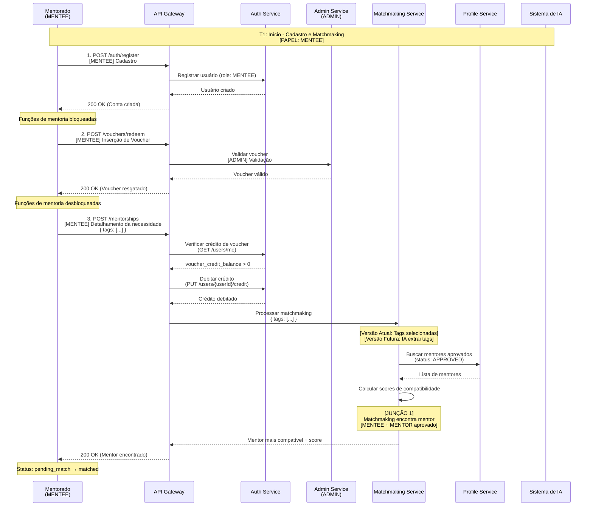
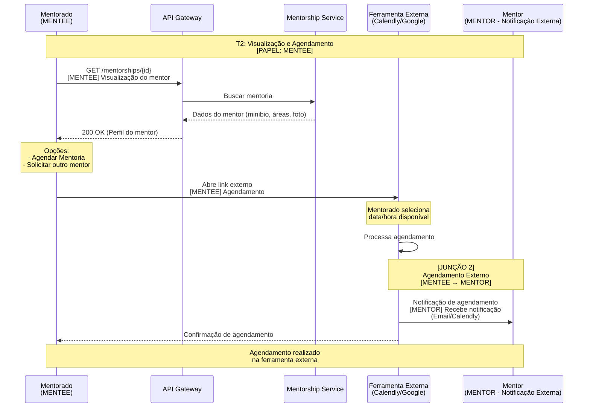
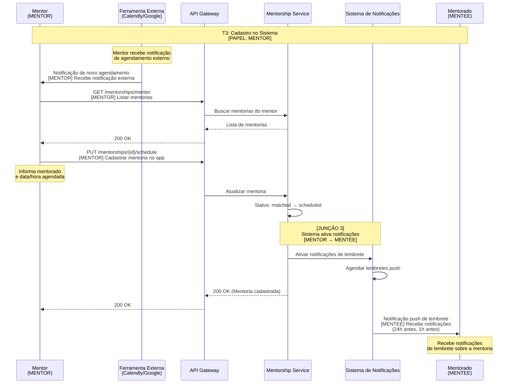
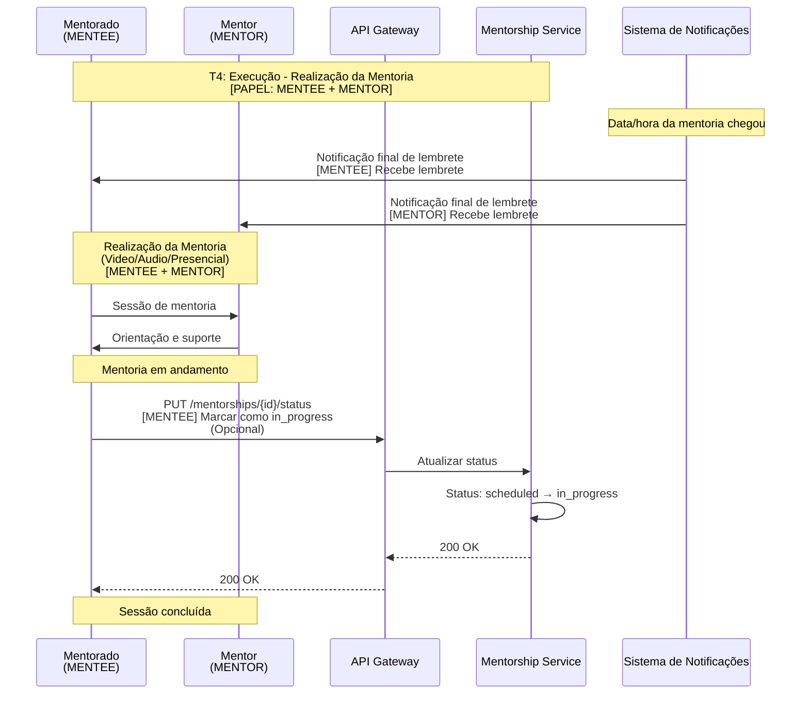
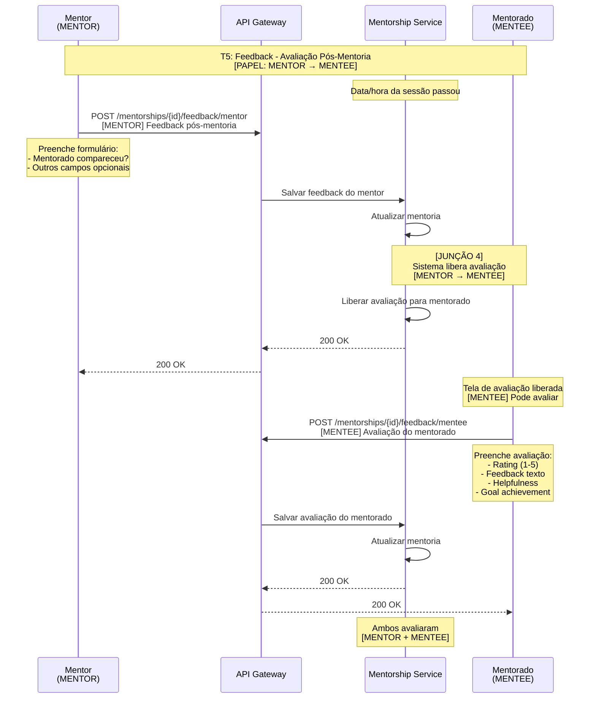
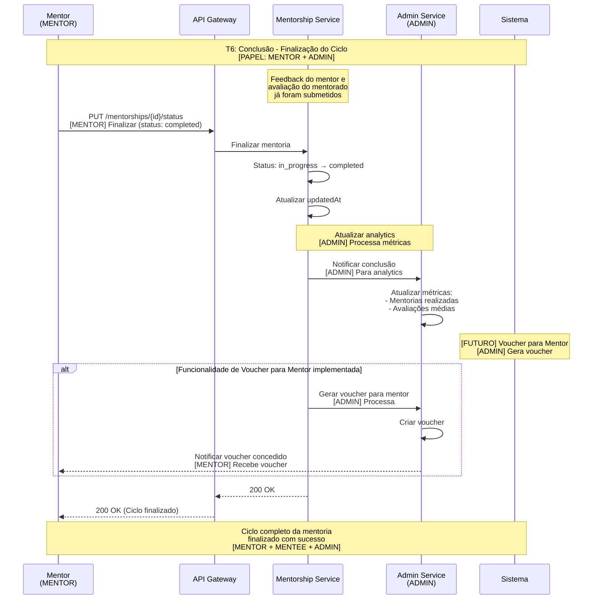

# Dependências Temporais e Junções de Fluxos

Este documento identifica as dependências temporais entre os fluxos (jornadas) de operações, ou seja, quais fluxos precisam acontecer antes de outros e onde ocorrem as junções.

> **📌 Referências:** Este documento complementa:
>
> - [Especificação de Requisitos - UberHub Mentorias](./Especificação%20de%20Requisitos%20-%20UberHub%20Mentorias.md) - Casos de uso detalhados e regras de negócio
> - [FLUXOS-JORNADAS-OPERACOES.md](./FLUXOS-JORNADAS-OPERACOES.md) - Jornadas completas dos usuários

---

## 📊 Diagrama de Dependências Temporais

> **📌 Nota sobre Numeração:** Os números entre parênteses referem-se aos passos das jornadas documentadas em [FLUXOS-JORNADAS-OPERACOES.md](./FLUXOS-JORNADAS-OPERACOES.md):
>
> - **1.X** = Jornada do Mentorado (seção 3.1)
> - **2.X** = Jornada do Mentor (seção 3.2)
> - **3.X** = Jornada do Administrador (seção 3.3)
>
> Exemplo: `(2.1)` = Jornada do Mentor, passo 1 (Cadastro)

```text
┌─────────────────────────────────────────────────────────────────┐
│                    FLUXO INICIAL (Setup)                        │
│  Admin: Geração de Vouchers (3.4)                               │
│  Mentor: Cadastro (2.1) → Admin: Aprovação (3.3) →              │
│  Mentor: Aprovado (2.2)                                         │
└─────────────────────────────────────────────────────────────────┘
                              │
                              ▼
┌─────────────────────────────────────────────────────────────────┐
│              FLUXO PRINCIPAL (Mentoria)                         │
│                                                                 │
│  MENTORADO:                                                     │
│  (1.1) Cadastro → (1.2) Voucher → (1.3) Detalhamento →          │
│  (1.4) Matchmaking                                              │
│                                                                 │
│  MENTOR:                                                        │
│  (2.2) Aprovado (pré-requisito para matchmaking)                │
│                                                                 │
│  JUNÇÃO 1: Matchmaking (Mentorado 1.4 + Mentor 2.2)             │
│                                                                 │
│  MENTORADO:                                                     │
│  (1.5) Visualização → (1.6) Agendamento (externo)               │
│                                                                 │
│  MENTOR:                                                        │
│  (2.3) Recebimento de Agendamento (externo)                     │
│                                                                 │
│  JUNÇÃO 2: Agendamento Externo (Mentorado 1.6 ↔ Mentor 2.3)     │
│                                                                 │
│  MENTOR:                                                        │
│  (2.4) Cadastro da Mentoria no App                              │
│                                                                 │
│  MENTORADO:                                                     │
│  (1.7) Notificações (ativadas pelo Mentor 2.4)                  │
│                                                                 │
│  JUNÇÃO 3: Notificações (Mentor 2.4 → Mentorado 1.7)            │
│                                                                 │
│  MENTORADO + MENTOR:                                            │
│  (2.5) Realização da Mentoria (data/hora marcada)               │
│                                                                 │
│  MENTOR:                                                        │
│  (2.6) Feedback Pós-Mentoria → (2.7) Conclusão                  │
│                                                                 │
│  MENTORADO:                                                     │
│  (1.8) Avaliação (após Mentor 2.6)                              │
│                                                                 │
│  JUNÇÃO 4: Feedback/Avaliação (Mentor 2.6 → Mentorado 1.8)      │
└─────────────────────────────────────────────────────────────────┘
```

---

## 🔗 Dependências Identificadas

### 1. Dependências de Setup (Pré-requisitos)

#### 1.1. Geração de Vouchers → Inserção de Voucher

- **Fluxo A:** Admin - Geração de Vouchers (3.4)
- **Fluxo B:** Mentorado - Inserção do Voucher (1.2)
- **Tipo:** Pré-requisito obrigatório
- **Descrição:** O Admin precisa gerar vouchers antes que qualquer mentorado possa inserir um código válido
- **Temporalidade:** Admin (3.4) deve acontecer ANTES de Mentorado (1.2)

#### 1.2. Cadastro de Mentor → Aprovação de Mentor → Matchmaking

- **Fluxo A:** Mentor - Cadastro (2.1)
- **Fluxo B:** Admin - Aprovação de Mentores (3.3)
- **Fluxo C:** Mentor - Aprovação (2.2)
- **Fluxo D:** Mentorado - Matchmaking (1.4)
- **Tipo:** Pré-requisito obrigatório
- **Descrição:**
  - O mentor precisa se cadastrar (2.1)
  - O Admin precisa aprovar (3.3)
  - O mentor recebe notificação de aprovação (2.2)
  - Apenas mentores aprovados podem aparecer no matchmaking
- **Temporalidade:**
  - Mentor (2.1) → Admin (3.3) → Mentor (2.2) → Mentorado (1.4) (matchmaking só funciona com mentores aprovados)

---

### 2. Dependências do Fluxo Principal de Mentoria

#### 2.1. Agendamento Externo → Recebimento de Agendamento

- **Fluxo A:** Mentorado - Agendamento (1.6)
- **Fluxo B:** Mentor - Recebimento de Agendamento (2.3)
- **Tipo:** Evento externo compartilhado
- **Descrição:**
  - O mentorado agenda na ferramenta externa (Calendly, Google Agenda)
  - A ferramenta externa notifica o mentor
  - Ambos os fluxos dependem do mesmo evento externo
- **Temporalidade:** Acontecem simultaneamente ou quase simultaneamente (evento externo)

#### 2.2. Recebimento de Agendamento → Cadastro da Mentoria no App

- **Fluxo A:** Mentor - Recebimento de Agendamento (2.3)
- **Fluxo B:** Mentor - Cadastro da Mentoria no App (2.4)
- **Tipo:** Sequencial obrigatório
- **Descrição:** O mentor só pode cadastrar a mentoria no app após receber o agendamento
- **Temporalidade:** Mentor (2.3) → Mentor (2.4) (sequencial)

#### 2.3. Cadastro da Mentoria no App → Notificações

- **Fluxo A:** Mentor - Cadastro da Mentoria no App (2.4)
- **Fluxo B:** Mentorado - Notificações (1.7)
- **Tipo:** Ativação/Trigger
- **Descrição:**
  - Quando o mentor cadastra a mentoria no app, o sistema ativa as notificações
  - O mentorado recebe lembretes push sobre a mentoria
- **Temporalidade:** Mentor (2.4) → Mentorado (1.7) (trigger)

#### 2.4. Realização da Mentoria → Feedback Pós-Mentoria

- **Fluxo A:** Mentor - Realização da Mentoria (2.5)
- **Fluxo B:** Mentor - Feedback Pós-Mentoria (2.6)
- **Tipo:** Sequencial obrigatório (baseado em data/hora)
- **Descrição:** O feedback só é liberado após a data/hora da sessão
- **Temporalidade:** Mentor (2.5) → Mentor (2.6) (após data/hora da sessão)

#### 2.5. Feedback do Mentor → Avaliação do Mentorado

- **Fluxo A:** Mentor - Feedback Pós-Mentoria (2.6)
- **Fluxo B:** Mentorado - Avaliação (1.8)
- **Tipo:** Pré-requisito para liberação
- **Descrição:**
  - Após a data/hora da mentoria E o preenchimento do formulário pelo mentor
  - O app libera a tela de avaliação para o mentorado
- **Temporalidade:** Mentor (2.6) → Mentorado (1.8) (sequencial condicional)

#### 2.6. Mentoria Matched/Pending → Expiração (Timeout Automático)

- **Fluxo A:** Sistema - Job/Scheduler Interno
- **Fluxo B:** Mentoria - Status `pending_match` ou `matched` → `expired`
- **Tipo:** Processo automático (job agendado)
- **Descrição:**
  - Sistema verifica periodicamente (diariamente) mentorias com status `pending_match` ou `matched`
  - Se a mentoria foi criada há mais de 7 dias e não foi agendada, marca como `expired`
  - Sistema notifica o mentorado sobre a expiração
  - Sistema registra evento de analytics para métricas
- **Temporalidade:** Após 7 dias da criação da mentoria (se não agendada)
- **Regra de Negócio:** RN08 - Mentorias com status `pending_match` ou `matched` por mais de 7 dias são automaticamente marcadas como EXPIRADA

#### 2.7. Conclusão → Voucher para Mentor (Funcionalidade Futura)

- **Fluxo A:** Mentor - Conclusão (2.7)
- **Fluxo B:** Sistema - Geração de Voucher para Mentor (5)
- **Tipo:** Trigger automático (futuro)
- **Descrição:** Quando o mentor completa uma mentoria, pode ganhar um voucher
- **Temporalidade:** Mentor (2.7) → Sistema gera voucher (futuro)

---

### 3. Dependências de Status da Mentoria

Com base no modelo de dados, os status seguem uma sequência temporal:

```text
pending_match → matched → scheduled → in_progress → completed
     ↓              ↓                                      ↓
  expired       expired / change_requested          cancelled
```

**Status disponíveis no sistema:**

- `pending_match`: Mentoria criada, aguardando matchmaking
- `matched`: Mentor encontrado, aguardando agendamento (equivalente a PENDENTE_AGENDAMENTO)
- `scheduled`: Agendamento registrado pelo mentor
- `in_progress`: Mentoria em andamento
- `completed`: Ciclo completo finalizado (feedback e avaliação concluídos)
- `cancelled`: Mentoria cancelada
- `expired`: Mentoria expirada (não agendada em 7 dias)
- `change_requested`: Solicitação de troca de mentor pendente de aprovação

#### 1. Status: `pending_match` → `matched`

- **Trigger:** Matchmaking bem-sucedido (Mentorado 1.4)
- **Descrição:** Quando o sistema encontra um mentor compatível
- **Regra de Negócio:** RN05 - O matchmaking considera apenas mentores com status APROVADO

#### 2. Status: `matched` → `scheduled`

- **Trigger:** Mentor cadastra a mentoria no app (Mentor 2.4)
- **Descrição:** Quando o mentor registra o agendamento no sistema
- **Regra de Negócio:** RN09 - A data/hora do agendamento deve ser futura

#### 3.2a. Status: `pending_match` ou `matched` → `expired` (Timeout)

- **Trigger:** Job/scheduler interno verifica mentorias antigas (executa diariamente)
- **Condição:** Mentoria com status `pending_match` ou `matched` criada há mais de 7 dias
- **Descrição:** Sistema marca automaticamente como expirada se não foi agendada
- **Regra de Negócio:** RN08 - Mentorias com status `pending_match` ou `matched` por mais de 7 dias são automaticamente marcadas como EXPIRADA
- **Ações:**
  - Sistema atualiza status para `expired`
  - Sistema notifica mentorado sobre expiração
  - Sistema registra evento de analytics (MENTORSHIP_EXPIRED)

#### 3. Status: `scheduled` → `in_progress`

- **Trigger:** Data/hora da sessão chegou
- **Descrição:** Sistema atualiza automaticamente ou manualmente

#### 3.4. Status: `in_progress` → `completed`

- **Trigger:** Mentor submete feedback (Mentor 2.6) E Mentorado avalia (Mentorado 1.8)
- **Descrição:** Ciclo completo finalizado
- **Regra de Negócio:** RN12 - O feedback do mentor só pode ser fornecido após a data/hora agendada
- **Regra de Negócio:** RN13 - Após o feedback do mentor, o mentorado pode avaliar o mentor

#### 3.5. Status: `matched` → `change_requested`

- **Trigger:** Mentorado solicita troca de mentor (Mentorado 1.5 - opção "Solicitar outro mentor")
- **Descrição:** Solicitação de troca pendente de aprovação do administrador
- **Regra de Negócio:** Admin deve aprovar/reprovar a solicitação (UC18)

---

## 🔄 Pontos de Junção Identificados

### Junção 1: Matchmaking

- **Participantes:** Mentorado (1.4) + Mentor Aprovado (2.2) + Sistema de Matchmaking
- **Momento:** Quando mentorado submete solicitação com tags selecionadas
- **Resultado:** Mentor mais compatível é apresentado, crédito de voucher é debitado, mentoria criada com status `matched`
- **Dependências:**
  - Mentor deve estar aprovado (Admin 3.3 → Mentor 2.2)
  - Mentorado deve ter voucher válido e crédito disponível (Admin 3.4 → Mentorado 1.2)
  - Deve existir pelo menos um mentor aprovado com tags compatíveis

### Junção 2: Agendamento Externo

- **Participantes:** Mentorado (1.6) + Mentor (2.3)
- **Momento:** Quando mentorado agenda na ferramenta externa
- **Resultado:** Ambos recebem notificação da ferramenta externa
- **Dependências:**
  - Matchmaking deve ter ocorrido (Mentorado 1.4)
  - Mentorado deve ter visualizado o mentor (Mentorado 1.5)

### Junção 3: Cadastro e Notificações

- **Participantes:** Mentor (2.4) + Mentorado (1.7)
- **Momento:** Quando mentor cadastra a mentoria no app
- **Resultado:** Sistema ativa notificações para o mentorado
- **Dependências:**
  - Agendamento externo deve ter ocorrido (Mentorado 1.6 → Mentor 2.3)

### Junção 4: Feedback e Avaliação

- **Participantes:** Mentor (2.6) + Mentorado (1.8)
- **Momento:** Após a data/hora da mentoria
- **Resultado:** Ambos avaliam a experiência
- **Dependências:**
  - Mentoria deve ter sido realizada (Mentor 2.5)
  - Mentor deve ter preenchido feedback primeiro (Mentor 2.6)

---

## 📋 Tabela de Dependências Temporais

> **📌 Nota:** As referências numéricas seguem o padrão do documento [FLUXOS-JORNADAS-OPERACOES.md](./FLUXOS-JORNADAS-OPERACOES.md)

| Fluxo Dependente | Etapa Dependente                 | Fluxo Pré-requisito | Etapa Pré-requisito              | Tipo           | Obrigatório |
| ---------------- | -------------------------------- | ------------------- | -------------------------------- | -------------- | ----------- |
| Mentorado        | (1.2) Inserção do Voucher        | Admin               | (3.4) Geração de Vouchers        | Pré-requisito  | ✅ Sim      |
| Mentorado        | (1.4) Matchmaking                | Mentor              | (2.2) Aprovação                  | Pré-requisito  | ✅ Sim      |
| Mentorado        | (1.4) Matchmaking                | Admin               | (3.3) Aprovação de Mentores      | Pré-requisito  | ✅ Sim      |
| Mentor           | (2.2) Aprovação                  | Admin               | (3.3) Aprovação de Mentores      | Pré-requisito  | ✅ Sim      |
| Mentor           | (2.3) Recebimento de Agendamento | Mentorado           | (1.6) Agendamento                | Evento Externo | ✅ Sim      |
| Mentor           | (2.4) Cadastro da Mentoria       | Mentor              | (2.3) Recebimento de Agendamento | Sequencial     | ✅ Sim      |
| Mentorado        | (1.7) Notificações               | Mentor              | (2.4) Cadastro da Mentoria       | Trigger        | ✅ Sim      |
| Mentor           | (2.6) Feedback Pós-Mentoria      | Mentor              | (2.5) Realização da Mentoria     | Temporal       | ✅ Sim      |
| Mentorado        | (1.8) Avaliação                  | Mentor              | (2.6) Feedback Pós-Mentoria      | Sequencial     | ✅ Sim      |
| Mentorado        | (1.8) Avaliação                  | Mentor              | (2.5) Realização da Mentoria     | Temporal       | ✅ Sim      |

---

## 🎯 Fluxos que Podem Ser Unificados

### 1. Fluxo Completo de Mentoria (Mentorado + Mentor)

**Sequência Unificada:**

1. **Setup:**

   - Admin gera vouchers
   - Mentor se cadastra → Admin aprova → Mentor aprovado

2. **Início da Mentoria:**

   - Mentorado: Cadastro → Voucher → Detalhamento → Matchmaking
   - **JUNÇÃO:** Matchmaking encontra mentor aprovado
   - Mentorado: Visualização → Agendamento (externo)

3. **Agendamento:**

   - **JUNÇÃO:** Agendamento externo (Mentorado agenda, Mentor recebe notificação)
   - Mentor: Recebe agendamento → Cadastra no app
   - **JUNÇÃO:** Sistema ativa notificações para mentorado

4. **Execução:**

   - Ambos: Realização da mentoria (data/hora marcada)

5. **Conclusão:**
   - Mentor: Feedback → Conclusão
   - **JUNÇÃO:** Sistema libera avaliação para mentorado
   - Mentorado: Avaliação

### 2. Fluxo de Aprovação de Mentor (Mentor + Admin)

**Sequência Unificada:**

1. Mentor: Cadastro (status: Pendente)
2. Admin: Visualiza pendentes → Aprova/Reprova
3. Mentor: Recebe notificação → Status: Aprovado
4. **Resultado:** Mentor elegível para matchmaking

---

## ⚠️ Pontos de Atenção

### 1. Dependências Críticas

- **Matchmaking não funciona sem mentores aprovados:** Sistema deve validar antes de processar
- **Notificações dependem do cadastro do mentor:** Se mentor não cadastrar, mentorado não recebe lembretes
- **Avaliação do mentorado depende do feedback do mentor:** Sistema deve garantir ordem correta

### 2. Fluxos Paralelos Possíveis

- **Admin pode gerar vouchers a qualquer momento** (independente de outros fluxos)
- **Múltiplos mentorados podem usar vouchers simultaneamente**
- **Múltiplos mentores podem ser aprovados simultaneamente**

### 3. Fluxos que Bloqueiam Outros

- **Sem vouchers gerados:** Mentorado não pode prosseguir
- **Sem crédito de voucher:** Mentorado não pode solicitar mentoria (matchmaking bloqueado)
- **Sem mentores aprovados:** Matchmaking não retorna resultados
- **Sem agendamento externo:** Mentor não pode cadastrar no app
- **Sem feedback do mentor:** Mentorado não pode avaliar
- **Mentoria expirada:** Mentorado pode solicitar nova mentoria, mas voucher já foi debitado

---

## 📝 Recomendações de Implementação

1. **Validações de Pré-requisitos:**

   - Validar voucher válido antes de permitir matchmaking
   - Validar existência de mentores aprovados antes de processar matchmaking
   - Validar agendamento externo antes de permitir cadastro no app

2. **Sistema de Notificações:**

   - Notificar mentor quando agendamento é feito (via ferramenta externa)
   - Notificar mentorado quando mentor cadastra no app
   - Notificar mentorado quando feedback do mentor é submetido (liberar avaliação)

3. **Controle de Status:**

   - Implementar máquina de estados para garantir transições válidas
   - Validar pré-requisitos antes de permitir mudança de status

4. **Tratamento de Erros e Timeouts:**
   - **Mentor não cadastra mentoria no app:** Sistema marca como `expired` após 7 dias (job automático diário)
   - **Matchmaking não encontra mentor:** Sistema pode retornar erro ou sugerir outras tags
   - **Mentor não preenche feedback:** Sistema pode enviar lembretes, mas não bloqueia indefinidamente
   - **Mentorado não avalia:** Sistema pode enviar lembretes, mas não bloqueia o ciclo indefinidamente
   - **Mentoria expirada:**
     - Sistema notifica mentorado sobre expiração
     - Sistema registra evento de analytics
     - Mentorado pode solicitar nova mentoria (voucher já foi debitado, não debita novamente)

---

## 🔄 Fluxo Temporal Completo (Linha do Tempo)

```text
T0: Setup
├─ Admin gera vouchers
└─ Mentor se cadastra → Admin aprova → Mentor aprovado

T1: Início (Mentorado)
├─ Mentorado: Cadastro
├─ Mentorado: Inserção de Voucher
├─ Mentorado: Detalhamento
└─ Mentorado: Matchmaking → [JUNÇÃO 1] → Sistema encontra mentor

T2: Visualização e Agendamento
├─ Mentorado: Visualização do mentor
└─ Mentorado: Agendamento (externo) → [JUNÇÃO 2] → Mentor recebe notificação

T3: Cadastro no Sistema
├─ Mentor: Recebe agendamento
├─ Mentor: Cadastra no app → [JUNÇÃO 3] → Sistema ativa notificações
└─ Mentorado: Recebe notificações de lembrete

T4: Execução
└─ Ambos: Realização da mentoria (data/hora marcada)

T5: Feedback
├─ Mentor: Feedback pós-mentoria → [JUNÇÃO 4] → Sistema libera avaliação
└─ Mentorado: Avaliação

T6: Conclusão
└─ Mentor: Conclusão → Sistema finaliza ciclo
```

---

## 📊 Diagramas Detalhados dos Fluxos Temporais

### T1: Início (Mentorado) - Fluxo de Cadastro e Matchmaking



### T2: Visualização e Agendamento - Fluxo de Seleção e Agendamento Externo



### T3: Cadastro no Sistema - Fluxo de Registro e Notificações



### T4: Execução - Fluxo de Realização da Mentoria



### T5: Feedback - Fluxo de Avaliação Pós-Mentoria



### T6: Conclusão - Fluxo de Finalização do Ciclo



---

## 📊 Resumo Executivo

**Total de Dependências Identificadas:** 11 dependências temporais principais (incluindo expiração automática)

**Junções Críticas:** 4 pontos de junção onde fluxos se encontram

**Fluxos Sequenciais Obrigatórios:**

- Setup (Admin/Mentor) → Matchmaking → Agendamento → Cadastro → Execução → Feedback → Avaliação

**Fluxos Paralelos Possíveis:**

- Geração de vouchers (independente)
- Aprovação de múltiplos mentores (paralelo)
- Múltiplas mentorias simultâneas (paralelo)
