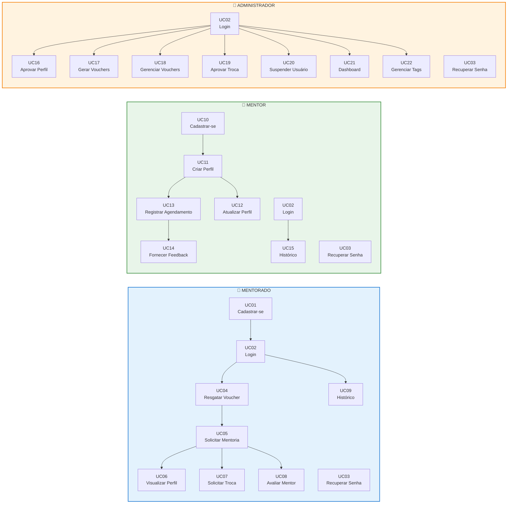
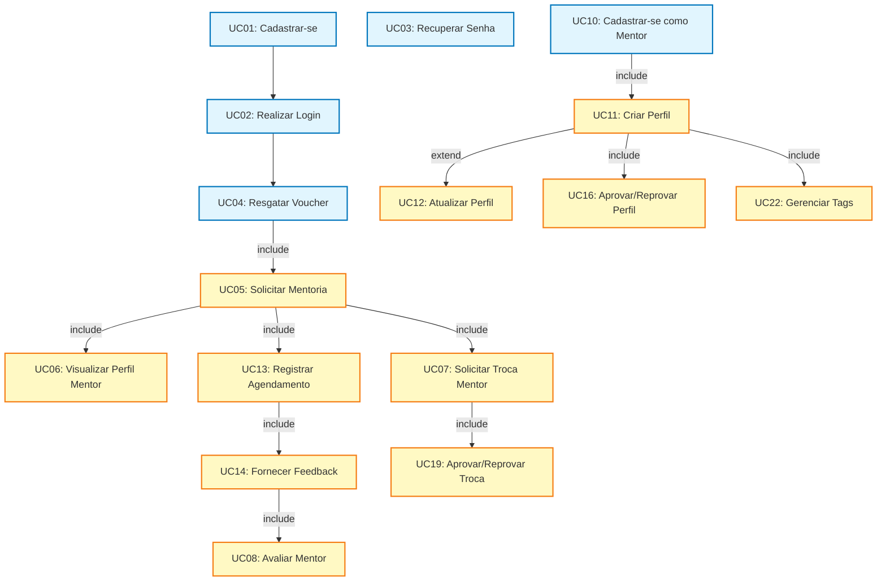

# Especificação Funcional

## Versão 2.0

### Responsáveis

\[Nome do responsável – e-mail\]

\[Nome do responsável – e-mail\]

\[Nome do responsável – e-mail\]

### Cliente

UberHub

Att.: \[Nome do responsável do cliente\]

Setor / Área: Tecnologia e Inovação

### Projeto

Aplicativo de Mentorias UberHub

**Histórico de Revisões**

| Versão | Data       | Descrição                                                   | Autor                     |
| ------ | ---------- | ----------------------------------------------------------- | ------------------------- |
| 1.0    | 2025-01-15 | Versão inicial do documento                                 | Equipe de Desenvolvimento |
| 2.0    | 2025-11-20 | Completados todos os casos de uso e adicionado diagrama UML | Equipe de Desenvolvimento |

### Sumário

[**1\. Introdução**](#1.-introdu%C3%A7%C3%A3o)

[1.1. Objetivos deste documento](#1.1.-objetivos-deste-documento)

[1.2 Escopo do Produto](#1.2-escopo-do-produto)

[1.3 Definições, acrônimos e abreviações](#1.3-defini%C3%A7%C3%B5es-acr%C3%B4nimos-e-abrevia%C3%A7%C3%B5es)

[1.4 Referências](#1.4-refer%C3%AAncias)

[**2\. Visão Geral do Sistema**](#2.-vis%C3%A3o-geral-do-sistema)

[2.1. Nome do Produto](#2.1.-nome-do-produto)

[2.2. Propósito do Produto](#2.2.-prop%C3%B3sito-do-produto)

[2.3 Escopo negativo](#2.3-escopo-negativo)

[2.4 Lista de Atores](#2.4-lista-de-atores)

[**3\. Requisitos**](#3.-requisitos)

[3.1 Funcionalidades](#3.1-funcionalidades)

[3.2 Requisitos de Qualidade (Não Funcionais)](#3.2-requisitos-de-qualidade-n%C3%A3o-funcionais)

[**4\. Requisitos Funcionais**](#4.-requisitos-funcionais)

[4.1 Diagrama de Casos de Uso](#4.1-diagrama-de-casos-de-uso)

[4.2 Casos de Uso Detalhados](#4.2-casos-de-uso-detalhados)

[**5\. Protótipos de tela**](#5.-prot%C3%B3tipos-de-tela)

# **1\. Introdução** {#1.-introdu%C3%A7%C3%A3o}

## **1.1. Objetivos deste documento** {#1.1.-objetivos-deste-documento}

Este documento tem como objetivo descrever e especificar as necessidades do UberHub que devem ser atendidas pelo produto Aplicativo de Mentorias UberHub, bem como definir para os desenvolvedores o produto a ser desenvolvido. O documento detalha os requisitos funcionais e não funcionais, os casos de uso, os atores envolvidos e as regras de negócio que regem o sistema.

## **1.2 Escopo do Produto** {#1.2-escopo-do-produto}

O Aplicativo de Mentorias UberHub é uma plataforma mobile que conecta profissionais experientes (Mentores) a pessoas que buscam orientação e desenvolvimento em áreas específicas (Mentorados), dentro do ecossistema do UberHub.

O sistema permite:

- Cadastro e gerenciamento de usuários (Mentores e Mentorados)
- Sistema de vouchers para ativação de mentorados
- Matchmaking inteligente entre mentorados e mentores baseado em tags/trilhas
- Agendamento de mentorias através de ferramentas externas
- Sistema de feedback e avaliação pós-mentoria
- Painel administrativo para gestão de mentores, usuários, vouchers e analytics
- Sistema de notificações push para lembretes e atualizações

O sistema é desenvolvido utilizando arquitetura de microsserviços, com backend em Spring Boot e aplicativos mobile em React Native.

## **1.3 Definições, acrônimos e abreviações** {#1.3-definições-acrônimos-e-abreviações}

| Palavra / Sigla | Definição                                                                            |
| --------------- | ------------------------------------------------------------------------------------ |
| IFTM            | Instituto Federal do Triângulo Mineiro                                               |
| UberHub         | Ecossistema de inovação e tecnologia                                                 |
| Mentor          | Profissional experiente que oferece orientação e mentoria                            |
| Mentorado       | Pessoa que busca orientação e desenvolvimento através de mentorias                   |
| Admin           | Administrador do sistema com permissões de gestão                                    |
| Matchmaking     | Processo de correspondência entre mentorado e mentor baseado em compatibilidade      |
| Voucher         | Código único que permite ao mentorado ativar sua conta e solicitar mentorias         |
| FCM             | Firebase Cloud Messaging - serviço de notificações push                              |
| JWT             | JSON Web Token - padrão de autenticação baseado em tokens                            |
| API Gateway     | Ponto de entrada único para todas as requisições externas ao sistema                 |
| Microsserviço   | Serviço independente com responsabilidade específica na arquitetura                  |
| Tags            | Categorias/áreas de conhecimento utilizadas para classificar mentores e solicitações |
| Trilhas         | Conjunto de tags relacionadas que definem áreas de especialidade                     |

## **1.4 Referências** {#1.4-referências}

| Material                   | Referência                                                                                                |
| -------------------------- | --------------------------------------------------------------------------------------------------------- |
| Arquitetura do Sistema     | Documento "Arquitetura v2.md" - Detalha a arquitetura de microsserviços do sistema                        |
| Especificação de Endpoints | Documento "Especificação de Endpoints da API (Por Equipe e Serviço).md" - Lista todos os endpoints da API |
| Requisitos Funcionais      | Documento "Requisitos Funcionais do Backend (Por Equipe e Serviço).md" - Mapeia requisitos para serviços  |
| Fluxos e Jornadas          | Documento "FLUXOS-JORNADAS-OPERACOES.md" - Descreve as jornadas dos usuários                              |
| Mockups                    | Arquivos "Mockup Baixa Fidelidade" - Protótipos de interface do sistema                                   |

# **2\. Visão Geral do Sistema** {#2.-vis%C3%A3o-geral-do-sistema}

## **2.1. Nome do Produto** {#2.1.-nome-do-produto}

**UberHub Mentorias**

## **2.2. Propósito do Produto** {#2.2.-propósito-do-produto}

O UberHub Mentorias tem como propósito facilitar a conexão entre profissionais experientes e pessoas que buscam orientação e desenvolvimento profissional, criando um ecossistema de mentoria dentro do UberHub. O sistema automatiza o processo de matchmaking, gerencia o ciclo completo de uma mentoria (desde a solicitação até a avaliação), e fornece ferramentas administrativas para gestão do programa.

O produto visa:

- Democratizar o acesso à mentoria de qualidade
- Facilitar o encontro entre mentorados e mentores compatíveis através de matchmaking inteligente
- Automatizar processos administrativos relacionados a mentorias
- Fornecer analytics e métricas para gestão do programa
- Garantir uma experiência fluida tanto para mentores quanto para mentorados

## **2.3 Escopo negativo** {#2.3-escopo-negativo}

| Limites                                                                                                                                                  |
| -------------------------------------------------------------------------------------------------------------------------------------------------------- |
| O sistema não gerencia o agendamento propriamente dito - o agendamento é realizado em ferramentas externas (ex: Calendly) e apenas registrado no sistema |
| O sistema não realiza videoconferências ou chamadas - a mentoria ocorre na ferramenta externa escolhida pelo mentor                                      |
| O sistema não processa pagamentos - os vouchers são gerados e gerenciados pelo admin, mas não há integração com sistemas de pagamento                    |
| O sistema não gerencia currículos ou portfólios detalhados dos mentores - apenas perfis básicos com minibio, tags e link de agendamento                  |
| O sistema não possui chat interno - toda comunicação ocorre através de ferramentas externas                                                              |
| O sistema não gerencia múltiplas organizações ou tenants - é um sistema single-tenant para o UberHub                                                     |
| O sistema não possui sistema de gamificação ou badges (futura versão)                                                                                    |
| O sistema não possui integração com redes sociais para compartilhamento (futura versão)                                                                  |

## **2.4 Lista de Atores** {#2.4-lista-de-atores}

| Ator          | Responsabilidade                                           | Descrição                                                                                                                      |
| ------------- | ---------------------------------------------------------- | ------------------------------------------------------------------------------------------------------------------------------ |
| Mentorado     | Solicitar mentorias, avaliar mentores, gerenciar histórico | Usuário que busca orientação e desenvolvimento profissional. Deve possuir voucher válido para solicitar mentorias.             |
| Mentor        | Criar perfil, gerenciar mentorias, fornecer feedback       | Profissional experiente que oferece orientação. Deve ter perfil aprovado pelo administrador para ser elegível ao matchmaking.  |
| Administrador | Gerenciar mentores, usuários, vouchers, analytics          | Responsável pela gestão completa do sistema, incluindo aprovação de mentores, geração de vouchers e monitoramento do programa. |

# **3\. Requisitos** {#3.-requisitos}

## **3.1 Funcionalidades** {#3.1-funcionalidades}

| Id.  | Descrição do requisito funcional                                              | Prioridade |
| ---- | ----------------------------------------------------------------------------- | ---------- |
| RF01 | Permitir o cadastro de novos usuários (mentores e mentorados)                 | Alta       |
| RF02 | Permitir autenticação de usuários através de login                            | Alta       |
| RF03 | Permitir recuperação de senha por e-mail                                      | Alta       |
| RF04 | Permitir que mentorados resgatem vouchers para ativar sua conta               | Alta       |
| RF05 | Permitir que mentorados solicitem mentorias através de matchmaking            | Alta       |
| RF06 | Permitir que mentores criem e atualizem seus perfis                           | Alta       |
| RF07 | Permitir que administradores aprovem/reprovem perfis de mentores              | Alta       |
| RF08 | Permitir que mentores registrem agendamentos de mentorias                     | Alta       |
| RF09 | Permitir que mentorados solicitem troca de mentor                             | Média      |
| RF10 | Permitir que mentores forneçam feedback pós-mentoria                          | Alta       |
| RF11 | Permitir que mentorados avaliem mentores após a mentoria                      | Alta       |
| RF12 | Permitir que usuários visualizem histórico de mentorias                       | Alta       |
| RF13 | Permitir envio de notificações push para lembretes e atualizações             | Alta       |
| RF14 | Permitir que administradores gerem vouchers (abertos ou restritos por trilha) | Alta       |
| RF15 | Permitir que administradores visualizem dashboard com métricas e analytics    | Alta       |
| RF16 | Permitir que administradores gerenciem tags e subtags do sistema              | Média      |
| RF17 | Permitir que administradores suspendam/reativem usuários                      | Média      |
| RF18 | Permitir que administradores aprovem/reprovem solicitações de troca de mentor | Média      |

## **3.2 Requisitos de Qualidade (Não Funcionais)** {#3.2-requisitos-de-qualidade-não-funcionais}

| Id.   | Categoria(s)     | Descrição                                                                                                                                      |
| ----- | ---------------- | ---------------------------------------------------------------------------------------------------------------------------------------------- |
| RNF01 | Segurança        | O sistema deve utilizar autenticação JWT para todas as rotas protegidas                                                                        |
| RNF02 | Segurança        | Cada ator deve ter permissão de acesso somente aos casos de uso com os quais interage, baseado em roles (ROLE_MENTEE, ROLE_MENTOR, ROLE_ADMIN) |
| RNF03 | Arquitetura      | O sistema deve ser desenvolvido em arquitetura de microsserviços, com serviços independentes e desacoplados                                    |
| RNF04 | Arquitetura      | O API Gateway deve ser o ponto de entrada único para todas as requisições externas                                                             |
| RNF05 | Manutenibilidade | A camada de acesso a dados deve seguir padrões de projeto adequados (DAO, Repository)                                                          |
| RNF06 | Portabilidade    | O backend deve ser desenvolvido em Spring Boot (Java 17+)                                                                                      |
| RNF07 | Portabilidade    | Os aplicativos mobile devem ser desenvolvidos em React Native                                                                                  |
| RNF08 | Usabilidade      | A interface mobile deve ser intuitiva e seguir padrões de design modernos                                                                      |
| RNF09 | Integração       | O sistema deve integrar com Firebase Cloud Messaging para notificações push                                                                    |
| RNF10 | Escalabilidade   | A arquitetura deve permitir escalar serviços individualmente conforme demanda                                                                  |
| RNF11 | Conformidade     | O sistema deve garantir conformidade com a LGPD (Lei Geral de Proteção de Dados)                                                               |
| RNF12 | Código Aberto    | O código do sistema será publicado no GitHub sob licença de código aberto                                                                      |
| RNF13 | Infraestrutura   | A arquitetura deve priorizar ferramentas gratuitas (MongoDB Atlas Free Tier, etc.) para minimizar custos                                       |
| RNF14 | Observabilidade  | O sistema deve implementar logging adequado para rastreamento de operações                                                                     |

# **4\. Requisitos Funcionais** {#4.-requisitos-funcionais}

## **4.1 Diagrama de Casos de Uso** {#4.1-diagrama-de-casos-de-uso}

O diagrama de casos de uso do sistema está dividido em três grupos principais, correspondentes aos três atores do sistema:

**Grupo 1: Casos de Uso do Mentorado**

- UC01 - Cadastrar-se no sistema
- UC02 - Realizar login
- UC03 - Recuperar senha
- UC04 - Resgatar voucher
- UC05 - Solicitar mentoria
- UC06 - Visualizar perfil do mentor
- UC07 - Solicitar troca de mentor
- UC08 - Avaliar mentor
- UC09 - Visualizar histórico de mentorias

**Grupo 2: Casos de Uso do Mentor**

- UC10 - Cadastrar-se como mentor
- UC11 - Criar perfil de mentor
- UC12 - Atualizar perfil de mentor
- UC13 - Registrar agendamento de mentoria
- UC14 - Fornecer feedback pós-mentoria
- UC15 - Visualizar histórico de mentorias

**Grupo 3: Casos de Uso do Administrador**

- UC16 - Aprovar/Reprovar perfil de mentor
- UC17 - Gerar vouchers
- UC18 - Gerenciar vouchers
- UC19 - Aprovar/Reprovar troca de mentor
- UC20 - Suspender/Reativar usuário
- UC21 - Visualizar dashboard e analytics
- UC22 - Gerenciar tags e subtags

### **Diagrama UML de Casos de Uso**

O diagrama abaixo representa visualmente todos os casos de uso do sistema e suas relações com os atores, utilizando a notação UML padrão:

```mermaid
flowchart TB
    %% Atores
    MENTEE[👤 Mentorado]
    MENTOR[👤 Mentor]
    ADMIN[👤 Administrador]

    %% Casos de Uso - Mentorado
    UC01[UC01<br/>Cadastrar-se]
    UC02[UC02<br/>Realizar Login]
    UC03[UC03<br/>Recuperar Senha]
    UC04[UC04<br/>Resgatar Voucher]
    UC05[UC05<br/>Solicitar Mentoria]
    UC06[UC06<br/>Visualizar Perfil Mentor]
    UC07[UC07<br/>Solicitar Troca Mentor]
    UC08[UC08<br/>Avaliar Mentor]
    UC09[UC09<br/>Visualizar Histórico]

    %% Casos de Uso - Mentor
    UC10[UC10<br/>Cadastrar-se como Mentor]
    UC11[UC11<br/>Criar Perfil]
    UC12[UC12<br/>Atualizar Perfil]
    UC13[UC13<br/>Registrar Agendamento]
    UC14[UC14<br/>Fornecer Feedback]
    UC15[UC15<br/>Visualizar Histórico]

    %% Casos de Uso - Administrador
    UC16[UC16<br/>Aprovar/Reprovar Perfil]
    UC17[UC17<br/>Gerar Vouchers]
    UC18[UC18<br/>Gerenciar Vouchers]
    UC19[UC19<br/>Aprovar/Reprovar Troca]
    UC20[UC20<br/>Suspender/Reativar Usuário]
    UC21[UC21<br/>Visualizar Dashboard]
    UC22[UC22<br/>Gerenciar Tags]

    %% Relações Mentorado
    MENTEE --> UC01
    MENTEE --> UC02
    MENTEE --> UC03
    MENTEE --> UC04
    MENTEE --> UC05
    MENTEE --> UC06
    MENTEE --> UC07
    MENTEE --> UC08
    MENTEE --> UC09

    %% Relações Mentor
    MENTOR --> UC02
    MENTOR --> UC03
    MENTOR --> UC10
    MENTOR --> UC11
    MENTOR --> UC12
    MENTOR --> UC13
    MENTOR --> UC14
    MENTOR --> UC15

    %% Relações Administrador
    ADMIN --> UC02
    ADMIN --> UC03
    ADMIN --> UC16
    ADMIN --> UC17
    ADMIN --> UC18
    ADMIN --> UC19
    ADMIN --> UC20
    ADMIN --> UC21
    ADMIN --> UC22

    %% Dependências Include
    UC05 -.->|include| UC04
    UC05 -.->|include| UC06
    UC07 -.->|include| UC05
    UC08 -.->|include| UC14
    UC11 -.->|include| UC10
    UC12 -.->|extend| UC11
    UC13 -.->|include| UC05
    UC14 -.->|include| UC13
    UC16 -.->|include| UC11
    UC19 -.->|include| UC07
    UC22 -.->|include| UC11

    %% Estilos
    classDef actorStyle fill:#E3F2FD,stroke:#1976D2,stroke-width:3px,font-weight:bold
    classDef menteeStyle fill:#BBDEFB,stroke:#1976D2,stroke-width:2px
    classDef mentorStyle fill:#C8E6C9,stroke:#388E3C,stroke-width:2px
    classDef adminStyle fill:#FFE0B2,stroke:#F57C00,stroke-width:2px

    class MENTEE,MENTOR,ADMIN actorStyle
    class UC01,UC02,UC03,UC04,UC05,UC06,UC07,UC08,UC09 menteeStyle
    class UC10,UC11,UC12,UC13,UC14,UC15 mentorStyle
    class UC16,UC17,UC18,UC19,UC20,UC21,UC22 adminStyle
```

#### **Diagrama Detalhado por Ator**

#### **Diagrama de Dependências entre Casos de Uso**

**Legenda dos Diagramas:**

- **👤**: Representa um ator (pessoa que interage com o sistema)
- **Seta sólida (→)**: Relação de comunicação entre ator e caso de uso
- **Seta tracejada com label "include" (-.->|include|)**: Um caso de uso sempre inclui outro
- **Seta tracejada com label "extend" (-.->|extend|)**: Um caso de uso pode estender outro (opcional)

**Cores:**

- **Azul claro**: Casos de uso do Mentorado
- **Verde claro**: Casos de uso do Mentor
- **Laranja claro**: Casos de uso do Administrador

**Dependências Principais:**

- **UC05** (Solicitar Mentoria) inclui **UC04** (Resgatar Voucher) e **UC06** (Visualizar Perfil)
- **UC07** (Solicitar Troca) inclui **UC05** (Solicitar Mentoria)
- **UC08** (Avaliar Mentor) inclui **UC14** (Fornecer Feedback)
- **UC11** (Criar Perfil) inclui **UC10** (Cadastrar-se como Mentor)
- **UC12** (Atualizar Perfil) estende **UC11** (Criar Perfil)
- **UC13** (Registrar Agendamento) inclui **UC05** (Solicitar Mentoria)
- **UC14** (Fornecer Feedback) inclui **UC13** (Registrar Agendamento)
- **UC16** (Aprovar Perfil) inclui **UC11** (Criar Perfil)
- **UC19** (Aprovar Troca) inclui **UC07** (Solicitar Troca)
- **UC22** (Gerenciar Tags) inclui **UC11** (Criar Perfil)

**Observações:**

1. **Casos de uso compartilhados**: UC02 (Login) e UC03 (Recuperar Senha) são utilizados por todos os atores
2. **Fluxo típico do Mentorado**: UC01 → UC02 → UC04 → UC05 → UC06 → UC08
3. **Fluxo típico do Mentor**: UC10 → UC11 → UC16 → UC13 → UC14
4. **Fluxo administrativo**: UC02 → UC16, UC17, UC18, UC19, UC20, UC21, UC22

## **4.2 Casos de Uso Detalhados** {#4.2-casos-de-uso-detalhados}

### **UC01 – Cadastrar-se no Sistema**

**Propósito:** Permitir que um novo usuário crie uma conta no sistema.

**Pré-Condições:**

- O usuário deve possuir um e-mail válido
- O e-mail não deve estar cadastrado no sistema

**Fluxo Principal:**

1. O usuário acessa a tela de cadastro
2. O sistema apresenta o formulário de cadastro solicitando: nome, e-mail e senha
3. O usuário preenche os dados e submete o formulário
4. O sistema valida os dados (e-mail único, senha com critérios mínimos)
5. O sistema cria o usuário com ROLE_MENTEE por padrão
6. O sistema retorna mensagem de sucesso
7. O sistema redireciona o usuário para a tela de login

**Fluxos Alternativos:**

4a. E-mail já cadastrado

- 4a.1 O sistema apresenta mensagem de erro informando que o e-mail já está em uso
- 4a.2 O sistema retorna ao passo 2

4b. Senha não atende critérios mínimos

- 4b.1 O sistema apresenta mensagem de erro informando os critérios de senha
- 4b.2 O sistema retorna ao passo 2

**Regras de Negócio:**

- RN01: Todo usuário criado através do cadastro recebe automaticamente a ROLE_MENTEE
- RN02: A senha deve ter no mínimo 8 caracteres
- RN03: O e-mail deve ser único no sistema

---

### **UC02 – Realizar Login**

**Propósito:** Permitir que um usuário autenticado acesse o sistema.

**Pré-Condições:**

- O usuário deve possuir uma conta cadastrada no sistema
- O usuário deve estar com status ACTIVE

**Fluxo Principal:**

1. O usuário acessa a tela de login
2. O sistema apresenta formulário solicitando: e-mail e senha
3. O usuário preenche os dados e submete o formulário
4. O sistema valida as credenciais
5. O sistema gera tokens JWT (access token e refresh token)
6. O sistema retorna os tokens ao cliente
7. O sistema redireciona o usuário para a tela principal conforme seu role (MENTEE, MENTOR ou ADMIN)

**Fluxos Alternativos:**

4a. Credenciais inválidas

- 4a.1 O sistema apresenta mensagem de erro informando que e-mail ou senha estão incorretos
- 4a.2 O sistema retorna ao passo 2

4b. Usuário suspenso

- 4b.1 O sistema apresenta mensagem informando que a conta está suspensa
- 4b.2 O sistema retorna ao passo 2

**Regras de Negócio:**

- RN25: O access token expira em 15 minutos
- RN26: O refresh token expira em 7 dias
- RN27: O sistema deve permitir renovação de access token através do refresh token
- RN28: Usuários com status SUSPENDED não podem realizar login

---

### **UC03 – Recuperar Senha**

**Propósito:** Permitir que um usuário recupere acesso à sua conta através de e-mail.

**Pré-Condições:**

- O usuário deve possuir uma conta cadastrada no sistema
- O usuário deve ter acesso ao e-mail cadastrado

**Fluxo Principal:**

1. O usuário acessa a tela de recuperação de senha
2. O sistema apresenta formulário solicitando o e-mail
3. O usuário informa o e-mail cadastrado
4. O sistema valida se o e-mail existe no sistema
5. O sistema gera um token temporário de recuperação
6. O sistema envia e-mail com link de recuperação contendo o token
7. O sistema apresenta mensagem informando que o e-mail foi enviado
8. O usuário acessa o link no e-mail
9. O sistema valida o token
10. O sistema apresenta formulário para nova senha
11. O usuário informa a nova senha e confirma
12. O sistema valida os critérios de senha
13. O sistema atualiza a senha do usuário
14. O sistema invalida o token de recuperação
15. O sistema apresenta mensagem de sucesso
16. O sistema redireciona para a tela de login

**Fluxos Alternativos:**

4a. E-mail não cadastrado

- 4a.1 O sistema apresenta mensagem genérica informando que se o e-mail existir, um link será enviado
- 4a.2 Finaliza o caso de uso (por segurança, não revela se o e-mail existe)

9a. Token inválido ou expirado

- 9a.1 O sistema apresenta mensagem informando que o link expirou
- 9a.2 O sistema sugere solicitar novo link de recuperação
- 9a.3 Finaliza o caso de uso

12a. Senha não atende critérios

- 12a.1 O sistema apresenta mensagem de erro informando os critérios de senha
- 12a.2 O sistema retorna ao passo 10

**Regras de Negócio:**

- RN29: O token de recuperação expira em 1 hora
- RN30: A senha deve ter no mínimo 8 caracteres
- RN31: Por segurança, o sistema não revela se um e-mail está cadastrado

---

### **UC04 – Resgatar Voucher**

**Propósito:** Permitir que um mentorado resgate um voucher para ativar sua conta e obter créditos para solicitar mentorias.

**Pré-Condições:**

- O usuário deve estar autenticado
- O usuário deve possuir ROLE_MENTEE
- O usuário deve possuir um código de voucher válido

**Fluxo Principal:**

1. O mentorado acessa a funcionalidade de resgatar voucher
2. O sistema apresenta formulário solicitando o código do voucher
3. O mentorado informa o código do voucher
4. O mentorado submete o formulário
5. O sistema valida o código do voucher (verifica se existe, se está ativo, se não foi resgatado)
6. O sistema verifica se o voucher é restrito e se as tags do voucher correspondem às necessidades do mentorado (se aplicável)
7. O sistema adiciona 1 crédito ao voucher_credit_balance do mentorado
8. O sistema marca o voucher como resgatado
9. O sistema registra o menteeId no voucher
10. O sistema apresenta mensagem de sucesso
11. O sistema atualiza a tela principal mostrando o novo saldo de vouchers

**Fluxos Alternativos:**

5a. Código de voucher inválido

- 5a.1 O sistema apresenta mensagem de erro informando que o código é inválido
- 5a.2 O sistema retorna ao passo 2

5b. Voucher já resgatado

- 5b.1 O sistema apresenta mensagem informando que o voucher já foi resgatado
- 5b.2 O sistema retorna ao passo 2

5c. Voucher expirado

- 5c.1 O sistema apresenta mensagem informando que o voucher expirou
- 5c.2 O sistema retorna ao passo 2

6a. Voucher restrito e tags não correspondem

- 6a.1 O sistema apresenta mensagem informando que o voucher é restrito e não pode ser usado para as áreas selecionadas
- 6a.2 O sistema retorna ao passo 2

**Regras de Negócio:**

- RN32: Um voucher só pode ser resgatado uma vez
- RN33: Um voucher resgatado adiciona 1 crédito ao voucher_credit_balance
- RN34: Vouchers restritos só podem ser resgatados se o mentorado solicitar mentoria nas tags especificadas
- RN35: Vouchers expirados não podem ser resgatados

---

### **UC05 – Solicitar Mentoria**

**Propósito:** Permitir que um mentorado solicite uma mentoria através do sistema de matchmaking.

**Pré-Condições:**

- O usuário deve estar autenticado
- O usuário deve possuir ROLE_MENTEE
- O usuário deve possuir crédito de voucher (voucher_credit_balance > 0)
- Deve existir pelo menos um mentor aprovado no sistema

**Fluxo Principal:**

1. O mentorado acessa a funcionalidade de solicitar mentoria
2. O sistema verifica se o mentorado possui crédito de voucher
3. O sistema apresenta formulário para seleção de tags/trilhas relacionadas à necessidade
4. O mentorado seleciona as tags/trilhas relevantes
5. O mentorado submete a solicitação
6. O sistema debita um crédito de voucher do mentorado
7. O sistema chama o matchmaking-service com as tags selecionadas
8. O matchmaking-service consulta mentores aprovados e retorna o mentorId mais adequado
9. O sistema cria a mentoria com status PENDENTE_AGENDAMENTO
10. O sistema apresenta o perfil do mentor selecionado ao mentorado
11. O mentorado visualiza minibio, áreas de especialidade e foto do mentor
12. O sistema apresenta opções: "Agendar Mentoria" ou "Solicitar outro mentor"

**Fluxos Alternativos:**

2a. Mentorado não possui crédito de voucher

- 2a.1 O sistema apresenta mensagem informando que é necessário resgatar um voucher
- 2a.2 O sistema redireciona para a tela de resgate de voucher
- 2a.3 Finaliza o caso de uso

8a. Nenhum mentor compatível encontrado

- 8a.1 O sistema apresenta mensagem informando que não há mentores disponíveis para as tags selecionadas
- 8a.2 O sistema sugere selecionar outras tags ou aguardar novos mentores
- 8a.3 O sistema retorna ao passo 3

12a. Mentorado seleciona "Solicitar outro mentor"

- 12a.1 O sistema apresenta formulário para justificativa
- 12a.2 O mentorado preenche a justificativa e submete
- 12a.3 O sistema cria solicitação de troca com status PENDENTE_APROVACAO
- 12a.4 O sistema notifica o administrador
- 12a.5 Finaliza o caso de uso

**Regras de Negócio:**

- RN04: Uma mentoria só pode ser criada se o mentorado possuir crédito de voucher
- RN05: O matchmaking considera apenas mentores com status APROVADO
- RN06: O matchmaking utiliza algoritmo de pontuação baseado em correspondência de tags
- RN07: Uma mentoria criada permanece com status PENDENTE_AGENDAMENTO até que o mentor registre o agendamento
- RN08: Mentorias com status PENDENTE_AGENDAMENTO por mais de 7 dias são automaticamente marcadas como EXPIRADA

---

### **UC06 – Visualizar Perfil do Mentor**

**Propósito:** Permitir que um mentorado visualize informações detalhadas do mentor selecionado pelo matchmaking.

**Pré-Condições:**

- O usuário deve estar autenticado
- O usuário deve possuir ROLE_MENTEE
- Deve existir uma mentoria com mentor atribuído

**Fluxo Principal:**

1. O mentorado acessa a tela de mentor selecionado (após matchmaking ou através de notificação push)
2. O sistema busca os dados do mentor associado à mentoria
3. O sistema apresenta o perfil do mentor contendo:
   - Foto do mentor
   - Nome completo
   - Minibio
   - Áreas de especialidade (tags)
   - Link de agendamento (Calendly/Google Agenda)
4. O mentorado visualiza as informações
5. O sistema apresenta opções: "Realizar Agendamento" ou "Solicitar Outro Mentor"

**Fluxos Alternativos:**

2a. Mentor não encontrado

- 2a.1 O sistema apresenta mensagem de erro
- 2a.2 O sistema redireciona para a tela principal

**Regras de Negócio:**

- RN36: O perfil do mentor só é exibido após o matchmaking ter atribuído um mentor
- RN37: O mentorado deve acessar o link externo para realizar o agendamento

---

### **UC07 – Solicitar Troca de Mentor**

**Propósito:** Permitir que um mentorado solicite a troca de mentor atribuído, com justificativa.

**Pré-Condições:**

- O usuário deve estar autenticado
- O usuário deve possuir ROLE_MENTEE
- Deve existir uma mentoria com mentor atribuído
- A mentoria deve estar em status MATCHED ou PENDING_AGENDAMENTO

**Fluxo Principal:**

1. O mentorado acessa a funcionalidade de solicitar troca de mentor
2. O sistema apresenta formulário solicitando justificativa
3. O sistema exibe aviso informando que a solicitação deve ser justificada e aprovada por um administrador
4. O sistema informa que a função deve ser usada somente para conflito de interesse
5. O mentorado preenche a justificativa
6. O mentorado submete a solicitação
7. O sistema valida a justificativa (mínimo de caracteres)
8. O sistema cria solicitação de troca com status PENDENTE_APROVACAO
9. O sistema atualiza o status da mentoria para CHANGE_REQUESTED
10. O sistema notifica o administrador
11. O sistema apresenta mensagem de sucesso informando que a solicitação será analisada

**Fluxos Alternativos:**

7a. Justificativa muito curta

- 7a.1 O sistema apresenta mensagem de erro informando o tamanho mínimo
- 7a.2 O sistema retorna ao passo 2

**Regras de Negócio:**

- RN38: A justificativa deve ter no mínimo 20 caracteres
- RN39: A solicitação de troca deve ser aprovada por um administrador
- RN40: A função deve ser usada somente para conflito de interesse
- RN41: Após aprovação, o sistema realiza novo matchmaking para encontrar outro mentor

---

### **UC08 – Avaliar Mentor**

**Propósito:** Permitir que um mentorado avalie o mentor após a mentoria ter sido realizada e o mentor ter fornecido feedback.

**Pré-Condições:**

- O usuário deve estar autenticado
- O usuário deve possuir ROLE_MENTEE
- Deve existir uma mentoria com status AGUARDANDO_AVALIACAO
- O mentor deve ter fornecido feedback para a mentoria

**Fluxo Principal:**

1. O mentorado recebe notificação informando que pode avaliar o mentor
2. O mentorado acessa a funcionalidade de avaliar mentoria
3. O sistema apresenta os dados da mentoria:
   - Foto do mentor
   - Nome do mentor
   - Data da mentoria
   - Feedback do mentor
4. O sistema apresenta formulário de avaliação solicitando:
   - Avaliação do mentor (estrelas de 1 a 5)
   - Comentário da mentoria (opcional)
5. O mentorado preenche a avaliação
6. O mentorado submete a avaliação
7. O sistema valida que a avaliação foi preenchida (rating obrigatório)
8. O sistema registra a avaliação
9. O sistema atualiza o status da mentoria para COMPLETADA
10. O sistema chama o admin-service para analytics
11. O sistema apresenta mensagem de sucesso
12. O sistema redireciona para a tela principal

**Fluxos Alternativos:**

7a. Avaliação não preenchida

- 7a.1 O sistema apresenta mensagem de erro informando que a avaliação é obrigatória
- 7a.2 O sistema retorna ao passo 4

**Regras de Negócio:**

- RN42: A avaliação só pode ser realizada após o mentor ter fornecido feedback
- RN43: A avaliação por estrelas é obrigatória (1 a 5)
- RN44: O comentário é opcional
- RN45: Após a avaliação, a mentoria é marcada como COMPLETADA

---

### **UC09 – Visualizar Histórico de Mentorias**

**Propósito:** Permitir que um mentorado visualize seu histórico completo de mentorias.

**Pré-Condições:**

- O usuário deve estar autenticado
- O usuário deve possuir ROLE_MENTEE

**Fluxo Principal:**

1. O mentorado acessa a tela principal
2. O sistema busca todas as mentorias do mentorado
3. O sistema apresenta o histórico organizado por data (mais recente primeiro)
4. Para cada mentoria, o sistema exibe:
   - Data da mentoria
   - Nome do mentor
   - Status da mentoria
   - Ação disponível (LINK AGENDA, AVALIAÇÃO ou N/A)
5. O mentorado pode clicar em uma mentoria para ver detalhes
6. O mentorado pode realizar ações conforme o status:
   - Se status AGENDADA: acessar link de agenda
   - Se status AGUARDANDO_AVALIACAO: avaliar o mentor
   - Se status COMPLETADA: visualizar apenas (N/A)

**Regras de Negócio:**

- RN46: O histórico é ordenado por data de criação (mais recente primeiro)
- RN47: Mentorias já avaliadas não permitem nova avaliação
- RN48: O mentorado pode visualizar todas as suas mentorias independente do status

---

### **UC10 – Cadastrar-se como Mentor**

**Propósito:** Permitir que um usuário se cadastre no sistema com a intenção de se tornar mentor.

**Pré-Condições:**

- O usuário deve possuir um e-mail válido
- O e-mail não deve estar cadastrado no sistema

**Fluxo Principal:**

1. O usuário acessa a tela de cadastro
2. O usuário seleciona a opção "Cadastrar como Mentor"
3. O sistema apresenta formulário solicitando: nome, e-mail, senha e telefone
4. O usuário preenche os dados e submete o formulário
5. O sistema valida os dados (e-mail único, senha com critérios mínimos)
6. O sistema cria o usuário com ROLE_MENTEE inicialmente
7. O sistema retorna mensagem de sucesso
8. O sistema redireciona o usuário para a tela de criação de perfil de mentor

**Fluxos Alternativos:**

5a. E-mail já cadastrado

- 5a.1 O sistema apresenta mensagem de erro informando que o e-mail já está em uso
- 5a.2 O sistema retorna ao passo 3

5b. Senha não atende critérios mínimos

- 5b.1 O sistema apresenta mensagem de erro informando os critérios de senha
- 5b.2 O sistema retorna ao passo 3

**Regras de Negócio:**

- RN49: Usuários que se cadastram como mentor recebem inicialmente ROLE_MENTEE
- RN50: A ROLE_MENTOR é adicionada apenas após aprovação do perfil pelo administrador
- RN51: A senha deve ter no mínimo 8 caracteres

---

### **UC11 – Criar Perfil de Mentor**

**Propósito:** Permitir que um usuário crie seu perfil de mentor para ser elegível ao matchmaking.

**Pré-Condições:**

- O usuário deve estar autenticado
- O usuário deve possuir ROLE_MENTEE (ainda não aprovado como mentor)

**Fluxo Principal:**

1. O mentor acessa a funcionalidade de criar perfil
2. O sistema apresenta formulário solicitando:
   - Minibio (descrição breve)
   - Áreas de especialidade (seleção de tags)
   - Link de agendamento (Calendly/Google Agenda)
   - Foto (opcional)
3. O mentor preenche os dados
4. O mentor submete o formulário
5. O sistema valida os dados (minibio obrigatório, pelo menos uma tag, link válido)
6. O sistema cria o perfil com status PENDENTE
7. O sistema notifica o administrador sobre novo perfil pendente
8. O sistema apresenta mensagem informando que o perfil será analisado
9. O sistema redireciona para a tela principal

**Fluxos Alternativos:**

5a. Dados inválidos

- 5a.1 O sistema apresenta mensagem de erro informando os campos obrigatórios
- 5a.2 O sistema retorna ao passo 2

**Regras de Negócio:**

- RN52: O perfil de mentor inicia com status PENDENTE
- RN53: Apenas perfis APROVADOS são elegíveis ao matchmaking
- RN54: O mentor deve selecionar pelo menos uma área de especialidade (tag)
- RN55: O link de agendamento deve ser uma URL válida

---

### **UC12 – Atualizar Perfil de Mentor**

**Propósito:** Permitir que um mentor atualize seu perfil de mentor.

**Pré-Condições:**

- O usuário deve estar autenticado
- O usuário deve possuir ROLE_MENTOR
- O mentor deve possuir um perfil criado

**Fluxo Principal:**

1. O mentor acessa a funcionalidade de atualizar perfil
2. O sistema busca o perfil atual do mentor
3. O sistema apresenta formulário pré-preenchido com os dados atuais
4. O mentor atualiza os campos desejados:
   - Minibio
   - Áreas de especialidade (tags)
   - Link de agendamento
   - Foto
5. O mentor submete o formulário
6. O sistema valida os dados
7. O sistema atualiza o perfil
8. Se o perfil estava APROVADO, o sistema mantém o status APROVADO
9. O sistema apresenta mensagem de sucesso

**Fluxos Alternativos:**

6a. Dados inválidos

- 6a.1 O sistema apresenta mensagem de erro
- 6a.2 O sistema retorna ao passo 3

**Regras de Negócio:**

- RN56: Um mentor pode atualizar seu perfil a qualquer momento
- RN57: Atualizações em perfis APROVADOS não alteram o status
- RN58: O mentor deve manter pelo menos uma área de especialidade

---

### **UC13 – Registrar Agendamento de Mentoria**

**Propósito:** Permitir que um mentor registre o agendamento de uma mentoria realizada em ferramenta externa.

**Pré-Condições:**

- O usuário deve estar autenticado
- O usuário deve possuir ROLE_MENTOR
- Deve existir uma mentoria com status PENDENTE_AGENDAMENTO atribuída ao mentor

**Fluxo Principal:**

1. O mentor acessa a área "Minhas Mentorias"
2. O sistema lista as mentorias pendentes de agendamento
3. O mentor seleciona uma mentoria
4. O mentor clica em "Registrar Agendamento"
5. O sistema apresenta formulário solicitando data e hora do agendamento
6. O mentor informa a data e hora combinadas na ferramenta externa
7. O mentor confirma o registro
8. O sistema atualiza a mentoria com a data/hora informada e status AGENDADA
9. O sistema chama o admin-service para enviar notificação push de lembrete ao mentorado
10. O sistema apresenta mensagem de sucesso

**Fluxos Alternativos:**

6a. Data/hora inválida (data no passado)

- 6a.1 O sistema apresenta mensagem de erro
- 6a.2 O sistema retorna ao passo 5

**Regras de Negócio:**

- RN09: A data/hora do agendamento deve ser futura
- RN10: Após o registro do agendamento, o sistema envia notificação push ao mentorado
- RN11: O mentorado pode visualizar contagem regressiva após o agendamento ser registrado

---

### **UC14 – Fornecer Feedback Pós-Mentoria**

**Propósito:** Permitir que um mentor forneça feedback sobre a realização da mentoria.

**Pré-Condições:**

- O usuário deve estar autenticado
- O usuário deve possuir ROLE_MENTOR
- Deve existir uma mentoria com status AGENDADA e data/hora já ocorrida
- O mentor ainda não deve ter fornecido feedback para esta mentoria

**Fluxo Principal:**

1. O mentor acessa a área "Minhas Mentorias"
2. O sistema lista mentorias agendadas com data/hora já ocorrida
3. O mentor seleciona uma mentoria
4. O sistema apresenta formulário de feedback solicitando: presença do mentorado (Sim/Não) e campos opcionais
5. O mentor preenche o formulário e submete
6. O sistema atualiza a mentoria com o feedback do mentor
7. O sistema atualiza o status da mentoria para AGUARDANDO_AVALIACAO
8. O sistema chama o admin-service para analytics e lógica de voucher do mentor
9. O sistema chama o admin-service para enviar notificação ao mentorado informando que pode avaliar
10. O sistema apresenta mensagem de sucesso

**Fluxos Alternativos:**

5a. Mentorado não compareceu

- 5a.1 O mentor marca "Não" para presença
- 5a.2 O sistema registra no-show
- 5a.3 O sistema pode notificar o admin para possível suspensão
- 5a.4 Continua no passo 6

**Regras de Negócio:**

- RN12: O feedback do mentor só pode ser fornecido após a data/hora agendada
- RN13: Após o feedback do mentor, o mentorado pode avaliar o mentor
- RN14: O mentor recebe crédito de voucher ao fornecer feedback (lógica gerenciada pelo admin-service)
- RN15: Múltiplos no-shows podem resultar em suspensão do mentorado

---

### **UC15 – Visualizar Histórico de Mentorias (Mentor)**

**Propósito:** Permitir que um mentor visualize seu histórico completo de mentorias.

**Pré-Condições:**

- O usuário deve estar autenticado
- O usuário deve possuir ROLE_MENTOR

**Fluxo Principal:**

1. O mentor acessa a área "Minhas Mentorias"
2. O sistema busca todas as mentorias do mentor
3. O sistema apresenta o histórico organizado por data (mais recente primeiro)
4. O sistema permite filtrar por status (PENDENTE_AGENDAMENTO, AGENDADA, COMPLETADA, etc.)
5. Para cada mentoria, o sistema exibe:
   - Data da mentoria
   - Nome do mentorado
   - Status da mentoria
   - Ações disponíveis conforme status
6. O mentor pode clicar em uma mentoria para ver detalhes
7. O mentor pode realizar ações conforme o status:
   - Se status PENDENTE_AGENDAMENTO: registrar agendamento
   - Se status AGENDADA e data já ocorrida: fornecer feedback
   - Se status COMPLETADA: visualizar apenas

**Regras de Negócio:**

- RN59: O histórico é ordenado por data de criação (mais recente primeiro)
- RN60: O mentor pode visualizar todas as suas mentorias independente do status
- RN61: O mentor pode filtrar mentorias por status para facilitar a gestão

---

### **UC16 – Aprovar/Reprovar Perfil de Mentor**

**Propósito:** Permitir que um administrador aprove ou reprove o cadastro de um mentor.

**Pré-Condições:**

- O usuário deve estar autenticado
- O usuário deve possuir ROLE_ADMIN
- Deve existir pelo menos um perfil de mentor com status PENDENTE

**Fluxo Principal:**

1. O administrador acessa o painel administrativo
2. O administrador navega para a seção "Aprovação de Mentores"
3. O sistema lista perfis de mentores com status PENDENTE
4. O administrador seleciona um perfil
5. O sistema exibe os dados completos do perfil: minibio, tags, link de agendamento, foto
6. O administrador analisa o perfil
7. O administrador clica em "Aprovar" ou "Reprovar"
8. O sistema atualiza o status do perfil (APROVADO ou REJEITADO)
9. Se aprovado, o sistema chama o auth-service para adicionar ROLE_MENTOR ao usuário
10. O sistema chama o admin-service para enviar notificação ao mentor
11. O sistema apresenta mensagem de sucesso

**Fluxos Alternativos:**

7a. Administrador reprova o perfil

- 7a.1 O sistema atualiza status para REJEITADO
- 7a.2 O sistema notifica o mentor sobre a reprovação
- 7a.3 O mentor pode atualizar o perfil e solicitar nova aprovação
- 7a.4 Finaliza o caso de uso

**Regras de Negócio:**

- RN16: Apenas perfis com status APROVADO são elegíveis para matchmaking
- RN17: Ao aprovar um perfil, o usuário recebe automaticamente a ROLE_MENTOR
- RN18: Um perfil reprovado pode ser atualizado e submetido novamente para aprovação

---

### **UC17 – Gerar Vouchers**

**Propósito:** Permitir que um administrador gere vouchers para distribuição aos mentorados.

**Pré-Condições:**

- O usuário deve estar autenticado
- O usuário deve possuir ROLE_ADMIN

**Fluxo Principal:**

1. O administrador acessa o painel administrativo
2. O administrador navega para a seção "Geração de Vouchers"
3. O sistema apresenta formulário para geração de vouchers
4. O administrador seleciona o tipo de voucher:
   - Aberto (qualquer área)
   - Restrito (especifica tags/trilhas)
5. O administrador informa a quantidade de vouchers a serem gerados
6. O administrador submete o formulário
7. O sistema gera a quantidade especificada de códigos únicos
8. O sistema armazena os vouchers no banco de dados
9. O sistema apresenta lista de códigos gerados
10. O administrador pode copiar ou exportar os códigos

**Fluxos Alternativos:**

4a. Voucher restrito por trilha

- 4a.1 O sistema apresenta lista de tags/trilhas disponíveis
- 4a.2 O administrador seleciona uma ou mais tags
- 4a.3 Continua no passo 5

**Regras de Negócio:**

- RN19: Cada voucher possui um código único e não pode ser reutilizado
- RN20: Vouchers abertos podem ser resgatados para qualquer área
- RN21: Vouchers restritos só podem ser resgatados se o mentorado solicitar mentoria nas tags especificadas
- RN22: Um voucher resgatado adiciona 1 crédito ao voucher_credit_balance do usuário

---

### **UC21 – Visualizar Dashboard e Analytics**

**Propósito:** Permitir que um administrador visualize métricas e estatísticas do sistema.

**Pré-Condições:**

- O usuário deve estar autenticado
- O usuário deve possuir ROLE_ADMIN

**Fluxo Principal:**

1. O administrador acessa o painel administrativo
2. O administrador navega para o "Dashboard"
3. O sistema consulta a coleção de analytics
4. O sistema apresenta dashboard com métricas principais:
   - Novos cadastros (período)
   - Mentorias pendentes
   - Mentorias realizadas no mês
   - Total de mentores aprovados
   - Total de mentorados ativos
   - Taxa de conclusão de mentorias
   - Gráficos e visualizações
5. O administrador pode filtrar por período
6. O sistema atualiza as métricas conforme filtros selecionados

**Regras de Negócio:**

- RN23: As métricas são atualizadas em tempo real através de eventos do sistema
- RN24: O dashboard consolida dados de múltiplos serviços (mentorship-service, auth-service, profile-service)

---

### **UC18 – Gerenciar Vouchers**

**Propósito:** Permitir que um administrador gerencie vouchers existentes (visualizar, editar, deletar, validar).

**Pré-Condições:**

- O usuário deve estar autenticado
- O usuário deve possuir ROLE_ADMIN

**Fluxo Principal:**

1. O administrador acessa o painel administrativo
2. O administrador navega para a seção "Gerenciar Vouchers"
3. O sistema lista todos os vouchers com filtros disponíveis:
   - Por status (ativo, resgatado, expirado)
   - Por código
   - Por menteeId (se resgatado)
   - Por data de criação
4. O administrador pode visualizar detalhes de um voucher específico
5. O administrador pode realizar ações:
   - Editar voucher (atualizar data de expiração, status)
   - Deletar voucher (se não resgatado)
   - Validar código de voucher
   - Visualizar histórico de resgates
6. O administrador seleciona uma ação
7. O sistema executa a ação solicitada
8. O sistema apresenta mensagem de confirmação

**Fluxos Alternativos:**

5a. Tentativa de deletar voucher já resgatado

- 5a.1 O sistema apresenta mensagem informando que vouchers resgatados não podem ser deletados
- 5a.2 O sistema retorna ao passo 3

**Regras de Negócio:**

- RN62: Vouchers resgatados não podem ser deletados
- RN63: Vouchers podem ser editados apenas se não resgatados
- RN64: O administrador pode visualizar todos os vouchers independente do status

---

### **UC19 – Aprovar/Reprovar Troca de Mentor**

**Propósito:** Permitir que um administrador aprove ou reprove solicitações de troca de mentor.

**Pré-Condições:**

- O usuário deve estar autenticado
- O usuário deve possuir ROLE_ADMIN
- Deve existir pelo menos uma solicitação de troca com status PENDENTE_APROVACAO

**Fluxo Principal:**

1. O administrador acessa o painel administrativo
2. O administrador navega para a seção "Solicitações de Troca"
3. O sistema lista solicitações de troca pendentes
4. O administrador seleciona uma solicitação
5. O sistema exibe os detalhes:
   - Dados da mentoria
   - Nome do mentorado
   - Nome do mentor atual
   - Justificativa da solicitação
   - Data da solicitação
6. O administrador analisa a solicitação
7. O administrador clica em "Aprovar" ou "Reprovar"
8. Se aprovado:
   - O sistema atualiza o status da solicitação para APROVADO
   - O sistema atualiza o status da mentoria para PENDING_MATCH
   - O sistema chama o matchmaking-service para encontrar novo mentor
   - O sistema notifica o mentorado sobre a aprovação
9. Se reprovado:
   - O sistema atualiza o status da solicitação para REJEITADO
   - O sistema mantém o mentor atual na mentoria
   - O sistema notifica o mentorado sobre a reprovação
10. O sistema apresenta mensagem de sucesso

**Fluxos Alternativos:**

8a. Nenhum mentor compatível encontrado no novo matchmaking

- 8a.1 O sistema mantém a mentoria em PENDING_MATCH
- 8a.2 O sistema notifica o mentorado que será encontrado um novo mentor em breve
- 8a.3 Continua no passo 10

**Regras de Negócio:**

- RN65: Apenas administradores podem aprovar/reprovar solicitações de troca
- RN66: Solicitações aprovadas disparam novo matchmaking
- RN67: Solicitações reprovadas mantêm o mentor atual

---

### **UC20 – Suspender/Reativar Usuário**

**Propósito:** Permitir que um administrador suspenda ou reative usuários do sistema.

**Pré-Condições:**

- O usuário deve estar autenticado
- O usuário deve possuir ROLE_ADMIN
- Deve existir pelo menos um usuário no sistema

**Fluxo Principal:**

1. O administrador acessa o painel administrativo
2. O administrador navega para a seção "Gerenciar Usuários"
3. O sistema lista todos os usuários com filtros:
   - Por role (MENTEE, MENTOR, ADMIN)
   - Por status (ACTIVE, SUSPENDED)
   - Por nome ou e-mail
4. O administrador seleciona um usuário
5. O sistema exibe os detalhes do usuário:
   - Nome, e-mail, telefone
   - Role(s)
   - Status atual
   - Data de cadastro
   - Histórico de mentorias (se aplicável)
6. O administrador clica em "Suspender" ou "Reativar"
7. Se suspender:
   - O sistema atualiza o status do usuário para SUSPENDED
   - O sistema invalida tokens JWT ativos do usuário
   - O sistema notifica o usuário sobre a suspensão
8. Se reativar:
   - O sistema atualiza o status do usuário para ACTIVE
   - O sistema notifica o usuário sobre a reativação
9. O sistema registra a ação no auditLog
10. O sistema apresenta mensagem de sucesso

**Fluxos Alternativos:**

6a. Tentativa de suspender administrador

- 6a.1 O sistema pode apresentar confirmação adicional
- 6a.2 Continua no passo 7

**Regras de Negócio:**

- RN68: Usuários suspensos não podem realizar login
- RN69: Usuários suspensos não aparecem em matchmaking
- RN70: Todas as ações administrativas são registradas em auditLog
- RN71: Administradores podem suspender outros administradores (com confirmação)

---

### **UC22 – Gerenciar Tags e Subtags**

**Propósito:** Permitir que um administrador gerencie as tags e subtags do sistema (criar, editar, deletar, listar).

**Pré-Condições:**

- O usuário deve estar autenticado
- O usuário deve possuir ROLE_ADMIN

**Fluxo Principal:**

1. O administrador acessa o painel administrativo
2. O administrador navega para a seção "Gerenciar Tags"
3. O sistema lista todas as tags organizadas por categoria
4. O administrador pode realizar ações:
   - Criar nova tag
   - Editar tag existente
   - Deletar tag
   - Visualizar tags por categoria
5. Se criar tag:
   - O sistema apresenta formulário solicitando: nome, categoria, descrição
   - O administrador preenche os dados
   - O sistema valida que o nome é único
   - O sistema cria a tag
6. Se editar tag:
   - O sistema apresenta formulário pré-preenchido
   - O administrador atualiza os campos
   - O sistema valida os dados
   - O sistema atualiza a tag
7. Se deletar tag:
   - O sistema verifica se a tag está sendo usada por mentores ou mentorias
   - Se não estiver em uso, o sistema deleta a tag
   - Se estiver em uso, o sistema apresenta aviso
8. O sistema apresenta mensagem de confirmação

**Fluxos Alternativos:**

7a. Tentativa de deletar tag em uso

- 7a.1 O sistema apresenta mensagem informando que a tag está em uso
- 7a.2 O sistema lista onde a tag está sendo usada
- 7a.3 O sistema sugere desativar ao invés de deletar
- 7a.4 Finaliza o caso de uso

**Regras de Negócio:**

- RN72: O nome da tag deve ser único no sistema
- RN73: Tags em uso não podem ser deletadas
- RN74: Tags podem ser organizadas por categorias
- RN75: A descrição da tag é opcional mas recomendada

---

# **5\. Protótipos de tela** {#5.-prot%C3%B3tipos-de-tela}

Um protótipo de tela, também conhecido como mockup de tela, é uma representação visual de como uma interface de usuário (UI) deve parecer. Ele é usado para visualizar a estrutura, o layout e a funcionalidade de uma interface de usuário antes que o desenvolvimento real comece.

Os protótipos de tela do sistema UberHub Mentorias estão disponíveis nos seguintes documentos:

**Mockup Baixa Fidelidade MentorApp**

**Mockup Baixa Fidelidade MentoradoApp**

Alguns elementos que são incluídos nos protótipos de tela:

**Layout da Interface**: Os protótipos mostram onde os diferentes elementos da interface, como botões, campos de texto, imagens, etc., serão localizados na tela.

**Navegação**: Os protótipos indicam como os usuários se movem de uma parte da interface para outra, incluindo menus, botões de navegação, links, etc.

**Conteúdo**: Embora o conteúdo real possa não estar disponível durante a fase de prototipagem, os protótipos indicam onde o conteúdo será colocado e como ele será apresentado.

**Feedback ao Usuário**: Os protótipos indicam como o sistema fornecerá feedback ao usuário, incluindo mensagens de erro, confirmações de ações bem-sucedidas, etc.

Lembre-se de que um protótipo de tela é uma ferramenta de design e não uma versão final do sistema. Ele é usado para coletar feedback e fazer iterações no design antes que o desenvolvimento real comece.

---

**Fim do Documento**
