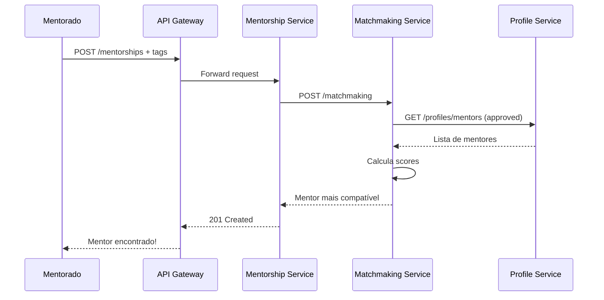

# 🔄 Fluxos e Jornadas de Operações

> Jornadas completas dos usuários no sistema UberHub Mentorias

---

## 🎓 Jornada do Mentorado

### 1. Download e Cadastro

- O usuário baixa o app e cria uma conta
- A tela principal mostra informações sobre o programa
- **As funções de mentoria estão bloqueadas** até ativar voucher

### 2. Inserção do Voucher

- O usuário insere um código de voucher válido
- Sistema valida e ativa as funcionalidades

### 3. Desbloqueio e Detalhamento

- O app libera a função para selecionar tags/trilhas
- O usuário pode selecionar múltiplas tags que representam áreas de conhecimento
- (Futuro: IA extrai as tags automaticamente de texto livre)

### 4. Matchmaking



### 5. Visualização do Mentor

- O app exibe a minibio, áreas de especialidade e foto do mentor
- Opções apresentadas:
  - **"Agendar Mentoria"**: Abre o link externo do mentor
  - **"Solicitar outro mentor"**: Formulário de justificativa (vai para Admin)

### 6. Agendamento

- O usuário realiza o agendamento na ferramenta externa (Calendly, etc.)

### 7. Notificações

- O usuário recebe notificações push de lembrete sobre a mentoria
- Notificações ativadas quando o mentor cadastra o agendamento no app

### 8. Avaliação

- Após a data/hora da mentoria e o preenchimento do formulário pelo mentor
- O app libera a tela de avaliação para o mentorado
- Mentorado pode avaliar com nota e comentário
- Ciclo da mentoria é finalizado (status: `completed`)

---

## 👨‍🏫 Jornada do Mentor

### 1. Cadastro

- O profissional se cadastra como mentor
- Preenche campos: minibio, áreas, link de agendamento
- Status do perfil fica como **"Pendente"**

### 2. Aprovação

- O Admin aprova o cadastro
- Mentor recebe notificação
- Perfil se torna ativo e elegível para matchmaking

### 3. Recebimento de Agendamento

- Mentor é notificado pela ferramenta externa (Calendly)

### 4. Cadastro da Mentoria no App

:::warning Passo Crucial!
Este registro permite que o sistema envie lembretes e controle o fluxo.
:::

- Mentor acessa "Minhas Mentorias"
- Visualiza mentorias com status `matched`
- Clica em "Registrar Agendamento"
- Informa a data/hora agendada
- Sistema atualiza status para `scheduled`

### 5. Realização da Mentoria

- A mentoria ocorre na data marcada

### 6. Feedback Pós-Mentoria

- Após a sessão, o app libera formulário para o mentor
- Campos: mentorado compareceu? (Sim/Não), observações

### 7. Conclusão

- Após feedback do mentor e avaliação do mentorado
- Sistema atualiza status para `completed`

---

## ⚙️ Jornada do Administrador

### 1. Login

- Acesso seguro ao painel de administração (web)

### 2. Dashboard

- Visualização de métricas principais:
  - Novos cadastros
  - Mentorias pendentes
  - Mentorias realizadas no mês

### 3. Aprovação de Mentores

- Lista de mentores com status "Pendente"
- Admin visualiza perfil completo
- Pode clicar em "Aprovar" ou "Reprovar"

### 4. Geração de Vouchers

- Seção para criar vouchers em lote ou individualmente
- **Tipo de Voucher:**
  - Aberto (qualquer área)
  - Restrito (ex: "Marketing Digital")
- **Quantidade:** Número de vouchers a gerar
- Sistema gera lista de códigos únicos

### 5. Monitoramento

- Visualiza listas de usuários e mentores
- Filtros por status, nº de mentorias, etc.
- Pode suspender usuário
- Pode aprovar/reprovar solicitações de troca de mentor

---

## 🔄 Fluxo Visual Completo

```
T0: Setup
├─ Admin gera vouchers
└─ Mentor se cadastra → Admin aprova → Mentor aprovado

T1: Início (Mentorado)
├─ Mentorado: Cadastro
├─ Mentorado: Inserção de Voucher
├─ Mentorado: Detalhamento
└─ Mentorado: Matchmaking → Sistema encontra mentor

T2: Visualização e Agendamento
├─ Mentorado: Visualização do mentor
└─ Mentorado: Agendamento (externo) → Mentor recebe notificação

T3: Cadastro no Sistema
├─ Mentor: Recebe agendamento
├─ Mentor: Cadastra no app → Sistema ativa notificações
└─ Mentorado: Recebe notificações de lembrete

T4: Execução
└─ Ambos: Realização da mentoria (data/hora marcada)

T5: Feedback
├─ Mentor: Feedback pós-mentoria → Sistema libera avaliação
└─ Mentorado: Avaliação

T6: Conclusão
└─ Mentor: Conclusão → Sistema finaliza ciclo
```

---

## 📊 Status da Mentoria

| Status | Significado |
|--------|-------------|
| `pending_match` | Mentoria criada, aguardando matchmaking |
| `matched` | Mentor encontrado, aguardando agendamento |
| `scheduled` | Agendamento registrado pelo mentor |
| `in_progress` | Mentoria em andamento |
| `completed` | Ciclo completo finalizado |
| `cancelled` | Mentoria cancelada |
| `expired` | Não agendada em 7 dias |
| `change_requested` | Solicitação de troca pendente |

---

## 📚 Documentação Relacionada

- [Dependências Temporais](/docs/arquitetura/dependencias-temporais)
- [Especificação de Requisitos](/docs/requisitos/especificacao)
- [Guia do Mentorado](/docs/guias-rapidos/mentorado)
- [Guia do Mentor](/docs/guias-rapidos/mentor)
