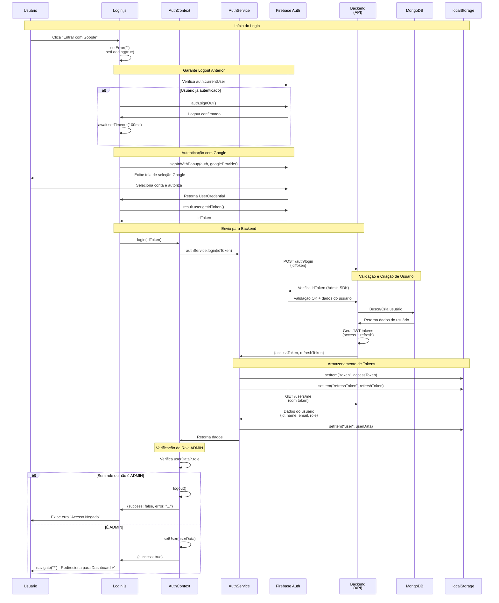
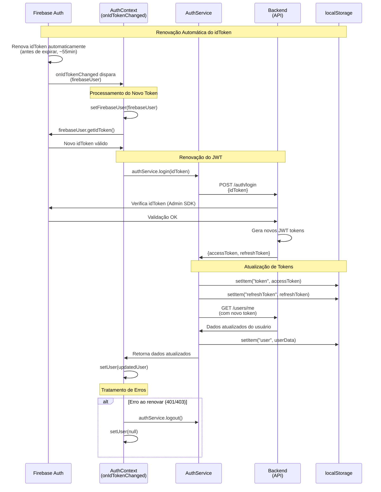
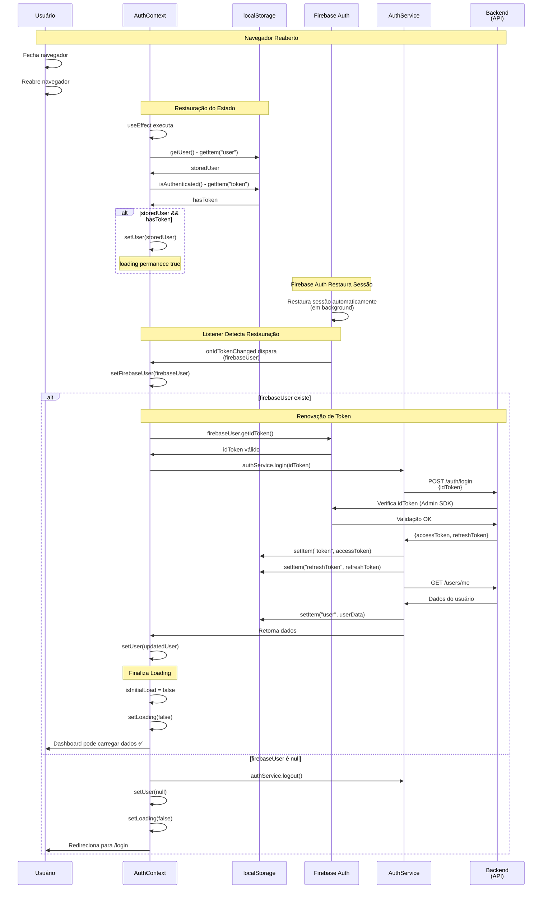
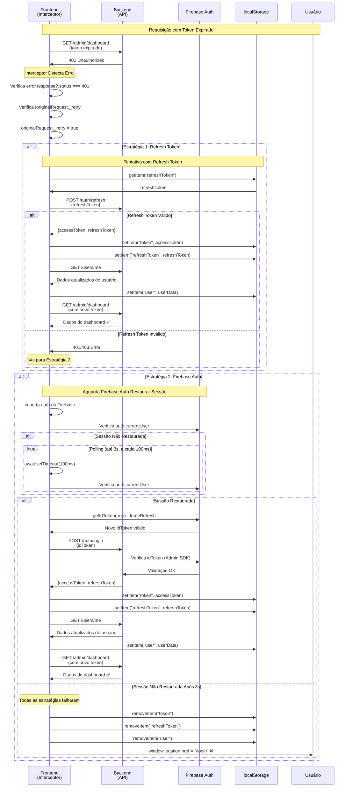
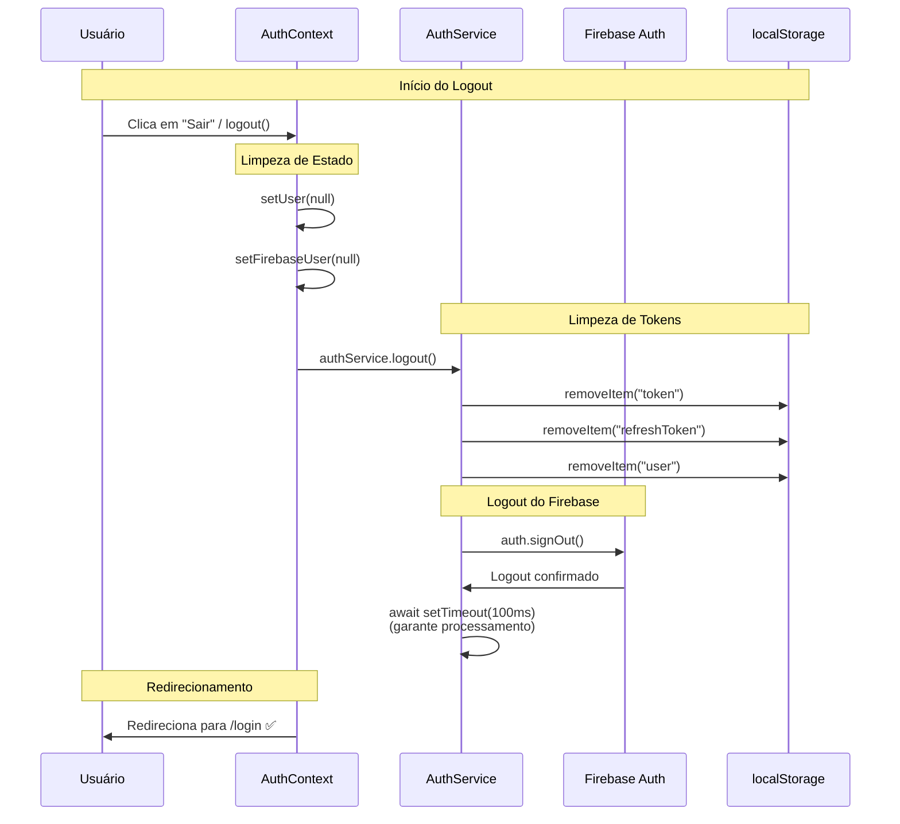

## 📊 Diagramas UML

### Visão Geral dos Diagramas

Este documento apresenta dois tipos complementares de diagramas:

1. **Diagrama de Sequência UML (Mermaid)**: Visão de alto nível mostrando todas as interações entre componentes do sistema
2. **Diagramas de Fluxo Detalhados (ASCII)**: Visão detalhada com código específico para cada fluxo crítico

**Quando usar cada um:**

- **Diagrama UML**: Para entender o fluxo geral e as interações entre componentes
- **Diagramas ASCII**: Para implementação, debug e referência rápida ao código

| Aspecto       | Diagrama UML                 | Diagramas ASCII               |
| ------------- | ---------------------------- | ----------------------------- |
| **Propósito** | Visão arquitetural           | Detalhamento técnico          |
| **Audiência** | Arquitetos, novos devs       | Desenvolvedores implementando |
| **Nível**     | Alto nível                   | Baixo nível (código)          |
| **Foco**      | Interações entre componentes | Implementação específica      |
| **Uso**       | Entender o sistema           | Implementar/debugar           |

### Diagrama de Sequência UML - Fluxo Completo de Autenticação

```mermaid
sequenceDiagram
    participant U as Usuário
    participant FE as Frontend<br/>(React)
    participant FA as Firebase Auth
    participant BE as Backend<br/>(API)
    participant DB as MongoDB

    Note over U,DB: 1. Login Inicial
    U->>FE: Clica "Entrar com Google"
    FE->>FA: signInWithPopup(googleProvider)
    FA->>U: Exibe tela de seleção Google
    U->>FA: Seleciona conta e autoriza
    FA->>FE: Retorna idToken
    FE->>BE: POST /auth/login {idToken}
    BE->>FA: Verifica idToken (Admin SDK)
    FA->>BE: Validação OK + dados do usuário
    BE->>DB: Busca/Cria usuário
    DB->>BE: Retorna dados do usuário
    BE->>BE: Gera JWT tokens (access + refresh)
    BE->>FE: {accessToken, refreshToken}
    FE->>FE: localStorage.setItem("token", accessToken)
    FE->>FE: localStorage.setItem("refreshToken", refreshToken)
    FE->>BE: GET /users/me (com token)
    BE->>FE: Dados do usuário {id, name, email, role}
    FE->>FE: localStorage.setItem("user", userData)
    FE->>U: Redireciona para Dashboard

    Note over U,DB: 2. Renovação Automática de Tokens
    FA->>FA: Renova idToken automaticamente (~55min)
    FA->>FE: onIdTokenChanged dispara
    FE->>FA: getIdToken()
    FA->>FE: Novo idToken
    FE->>BE: POST /auth/login {idToken}
    BE->>FA: Verifica idToken
    FA->>BE: Validação OK
    BE->>BE: Gera novos JWT tokens
    BE->>FE: {accessToken, refreshToken}
    FE->>FE: Atualiza tokens no localStorage
    FE->>BE: GET /users/me
    BE->>FE: Dados atualizados do usuário

    Note over U,DB: 3. Requisição com Token Válido
    U->>FE: Interage com aplicação
    FE->>FE: Interceptor adiciona token
    FE->>BE: GET /admin/dashboard<br/>(Authorization: Bearer token)
    BE->>BE: Valida JWT token
    BE->>FE: Dados do dashboard
    FE->>U: Exibe dados

    Note over U,DB: 4. Tratamento de Erro 401 - Token Expirado<br/>(Ver diagrama detalhado abaixo)
    FE->>BE: GET /admin/dashboard<br/>(token expirado)
    BE->>FE: 401 Unauthorized
    FE->>FE: Interceptor detecta 401
    FE->>FE: Verifica flag _retry

    alt Estratégia 1: Refresh Token
        FE->>BE: POST /auth/refresh {refreshToken}
        BE->>FE: {accessToken, refreshToken}
        FE->>FE: Atualiza tokens no localStorage
        FE->>BE: GET /users/me
        BE->>FE: Dados atualizados
        FE->>BE: GET /admin/dashboard<br/>(com novo token)
        BE->>FE: Dados do dashboard
    else Estratégia 2: Firebase Auth
        FE->>FE: Aguarda Firebase Auth (até 3s)
        FA->>FE: Sessão restaurada
        FE->>FA: getIdToken(true) - forceRefresh
        FA->>FE: Novo idToken
        FE->>BE: POST /auth/login {idToken}
        BE->>FA: Verifica idToken
        FA->>BE: Validação OK
        BE->>FE: {accessToken, refreshToken}
        FE->>FE: Atualiza tokens no localStorage
        FE->>BE: GET /users/me
        BE->>FE: Dados atualizados
        FE->>BE: GET /admin/dashboard<br/>(com novo token)
        BE->>FE: Dados do dashboard
    else Todas as estratégias falharam
        FE->>FE: Limpa localStorage
        FE->>U: Redireciona para /login
    end

    Note over U,DB: 5. Restauração de Sessão ao Reabrir Navegador
    U->>FE: Fecha navegador
    U->>FE: Reabre navegador
    FE->>FE: Restaura estado do localStorage
    FE->>FE: loading = true
    FA->>FA: Restaura sessão automaticamente
    FA->>FE: onIdTokenChanged dispara
    FE->>FA: getIdToken()
    FA->>FE: idToken válido
    FE->>BE: POST /auth/login {idToken}
    BE->>FA: Verifica idToken
    FA->>BE: Validação OK
    BE->>FE: {accessToken, refreshToken}
    FE->>FE: Atualiza tokens no localStorage
    FE->>BE: GET /users/me
    BE->>FE: Dados do usuário
    FE->>FE: loading = false
    FE->>U: Dashboard carrega dados

    Note over U,DB: 6. Logout
    U->>FE: Clica em "Sair"
    FE->>FE: Limpa localStorage (tokens, user)
    FE->>FA: auth.signOut()
    FA->>FE: Logout confirmado
    FE->>U: Redireciona para /login
```



### Legenda do Diagrama

- **Usuário**: Pessoa usando a aplicação
- **Frontend (React)**: Aplicação React com AuthContext e interceptors
- **Firebase Auth**: Serviço de autenticação do Firebase
- **Backend (API)**: API REST que valida tokens e gerencia usuários
- **MongoDB**: Banco de dados onde os usuários são armazenados

### Fluxos Representados

1. **[Login Inicial](#login-inicial-diagrama-uml-detalhado)**: Fluxo completo desde o clique até o armazenamento dos tokens
2. **[Renovação Automática](#renovação-automática-diagrama-uml-detalhado)**: Como os tokens são renovados automaticamente
3. **Requisição com Token Válido**: Fluxo normal de uma requisição autenticada
4. **[Tratamento de Erro 401](#tratamento-de-erro-401-diagrama-uml-detalhado)**: Estratégias de recuperação quando o token expira
5. **[Restauração de Sessão](#restauração-de-sessão-diagrama-uml-detalhado)**: Como a sessão é restaurada ao reabrir o navegador
6. **[Logout](#logout-diagrama-uml-detalhado)**: Processo completo de logout

---

## 📋 Diagramas UML Detalhados

### Login Inicial (Diagrama UML Detalhado)



**Referências:**

- Ver também: [Diagrama ASCII do Login Inicial](#login-inicial-diagrama-ascii)
- Código fonte: `Login.js:25-59`, `AuthContext.js:92-137`, `api.js:147-162`

### Renovação Automática (Diagrama UML Detalhado)



**Referências:**

- Ver também: [Diagrama ASCII da Renovação Automática](#renovação-automática-onidtokenchanged)
- Código fonte: `AuthContext.js:43-72`, `api.js:147-162`

### Restauração de Sessão (Diagrama UML Detalhado)



**Referências:**

- Ver também: [Diagrama ASCII da Restauração de Sessão](#restauração-de-sessão-ao-reabrir-navegador)
- Código fonte: `AuthContext.js:27-84`

### Tratamento de Erro 401 (Diagrama UML Detalhado)



**Referências:**

- Ver também: [Diagrama ASCII detalhado do Tratamento de Erro 401](#tratamento-de-erro-401-interceptor-de-resposta)
- Código fonte: `api.js:27-120`

### Logout (Diagrama UML Detalhado)



**Referências:**

- Código fonte: `AuthContext.js:139-145`, `api.js:166-182`

---

## 📝 Diagramas ASCII Detalhados

### Login Inicial (Diagrama ASCII)

```
┌─────────────────────────────────────────────────────────┐
│  Usuário clica "Entrar com Google"                     │
│                                                          │
│  Código: Login.js:25-27                                  │
│  const handleGoogleSignIn = async () => {               │
│    setError("");                                        │
│    setLoading(true);                                     │
│  }                                                       │
└─────────────────────────────────────────────────────────┘
                    │
                    ▼
┌─────────────────────────────────────────────────────────┐
│  Garante logout anterior (força seleção de conta)       │
│                                                          │
│  Código: Login.js:32-36                                  │
│  if (auth.currentUser) {                                │
│    await auth.signOut();                                │
│    await new Promise(resolve =>                         │
│      setTimeout(resolve, 100));                          │
│  }                                                       │
└─────────────────────────────────────────────────────────┘
                    │
                    ▼
┌─────────────────────────────────────────────────────────┐
│  Faz login com Google via Firebase                      │
│                                                          │
│  Código: Login.js:40-41                                  │
│  const result = await signInWithPopup(                   │
│    auth, googleProvider);                                │
│  const idToken = await result.user.getIdToken();        │
└─────────────────────────────────────────────────────────┘
                    │
                    ▼
┌─────────────────────────────────────────────────────────┐
│  Envia idToken para AuthContext                         │
│                                                          │
│  Código: Login.js:44                                     │
│  const loginResult = await login(idToken);              │
│                                                          │
│  AuthContext.js:92-94                                    │
│  const login = async idToken => {                        │
│    const data = await authService.login(idToken);      │
│  }                                                       │
└─────────────────────────────────────────────────────────┘
                    │
                    ▼
┌─────────────────────────────────────────────────────────┐
│  AuthService envia para backend                         │
│                                                          │
│  Código: api.js:148                                      │
│  const response = await axios.post(                      │
│    `${API_BASE_URL}/auth/login`,                        │
│    { idToken }                                           │
│  );                                                      │
└─────────────────────────────────────────────────────────┘
                    │
                    ▼
┌─────────────────────────────────────────────────────────┐
│  Backend valida idToken e retorna JWT tokens            │
│  (Backend: AuthController.java)                          │
└─────────────────────────────────────────────────────────┘
                    │
                    ▼
┌─────────────────────────────────────────────────────────┐
│  Frontend armazena tokens no localStorage                │
│                                                          │
│  Código: api.js:154-156                                  │
│  localStorage.setItem("token",                            │
│    response.data.accessToken);                           │
│  localStorage.setItem("refreshToken",                     │
│    response.data.refreshToken);                          │
└─────────────────────────────────────────────────────────┘
                    │
                    ▼
┌─────────────────────────────────────────────────────────┐
│  Busca dados do usuário                                 │
│                                                          │
│  Código: api.js:161-162                                  │
│  const userResponse = await api.get(                     │
│    `${API_BASE_URL}/users/me`);                          │
│  localStorage.setItem("user",                             │
│    JSON.stringify(userResponse.data));                    │
└─────────────────────────────────────────────────────────┘
                    │
                    ▼
┌─────────────────────────────────────────────────────────┐
│  AuthContext verifica role ADMIN                        │
│                                                          │
│  Código: AuthContext.js:100-126                          │
│  if (!userData?.role) {                                  │
│    await logout();                                       │
│    return { success: false, error: "..." };              │
│  }                                                       │
│  const isAdmin = roles.includes("ADMIN");                │
│  if (!isAdmin) {                                         │
│    await logout();                                       │
│    return { success: false, error: "..." };              │
│  }                                                       │
└─────────────────────────────────────────────────────────┘
                    │
                    ├─ Não é ADMIN ──► Logout e erro
                    │
                    └─ É ADMIN
                           │
                           ▼
┌─────────────────────────────────────────────────────────┐
│  Redireciona para Dashboard                             │
│                                                          │
│  Código: Login.js:47-49                                  │
│  if (loginResult.success) {                             │
│    navigate("/");                                       │
│  }                                                       │
└─────────────────────────────────────────────────────────┘
```

**Referências:**

- Ver também: [Diagrama UML Detalhado do Login Inicial](#login-inicial-diagrama-uml-detalhado)
- Código fonte: `Login.js:25-59`, `AuthContext.js:92-137`, `api.js:147-162`

### Renovação Automática (onIdTokenChanged)

**Referências:**

- Ver também: [Diagrama UML Detalhado da Renovação Automática](#renovação-automática-diagrama-uml-detalhado)
- Código fonte: `AuthContext.js:43-72`

```
┌─────────────────────────────────────────────────────────┐
│  Firebase renova idToken automaticamente                │
│  (antes de expirar, ~55 minutos)                       │
└─────────────────────────────────────────────────────────┘
                    │
                    ▼
┌─────────────────────────────────────────────────────────┐
│  onIdTokenChanged dispara automaticamente                │
│                                                          │
│  Código: AuthContext.js:43                              │
│  const unsubscribe = onIdTokenChanged(auth, async      │
│    firebaseUser => { ... })                             │
└─────────────────────────────────────────────────────────┘
                    │
                    ▼
┌─────────────────────────────────────────────────────────┐
│  Frontend obtém novo idToken                            │
│                                                          │
│  Código: AuthContext.js:52                              │
│  const idToken = await firebaseUser.getIdToken();      │
└─────────────────────────────────────────────────────────┘
                    │
                    ▼
┌─────────────────────────────────────────────────────────┐
│  Envia para /auth/login                                 │
│                                                          │
│  Código: AuthContext.js:53                               │
│  await authService.login(idToken);                      │
│                                                          │
│  api.js:134                                             │
│  const response = await axios.post(                     │
│    `${API_BASE_URL}/auth/login`,                        │
│    { idToken }                                          │
│  );                                                      │
└─────────────────────────────────────────────────────────┘
                    │
                    ▼
┌─────────────────────────────────────────────────────────┐
│  Backend valida e retorna novos JWT tokens             │
│  (Backend: AuthController.java)                         │
└─────────────────────────────────────────────────────────┘
                    │
                    ▼
┌─────────────────────────────────────────────────────────┐
│  Frontend armazena novos tokens                         │
│                                                          │
│  Código: api.js:140-142                                 │
│  localStorage.setItem("token",                          │
│    response.data.accessToken);                          │
│  localStorage.setItem("refreshToken",                   │
│    response.data.refreshToken);                          │
│                                                          │
│  api.js:147-150                                         │
│  const userResponse = await api.get(                     │
│    `${API_BASE_URL}/users/me`);                         │
│  localStorage.setItem("user",                           │
│    JSON.stringify(userResponse.data));                    │
└─────────────────────────────────────────────────────────┘
```

### Restauração de Sessão ao Reabrir Navegador

**Referências:**

- Ver também: [Diagrama UML Detalhado da Restauração de Sessão](#restauração-de-sessão-diagrama-uml-detalhado)
- Código fonte: `AuthContext.js:27-84`

```
┌─────────────────────────────────────────────────────────┐
│  Navegador é reaberto                                   │
│  (Evento do navegador)                                  │
└─────────────────────────────────────────────────────────┘
                    │
                    ▼
┌─────────────────────────────────────────────────────────┐
│  AuthContext restaura estado do localStorage            │
│  (mantém loading = true)                                │
│                                                          │
│  Código: AuthContext.js:32-38                           │
│  const storedUser = authService.getUser();              │
│  const hasToken = authService.isAuthenticated();       │
│  if (storedUser && hasToken) {                          │
│    setUser(storedUser);                                 │
│    // Não define loading = false ainda                  │
│  }                                                       │
└─────────────────────────────────────────────────────────┘
                    │
                    ▼
┌─────────────────────────────────────────────────────────┐
│  Firebase Auth restaura sessão                          │
│  (Automático do Firebase)                               │
└─────────────────────────────────────────────────────────┘
                    │
                    ▼
┌─────────────────────────────────────────────────────────┐
│  onIdTokenChanged dispara com firebaseUser              │
│                                                          │
│  Código: AuthContext.js:43-44                           │
│  const unsubscribe = onIdTokenChanged(auth,             │
│    async firebaseUser => {                              │
│      setFirebaseUser(firebaseUser);                     │
│      if (firebaseUser) { ... }                          │
│    });                                                  │
└─────────────────────────────────────────────────────────┘
                    │
                    ▼
┌─────────────────────────────────────────────────────────┐
│  Renova token JWT usando novo idToken                   │
│                                                          │
│  Código: AuthContext.js:51-57                           │
│  const idToken = await firebaseUser.getIdToken();      │
│  await authService.login(idToken);                      │
│  const updatedUser = authService.getUser();             │
│  if (updatedUser) {                                      │
│    setUser(updatedUser);                                │
│  }                                                       │
└─────────────────────────────────────────────────────────┘
                    │
                    ▼
┌─────────────────────────────────────────────────────────┐
│  loading = false (Dashboard pode carregar dados)       │
│                                                          │
│  Código: AuthContext.js:68-72                           │
│  if (isInitialLoad) {                                   │
│    isInitialLoad = false;                               │
│    setLoading(false);                                    │
│  }                                                       │
└─────────────────────────────────────────────────────────┘
```

### Tratamento de Erro 401 (Interceptor de Resposta)

**Referências:**

- Ver também: [Diagrama UML Detalhado do Tratamento de Erro 401](#tratamento-de-erro-401-diagrama-uml-detalhado)
- Código fonte: `api.js:27-120`

```
┌─────────────────────────────────────────────────────────┐
│  Requisição recebe 401 (token expirado)                 │
│  (Resposta do servidor)                                 │
└─────────────────────────────────────────────────────────┘
                    │
                    ▼
┌─────────────────────────────────────────────────────────┐
│  Interceptor de resposta detecta erro 401               │
│  (api.interceptors.response.use)                       │
│                                                          │
│  Código: api.js:27-29                                    │
│  api.interceptors.response.use(                         │
│    response => response,                                │
│    async error => { ... }                               │
│  );                                                      │
└─────────────────────────────────────────────────────────┘
                    │
                    ▼
┌─────────────────────────────────────────────────────────┐
│  Verifica flag _retry (evita loops)                     │
│                                                          │
│  Código: api.js:33-34                                    │
│  if (error.response?.status === 401 &&                 │
│      !originalRequest._retry) {                         │
│    originalRequest._retry = true;                       │
│  }                                                       │
└─────────────────────────────────────────────────────────┘
                    │
                    ▼
┌─────────────────────────────────────────────────────────┐
│  Estratégia 1: Tenta renovar com refreshToken            │
│  POST /auth/refresh                                      │
│                                                          │
│  Código: api.js:37-42                                    │
│  const refreshToken = localStorage.getItem(              │
│    "refreshToken");                                      │
│  if (refreshToken) {                                     │
│    const response = await axios.post(                   │
│      `${API_BASE_URL}/auth/refresh`,                    │
│      { refreshToken }                                    │
│    );                                                    │
│  }                                                       │
└─────────────────────────────────────────────────────────┘
                    │
                    ├─ Sucesso
                    │       │
                    │       ▼
                    │  Salva novos tokens no localStorage
                    │
                    │  Código: api.js:46-47                │
                    │  localStorage.setItem("token",       │
                    │    response.data.accessToken);       │
                    │  localStorage.setItem("refreshToken",│
                    │    response.data.refreshToken);      │
                    │       │
                    │       ▼
                    │  Busca dados atualizados (/users/me)
                    │
                    │  Código: api.js:50-54                │
                    │  const userResponse = await api.get( │
                    │    `${API_BASE_URL}/users/me`);      │
                    │  localStorage.setItem("user",        │
                    │    JSON.stringify(userResponse.data));│
                    │       │
                    │       ▼
                    │  Repete requisição original
                    │
                    │  Código: api.js:60-61                │
                    │  originalRequest.headers.Authorization│
                    │    = `Bearer ${response.data.accessToken}`;│
                    │  return api(originalRequest);        │
                    │       │
                    │       └─► Retorna dados normalmente
                    │
                    └─ Falha
                           │
                           ▼
┌─────────────────────────────────────────────────────────┐
│  Estratégia 2: Aguarda Firebase Auth (até 3s)           │
│  Polling a cada 100ms                                   │
│                                                          │
│  Código: api.js:65-79                                    │
│  const { auth } = await import(                         │
│    "../config/firebase.js");                            │
│  let currentUser = auth.currentUser;                    │
│  if (!currentUser) {                                     │
│    const maxWait = 3000; // 3 segundos                  │
│    const checkInterval = 100; // 100ms                  │
│    let waited = 0;                                       │
│    while (!currentUser && waited < maxWait) {           │
│      await new Promise(resolve =>                       │
│        setTimeout(resolve, checkInterval));              │
│      currentUser = auth.currentUser;                     │
│      waited += checkInterval;                            │
│    }                                                     │
│  }                                                       │
└─────────────────────────────────────────────────────────┘
                    │
                    ├─ Sessão restaurada (auth.currentUser)
                    │       │
                    │       ▼
                    │  Obtém novo idToken (forceRefresh)
                    │
                    │  Código: api.js:84                    │
                    │  const newIdToken = await            │
                    │    currentUser.getIdToken(true);     │
                    │       │
                    │       ▼
                    │  POST /auth/login com novo idToken
                    │
                    │  Código: api.js:85-87                │
                    │  const loginResponse = await         │
                    │    axios.post(`${API_BASE_URL}/auth/login`,│
                    │      { idToken: newIdToken });       │
                    │       │
                    │       ▼
                    │  Salva novos tokens no localStorage
                    │
                    │  Código: api.js:91-92                │
                    │  localStorage.setItem("token",       │
                    │    loginResponse.data.accessToken);  │
                    │  localStorage.setItem("refreshToken",│
                    │    loginResponse.data.refreshToken); │
                    │       │
                    │       ▼
                    │  Busca dados atualizados (/users/me)
                    │
                    │  Código: api.js:96-99                │
                    │  const userResponse = await api.get( │
                    │    `${API_BASE_URL}/users/me`);      │
                    │  localStorage.setItem("user",        │
                    │    JSON.stringify(userResponse.data));│
                    │       │
                    │       ▼
                    │  Repete requisição original
                    │
                    │  Código: api.js:104-105               │
                    │  originalRequest.headers.Authorization│
                    │    = `Bearer ${loginResponse.data.accessToken}`;│
                    │  return api(originalRequest);        │
                    │       │
                    │       └─► Retorna dados normalmente
                    │
                    └─ Sem sessão após 3s
                           │
                           ▼
┌─────────────────────────────────────────────────────────┐
│  Limpa tokens do localStorage                            │
│  (token, refreshToken, user)                            │
│                                                          │
│  Código: api.js:109-111 ou 116-118                       │
│  localStorage.removeItem("token");                      │
│  localStorage.removeItem("refreshToken");               │
│  localStorage.removeItem("user");                       │
└─────────────────────────────────────────────────────────┘
                    │
                    ▼
┌─────────────────────────────────────────────────────────┐
│  Redireciona para /login                                 │
│                                                          │
│  Código: api.js:112 ou 119                               │
│  window.location.href = "/login";                        │
└─────────────────────────────────────────────────────────┘
```
