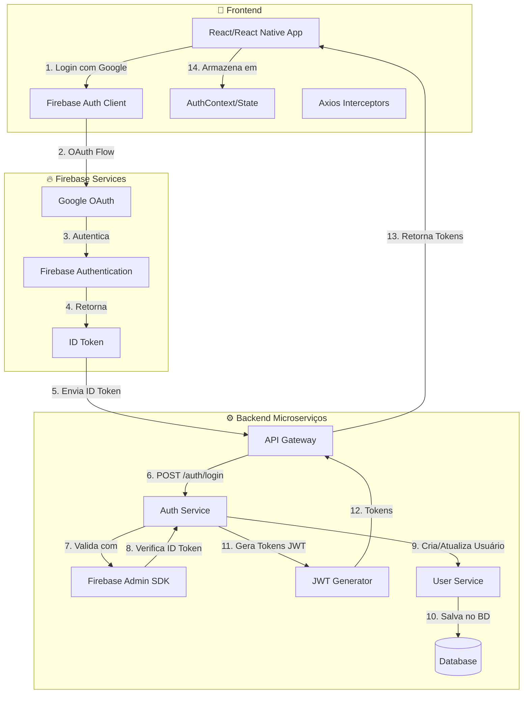

# 🔐 Fluxo de Autenticação Firebase

> Visão geral do sistema de autenticação com Firebase + JWT próprio

---

## 📊 Arquitetura de Autenticação Dupla



---

## 🎯 Por que usar DOIS tipos de token?

| Token | Propósito | Gerado por |
|-------|-----------|------------|
| **ID Token (Firebase)** | Provar identidade do usuário | Firebase |
| **JWT Próprio (Backend)** | Autorização e acesso às APIs | Nosso backend |

<details>
<summary>💡 <strong>Decisão de Arquitetura (ADR-004)</strong>: Por que usar JWT próprio além do Firebase?</summary>

### Contexto
O Firebase já fornece um ID Token válido. Por que gerar outro?

### Decisão
Usamos JWT próprio do backend pelos seguintes motivos:
- ✅ Controle total sobre claims e permissões
- ✅ Roles customizados (`ADMIN`, `MENTOR`, `MENTEE`)
- ✅ Não dependemos 100% do Firebase para autorização
- ✅ Podemos revogar tokens individualmente
- ✅ Tempo de expiração configurável

### Consequências
- **Positivas:** Flexibilidade, segurança, independência
- **Negativas:** Maior complexidade na renovação de tokens

</details>

---

## 🔄 Fluxo Completo (Passo a Passo)

### Passo 1: Usuário Clica em "Entrar com Google"

```
Usuário → Clica no botão → Frontend inicia processo
```

- Frontend chama `signInWithPopup(auth, googleProvider)` (Web)
- Ou usa `@react-native-google-signin` (Mobile)
- Firebase abre popup/tela do Google
- Usuário seleciona conta e autoriza

### Passo 2: Firebase Retorna ID Token

```
Firebase → Valida com Google → Retorna ID Token
```

- Google valida credenciais
- Firebase gera ID token (JWT do Firebase)
- Frontend recebe o token

### Passo 3: Frontend Envia ID Token para Backend

```
Frontend → POST /auth/login {idToken} → Backend
```

- Frontend envia ID token para nosso backend
- Backend precisa validar esse token

### Passo 4: Backend Valida ID Token

```
Backend → Firebase Admin SDK → Valida ID Token
```

- Backend usa Firebase Admin SDK
- Verifica se o token é válido
- Obtém dados do usuário (email, nome, etc.)

### Passo 5: Backend Cria/Atualiza Usuário

```
Backend → MongoDB → Salva/Atualiza usuário
```

- Backend verifica se usuário existe
- Se não existe, cria novo usuário
- Se existe, atualiza dados

### Passo 6: Backend Gera Tokens JWT

```
Backend → Gera accessToken + refreshToken → Retorna ao Frontend
```

- **Access Token:** Curta duração (15min-1h)
- **Refresh Token:** Longa duração (7-30 dias)

### Passo 7: Frontend Armazena Tokens

```
Frontend → localStorage/AsyncStorage → Salva tokens
```

- Web: `localStorage`
- Mobile: `AsyncStorage`
- Estado de autenticação é atualizado

---

## 🔑 Estrutura do JWT

```javascript
{
  "sub": "joao.silva@email.com",  // Email do usuário
  "userId": "507f1f77bcf86cd799439011",  // ID único
  "roles": "ROLE_MENTOR",  // Roles separados por vírgula
  "iat": 1698765432,  // Issued at
  "exp": 1698766332   // Expiration
}
```

---

## 🔄 Renovação Automática de Tokens

### Quando o Access Token Expira

1. **Estratégia 1: Refresh Token**
   ```
   Access Token expirado → Usa Refresh Token → Novo Access Token
   ```

2. **Estratégia 2: Firebase Auth (fallback)**
   ```
   Refresh falhou → Aguarda Firebase → Novo ID Token → Login novamente
   ```

3. **Estratégia 3: Logout (última opção)**
   ```
   Tudo falhou → Limpa tokens → Redireciona para login
   ```

---

## 📱 Diferenças Web vs Mobile

| Aspecto | Web | Mobile |
|---------|-----|--------|
| **Storage** | `localStorage` | `AsyncStorage` |
| **Login Google** | `signInWithPopup` | `@react-native-google-signin` |
| **Navegação** | React Router | React Navigation |
| **Auth Init** | `getAuth()` | `initializeAuth()` com persistência |

---

## 📚 Próximos Passos

- [Tutorial Completo de Implementação](/docs/autenticacao/aula-firebase-auth)
- [Configuração Completa do Firebase](/docs/autenticacao/configuracao-completa)
- [Configurar SHA1 no Android](/docs/autenticacao/sha1-android)
